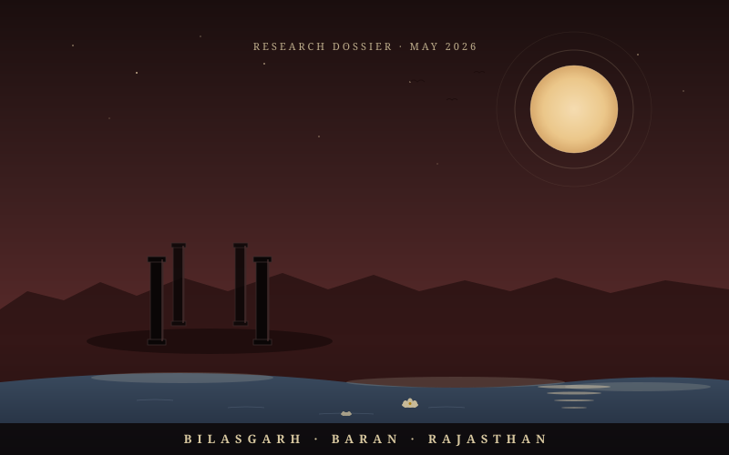
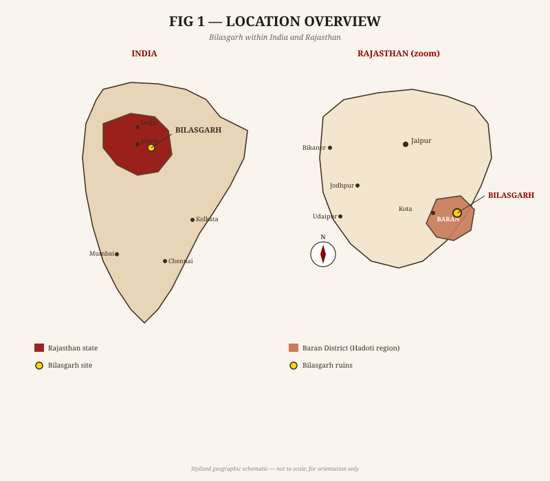
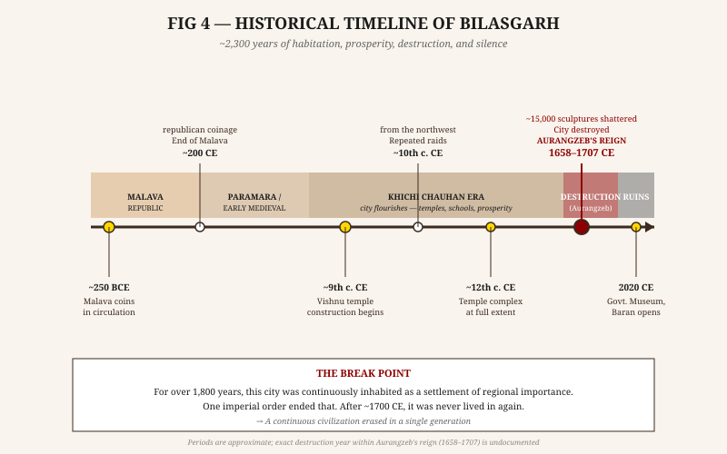
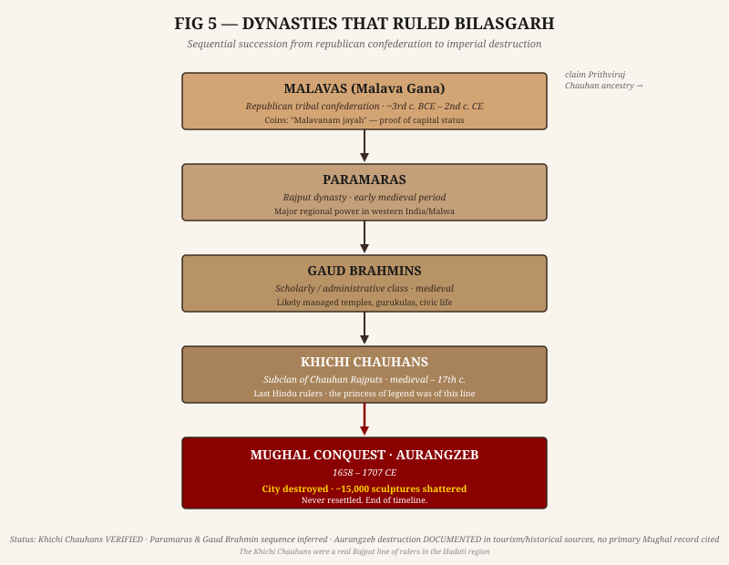
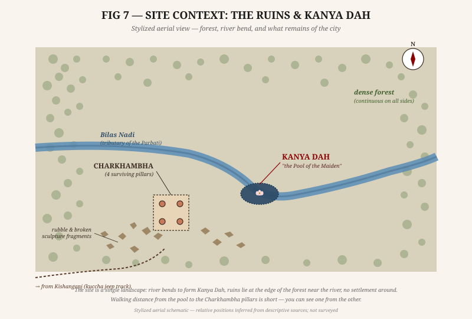
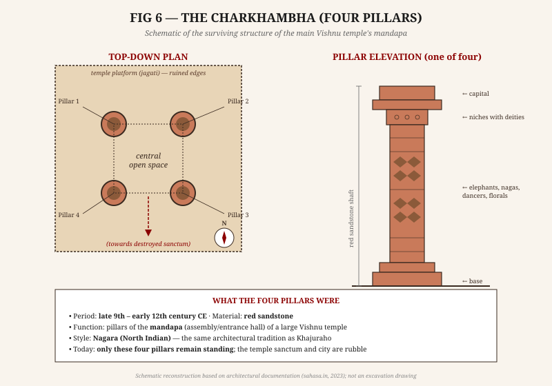
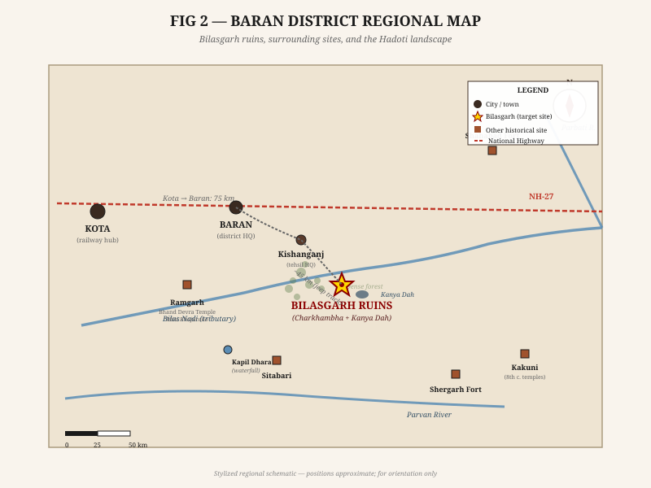
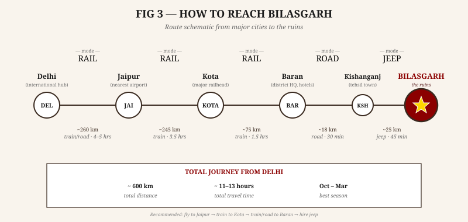
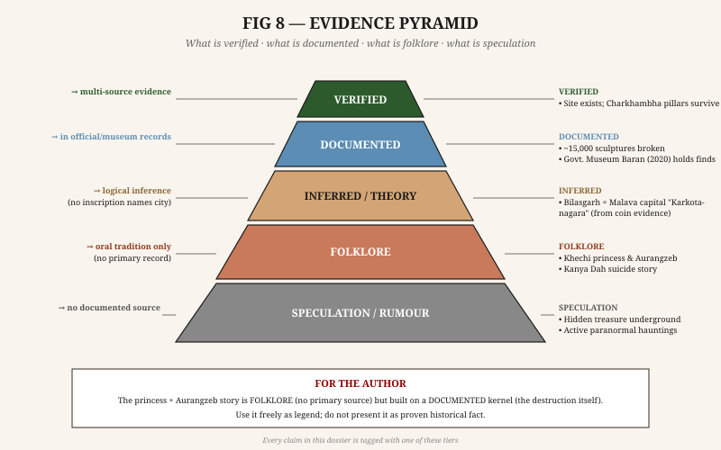

# RESEARCH DOSSIER: BILASGARH FORT / BILASGARH RUINS
## Baran District, Rajasthan, India

**Document Type:** Investigative Research Dossier — Historical, Archaeological, Folkloric  
**Prepared for:** Author Research Brief  
**Date:** May 2026  
**Classification:** Open Research  

> **CRITICAL NOTE:** Bilasgarh is NOT Bhangarh Fort. These are two entirely different sites in different districts of Rajasthan. Bhangarh is in Alwar district (northern Rajasthan). Bilasgarh is in Baran district (southeastern Rajasthan, Hadoti region). Do not conflate them.

---

## TABLE OF CONTENTS

1. [Basic Identification](#section-1)
2. [Historical Background](#section-2)
3. [Folklore & Haunted Stories](#section-3)
4. [Archaeology](#section-4)
5. [Connectivity — How to Reach](#section-5)
6. [Infrastructure — Physical & Social](#section-6)
7. [Nearby Places & Amenities](#section-7)
8. [Reality vs Myth Table](#section-8)
9. [Author's Briefing Material](#section-9)
10. [Sources](#section-10)

---

## SECTION 1 — BASIC IDENTIFICATION

| Field | Answer |
|---|---|
| **What is Bilasgarh?** | Ruins of an ancient city and temple complex, once a major urban settlement in southeastern Rajasthan |
| **Also known as** | Vilasnagara, Krishnavillas, Vilasa, Karkotanagara (historical names) |
| **Location** | Village: Bilasgarh, Tehsil: Kishanganj, District: Baran, State: Rajasthan |
| **Approximate coordinates** | ~24°43'N, 76°51'E (based on Kishanganj tehsil; exact ruin GPS undocumented in available sources) |
| **On which river** | Banks of the Bilas Nadi (a tributary of the Parbati River, which drains into the Chambal) |
| **Distance from Baran city** | ~45 km |
| **Distance from Kishanganj town** | ~20–25 km |
| **Distance from Kota** | ~115–120 km |
| **Distance from Jaipur** | ~290–320 km |
| **Classification** | Ruined ancient city + destroyed temple complex + archaeological site (not a single standing fort) |
| **What survives today** | The Charkhambha (four decorated sandstone pillars), scattered rubble over large area, ruins of main Vishnu temple platform |
| **Managed by** | Status unclear; sculptures moved to Government Museum, Baran (state government) |
| **ASI involvement** | NOT confirmed in available sources; site does not appear in prominent ASI protected monument lists |
| **Abandoned?** | Yes — fully abandoned; no resident population at ruins site |
| **Tourist accessible?** | Yes, accessible by private vehicle (jeep recommended); one source cites entry ₹20 (Indians) / ₹100 (foreigners), UNVERIFIED |
| **Reported timings** | 9 AM–5 PM (UNVERIFIED — single source) |
| **Setting** | Dense forest, isolated, desolate — described as "treeless, strewn with rubble" inside a forested area |

---

## SECTION 2 — HISTORICAL BACKGROUND

### 2.1 Timeline of Key Events

| Period | Event | Status |
|---|---|---|
| ~250 BCE – 2nd century CE | Bilasgarh = probable capital of the Malava republic/tribal confederation; Malava punch-marked coins found | VERIFIED |
| ~2nd–6th century CE | Transitional period; part of Hadoti regional political landscape | THEORY |
| ~6th–10th century CE | City under Paramara rulers; Hindu temple construction begins | PARTIALLY DOCUMENTED |
| ~9th–12th century CE | Flourishing of city; main Vishnu temple complex built; city has temples, dharmashalas, gurukulas, bhojanashalas | VERIFIED (architectural evidence) |
| ~10th century CE onward | Repeated raids by armies from the northwest; city attacked multiple times | UNVERIFIED (general regional history applied to Bilasgarh) |
| Medieval period | Khichi Chauhan dynasty (subclan of Chauhan Rajputs) rules Bilasgarh as part of Hadoti | VERIFIED (Rajput clan records) |
| 1658–1707 CE (Aurangzeb's reign) | Aurangzeb orders destruction of Bilasgarh; ~15,000 sculptures shattered; city razed | DOCUMENTED in tourism/historical sources; no primary Mughal court record cited |
| Post-destruction | City abandoned, never rebuilt or resettled | VERIFIED (current state of ruins) |
| August 20, 2020 | Government Museum, Baran inaugurated; Bilasgarh sculptures become central exhibit | VERIFIED |

---

### 2.2 Dynasty Chart

| Period | Ruling Power | Capital/Context |
|---|---|---|
| 3rd century BCE – 2nd century CE | **Malavas** (Malava Gana — republican tribal confederation) | Bilasgarh possibly = Karkotanagara, Malava capital |
| Early Medieval | **Paramaras** | Part of wider Paramara Rajput territory |
| Medieval | **Gaud Brahmins** (scholarly/feudal class, not military rulers) | Administrative/religious class |
| Medieval–17th century | **Khichi Chauhans** (subclan of Chauhan Rajputs; claim descent from Prithviraj Chauhan) | Rulers of Bilasgarh and surrounding Hadoti region |
| 17th century | **Mughal Empire / Aurangzeb** | Conquest and destruction |

---

### 2.3 Key Facts

**Who built it:**
- The founding date is prehistoric; the city existed as a Malava settlement from at least 3rd century BCE
- The Vishnu temple complex (the most visible surviving monument) was built by Khichi Chauhan/Paramara-era rulers in the 9th–12th century CE
- Multiple rulers over multiple centuries added to and used the city

**Why it was important:**
- Seat of Malava republican power (~250 BCE–2nd century CE)
- Major religious center — described as having "countless temples dedicated to Lord Vishnu"; one source calls it "Krishnavillas" (City of Krishna's Play) and "Vilasnagara" (City of Pleasure/Prosperity)
- Seat of learning — gurukulas (traditional schools) documented
- Civic infrastructure — dharmashalas (rest houses), bhojanashalas (community dining halls)
- Regional political hub for Khichi Chauhans in Hadoti

**Trade significance:**
- Located on historical routes connecting Malwa (Madhya Pradesh) to Rajputana via the Chambal/Parbati river basin corridor
- No specific trade records found in available sources

**Religious significance:**
- Primarily Vaishnavite (Vishnu worship): main temple, sculpture iconography, city names all reference Vishnu/Krishna
- Multiple temples in the city (number not specified in surviving records)

**Mughal/Aurangzeb connection:**
- Aurangzeb ordered destruction during his reign (1658–1707)
- The specific trigger is described in local tradition as the story of the Khechi princess (see Section 3)
- Aurangzeb was historically known for widespread temple demolition across India — the Bilasgarh destruction fits his documented pattern
- No primary Mughal court document (farmaan/chronicle) specifically mentioning Bilasgarh has been cited in any available source

**Was it destroyed?**
- Yes — comprehensively. ~15,000 sculptures shattered, main temple destroyed down to rubble (only four pillars remain)

**Why was it abandoned?**
- Total destruction by Aurangzeb's forces; the population dispersed or was killed
- Never rebuilt

**Was famine/drought involved?**
- Not mentioned in any available source

**Any invasions pre-Aurangzeb?**
- General regional history suggests raids from the 10th century CE onward; specific pre-Aurangzeb invasions of Bilasgarh are mentioned in narrative sources but without dated primary references

---

### 2.4 FACT / THEORY / FOLKLORE Separation

**FACT** (verifiable, documented):
- Ruins exist at Bilasgarh, Kishanganj Tehsil, Baran District
- Malava coins (3rd century BCE – 2nd century CE) found at site
- Vishnu temple complex dated architecturally to late 9th–12th century CE
- ~15,000 broken sculptures recovered from rubble
- Sculptures now in Government Museum, Baran
- Khichi Chauhans were historical Rajput rulers in Hadoti
- City was destroyed and abandoned; not rebuilt

**THEORY** (plausible, inferred from evidence, not confirmed):
- Bilasgarh = Karkotanagara = Malava capital (based on coin finds; no inscription yet names the city explicitly)
- Destruction by Aurangzeb's forces specifically (consistent with his documented reign but no primary record cited)
- Paramara dynasty preceded Khichi Chauhans at this specific site

**FOLKLORE** (oral tradition, cannot be verified historically):
- Aurangzeb sent troops to abduct the Khechi princess
- The princess drowned herself in the Bilas river to preserve her honor
- The spot is called Kanya Dah because of her death
- Aurangzeb destroyed the city in rage/revenge after the princess's death
- Any paranormal/haunted elements

---

## SECTION 3 — FOLKLORE & HAUNTED STORIES

### 3.1 The Central Legend: The Khechi Princess & Aurangzeb

**The Story (as told in regional oral tradition and tourism sources):**

- Aurangzeb, the Mughal Emperor, learned of Bilasgarh's extraordinary wealth, beauty, and opulence — and of the beauty of the daughter of the Khichi (Khechi) Chauhan ruler
- He sent his army to the city with orders to bring the princess back to his court/harem
- The princess, unwilling to be taken captive and dishonored, chose death over submission
- She drowned herself in the Bilas river (a tributary of the Parbati), at a deep pool
- The spot where she drowned is now called **Kanya Dah** — "Pool of the Maiden" (Kanya = girl/daughter/maiden; Dah = deep pool/submerged spot)
- When Aurangzeb's forces reported what happened, he was enraged
- He ordered the complete destruction of the city — temples razed, idols destroyed (~15,000 sculptures shattered), population dispersed, city reduced to rubble

**Named Location:**
- **Kanya Dah** — on the Bilas Nadi; ~32–45 km from Baran city (distance discrepancy in sources; likely measuring from different reference points)
- Listed as a tourist destination by Rajasthan Tourism Department
- Listed on TripAdvisor India

**Source:** Multiple tourism sources — Rajasthan Tourism official website, TripAdvisor, Baran tourism blogs, museum sources  
**Primary source:** No Mughal farmaan, Rajput chronicle, or bard (bhat) record has been cited in available sources  
**Classification:** FOLKLORE with a plausible historical kernel (Aurangzeb's temple destruction is well-documented across India; the specific princess story is unverified)  
**Credibility assessment:** The destruction of Bilasgarh by Mughal forces is almost certainly historical. The specific narrative about the princess is the traditional explanation for WHY the city was targeted — it is a recurring archetype in Rajput legend (the princess who chooses death over dishonor) and may be a later narrative overlay on the factual core of Mughal destruction.

---

### 3.2 Haunted / Paranormal Status

**KEY FINDING:** Bilasgarh does NOT appear in any mainstream "haunted places in Rajasthan" lists. It is not commercially marketed as a haunted site. This is a significant absence — active haunted reputation (like Bhangarh) generates hundreds of online articles; Bilasgarh generates none in the paranormal category.

**Elements that generate an eerie / haunted atmosphere:**

- Located deep in dense forest, isolated, no permanent residents
- Described as "a treeless, desolate place strewn with rubble"
- The entire city was destroyed — mass death implied by scale of destruction
- ~15,000 shattered sculptures create a visually disturbing archaeological landscape
- The Kanya Dah story (site of a royal woman's drowning suicide)
- No infrastructure, no visitors — extreme isolation
- The tragedy of the destruction: a once-great city reduced to nothing

**Documented ghost sightings/paranormal reports:**
- NONE found in any available source
- No Reddit threads, YouTube videos, news reports, or travel blogs about paranormal experiences at Bilasgarh specifically

**Local attitudes:**
- No documented evidence of locals actively avoiding the site
- No documented fear of visiting after dark
- The site appears to be genuinely obscure — rarely visited, not actively feared

**Tantric/occult legends:**
- None documented at Bilasgarh
- Note: The nearby Ramgarh Bhand Devra Temple (~40 km away) is associated with tantric Shiva worship — NOT connected to Bilasgarh

**Hidden treasure legends:**
- None documented in available sources

**Disappearances:**
- None documented in available sources

**Strange sounds/lights:**
- None documented in available sources

**Curses:**
- No formal curse legend documented (unlike Bhangarh's "Singhia the sorcerer" curse narrative)

---

### 3.3 Story-by-Story Assessment

| Story | Brief Explanation | Source | Credibility |
|---|---|---|---|
| Khechi princess drowned at Kanya Dah | Princess chose death over Aurangzeb's soldiers; spot named Kanya Dah | Rajasthan Tourism, multiple blogs | FOLKLORE — plausible archetype, no primary source |
| Aurangzeb destroyed city in retaliation | Post-death destruction of entire city | Same sources | PLAUSIBLE — fits Aurangzeb's documented behavior; specific trigger (princess) unverified |
| City is cursed/haunted | Implied by tragedy and desolation | No specific source | ATMOSPHERIC — not an active local belief per available evidence |
| 15,000 idols destroyed | Mass destruction of sculpture during Mughal attack | Government Museum, Baran; archaeological sources | VERIFIED |
| City was once called "Krishnavillas" | Name indicating Vaishnava prosperity | Historical/tourism sources | DOCUMENTED |

---

## SECTION 4 — ARCHAEOLOGY

### 4.1 The Charkhambha — Primary Surviving Structure

**What it is:**
- The Charkhambha ("Four Pillars" in Hindi; char = four, khamba = pillar/column)
- The four surviving pillars from the pillared mandapa (assembly hall / entrance pavilion) of the main Vishnu temple
- Arranged in a square formation with a central open space
- Originally part of a much larger temple complex

**Material:** Red sandstone

**Period:** Late 9th to early 12th century CE

**Architectural style:**
- North Indian Nagara style (same tradition as Khajuraho)
- The sculpture and pillar style is consistent with the Pratihara-period and post-Pratihara artistic tradition of central Rajasthan and Hadoti
- Strong visual similarities to Khajuraho mandapa pillars

**Decorative elements on pillars:**
- Elephants
- Nagas (serpent figures)
- Celestial dancers (apsaras)
- Geometric and floral patterns, repetitive interlocking motifs
- Miniature niches containing images of gods and goddesses
- Multiple forms of Bhagawan Vishnu
- Auspicious Hindu iconographic symbols

**Platform (jagati/adhishthana):**
- Richly embellished tiered platform survives in ruined form
- Platform had decorated moldings typical of Nagara temple architecture

**Current condition:** The four pillars stand; the main temple body is completely destroyed; the mandapa and rest of complex is rubble

---

### 4.2 Sculpture Finds

**Scale of destruction:**
- Approximately **15,000 broken sculptures** found in the debris — indicating mass, systematic destruction
- This number implies a temple complex of enormous scale and artistic wealth

**Notable identified sculptures (now in Government Museum, Baran):**

| Sculpture | Subject | Style |
|---|---|---|
| Yoga Narayana | Vishnu in meditative posture | Nagara, 10th–12th c. |
| Anantasayana | Vishnu reclining on cosmic serpent Shesha | Nagara, 10th–12th c. |
| Bhagawan Krishna playing flute | Krishna as musician | Vaishnava tradition |
| Dasha Avatar | Ten Avatars of Vishnu | Multi-panel |
| Vishnu Varaha | Boar incarnation of Vishnu | Classical Vaishnava |

---

### 4.3 Government Museum, Baran

- **Inaugurated:** August 20, 2020 (virtual inauguration by Chief Minister, Rajasthan, during COVID-19 lockdown)
- **Location:** Baran city
- **Contents:** Sculptures from Bilasgarh as major collection; also sculptures from Bhand Devra Temple
- **Significance:** Primary conservation repository for Bilasgarh archaeological finds
- **STATUS:** VERIFIED

---

### 4.4 Prehistoric Evidence

- Archaeological surveys in the broader Chambal Valley area (which includes Baran district) have documented caves with **prehistoric rock drawings and petroglyphs**
- The rock art spans Acheulian, Lower/Middle/Upper Palaeolithic, Mesolithic, Chalcolithic, and Early Historical periods
- Chambal Valley rock art sites are on UNESCO's Tentative Heritage List (serial nomination with other sites)
- Whether the caves immediately adjacent to Bilasgarh ruins contain such art is referenced but not detailed in available sources
- **STATUS:** DOCUMENTED (regional; specific proximity to ruins not confirmed)

---

### 4.5 Coin Finds

- **Punch-marked coins:** Dated ~3rd century BCE – 2nd century CE
- **Malava coins:** Bear legends "Malavanam jayah" (Victory of the Malavas) and "Malava Ganasya jayah" (Victory of the Malava republic)
- These coins are the primary archaeological evidence for Bilasgarh as a significant Malava settlement
- Identical coin types found at other known Malava sites provide context for identification
- **STATUS:** VERIFIED / DOCUMENTED in numismatic literature

---

### 4.6 What Survives / What Is Damaged / What Is Missing

| Category | Status |
|---|---|
| Charkhambha (four pillars) | SURVIVES — standing |
| Main temple sanctum (garbhagriha) | DESTROYED — rubble |
| Temple mandapa (except four pillars) | DESTROYED |
| Temple platform (jagati) | PARTIALLY survives in ruins |
| ~15,000 sculptures | MOVED to museum (broken); many pieces lost/scattered |
| Fortification walls | Unknown; rubble present but not described in detail |
| Stepwells / water systems | Not documented in available sources |
| Underground structures | Not documented in available sources |
| Inscriptions | None found/cited in available sources |
| Residential structures | Rubble; undifferentiated |
| Dharmashalas, gurukulas | Rubble; referenced historically but not archaeologically identified |

---

### 4.7 ASI Status

- Bilasgarh does NOT appear in publicly available ASI protected monument databases
- Sculptures are in state government museum custody (not ASI)
- No formal ASI excavation report found in available sources
- Site appears to exist in a conservation gray zone — recognized historically but not under formal protection framework

---

## SECTION 5 — CONNECTIVITY: HOW TO REACH

### 5.1 Current Connectivity

**By Road:**
- NH-27 (formerly NH-76, East-West Corridor) passes through Baran district
- Route: Kota → Baran (67–75 km) → Kishanganj (18 km east of Baran) → Village Faldi → Bilasgarh ruins
- Total from Baran: ~45 km
- Total from Kota: ~115–120 km (~2.5–3 hours)
- Last stretch from Kishanganj to ruins: forest road, kuccha/unpaved track, 4WD/jeep recommended
- No dedicated public transport to the ruins; requires private vehicle hire from Baran or Kishanganj

**By Rail:**
- **Baran Railway Station** — on the Kota–Bina line (West Central Railway)
- Distance Kota to Baran: ~67 km (~55 min – 2.5 hrs depending on train)
- Key trains from Kota: Dayodaya Super Fast Express (12181/82), Kota-Etawah Express (19811/12), Indore-Kota Intercity Express (22983/84), Bhopal-Jodhpur Passenger Express (14813/14)
- Distance Jaipur to Baran: ~181 km by rail (~3.5 hrs minimum)
- **No railway station at Kishanganj** — Baran is the nearest railhead
- From Baran station: hire taxi/jeep for remaining 45 km to ruins

**By Air:**
- No airport in Baran district
- Kota Airport: non-operational for commercial flights
- **Nearest functioning airports:**
  - Jaipur International Airport (JAI): ~248 km from Baran, ~320 km from Bilasgarh
  - Kishangarh Airport (KQH): ~239 km from Baran (limited flights)
  - Udaipur (UDR) and Jodhpur (JDH): further

**Practical travel route from Delhi:**
1. Delhi → Kota (by train, ~6–7 hrs; Rajdhani/Intercity) → Baran (taxi/bus, 1.5 hrs) → Bilasgarh (jeep, 1.5 hrs)
2. Delhi → Jaipur (by train/road, 4.5–5 hrs) → Kota/Baran (3–4 hrs) → Bilasgarh (1.5 hrs)

---

### 5.2 Historical Connectivity

- Bilasgarh sat on natural regional routes in the Hadoti / Chambal Valley, connecting:
  - Malwa plateau (Madhya Pradesh) to the east and south
  - Rajputana (western Rajasthan) to the north and west
- The Parbati and Chambal river valleys served as natural movement corridors
- As a Malava capital (~250 BCE – 2nd century CE), the city was likely on the subcontinent's internal trade networks (the Malava Gana controlled trade in this region)
- Post-Malava era: regional Rajput kingdoms maintained the Hadoti road network

---

### 5.3 Distance Summary Table

| Origin | Distance | Transport | Approx. Time |
|---|---|---|---|
| Baran city | ~45 km | Road (jeep) | 1–1.5 hrs |
| Kishanganj town | ~20–25 km | Road | 30–45 min |
| Kota | ~120 km | Road | 2.5–3 hrs |
| Jaipur | ~290–320 km | Road | 5–6 hrs |
| Delhi | ~450–500 km | Road | 8–9 hrs |
| Bhopal | ~230 km | Road | 4–4.5 hrs |

---

### 5.4 Best Time to Visit

| Season | Months | Condition |
|---|---|---|
| **Ideal** | October – March | Cool, dry; forest accessible; comfortable temperatures |
| **Avoid** | April – June | Extreme heat (40–45°C); no shade at ruins |
| **Avoid** | July – September | Monsoon; forest roads impassable; Bilas Nadi in flood |

---

## SECTION 6 — INFRASTRUCTURE: PHYSICAL & SOCIAL

### 6.1 Physical Infrastructure

| Infrastructure | Status |
|---|---|
| Roads to Baran/Kishanganj | Paved; NH-27 corridor |
| Road from Kishanganj to ruins | Forest track; likely unpaved/kuccha |
| Electricity at ruins site | None |
| Water supply at ruins site | None |
| Mobile network at ruins | Likely poor/absent (deep forest) |
| Toilets/facilities at ruins | None documented |
| Parking | Unmanaged open area |

**Baran district infrastructure (general):**
- District connected to national highway network
- Electricity grid covers Baran and Kishanganj towns
- Baran city has municipal water supply
- Kishanganj tehsil: 195 villages; population ~223,598 (2024 est.)

---

### 6.2 Social Infrastructure

**Medical:**
- Government Medical College, Baran (opened 2024; MBBS programs)
- District Hospital, Baran
- Government Primary Health Centers (PHCs) across Kishanganj Tehsil
- No medical facility at/near ruins

**Education:**
- Government schools throughout Kishanganj Tehsil
- No educational institution near ruins

**Administration:**
- Tehsildar office at Kishanganj
- Baran district civil administration
- Police stations in Baran and tehsil HQs

**Baran District Population (2024 est.):** ~14.07 lakh

---

## SECTION 7 — NEARBY PLACES & AMENITIES

### 7.1 Nearby Historical/Tourist Attractions

| Site | Distance from Baran | Description |
|---|---|---|
| **Ramgarh Bhand Devra Temple** | ~40 km | "Mini Khajuraho of Rajasthan"; 10th-century Shiva temple on Ramgarh Hill; crater lake; Khajuraho-style erotic sculptures; most famous site in Baran district |
| **Sitabari** | ~45 km | Sita-Laxman temples; believed birthplace of Luv and Kush (Ram's sons); venue of famous Sitabari Fair (May–June) |
| **Shahabad Fort** | ~80 km | 16th-century Chauhan Rajput fort in dense forest; Kunda Koh valley |
| **Shergarh Fort & Wildlife Sanctuary** | ~65 km | Fort on Parvan River; reserve with tigers, sloth bears, leopards |
| **Kakuni** | ~85 km | 8th-century Vaishnava, Shiva, and Jain temples on Parvan River |
| **Kapil Dhara** | ~50 km | Natural waterfall and Gamukh water spout; popular picnic spot |
| **Shahi Jama Masjid, Shahabad** | ~80 km | Built by Aurangzeb on pattern of Delhi's Jama Masjid — ironic Aurangzeb connection in same region |
| **Bansthuni Temple** | ~24 km | 9th–10th century temple with carved pillars; Varaha sculpture |
| **Hadoti Panorama Complex** | Near Baran (Gajanpura) | Showcases Bilasgarh and other Baran district history |
| **Sorsan Wildlife Sanctuary** | Baran district | Grassland; Great Indian Bustard habitat; birding site |
| **Kanya Dah** | ~32–45 km from Baran | The specific pool/spot where the Khechi princess is said to have drowned; named tourist destination within the Bilasgarh ruins area |

---

### 7.2 Accommodation (nearest to Bilasgarh)

**All significant accommodation is in Baran city (~45 km from ruins). Nothing exists at Kishanganj or the ruins.**

| Hotel | Location | Notes |
|---|---|---|
| Hotel The Shree Dwarika | Baran city | 4-star; swimming pool, spa, restaurant |
| Suraj Inn Hotel | Near Baran Railway Station | 26 rooms; budget/mid-range |
| Hotel Raj Palace Baran | Civil Line, Baran | Mid-range |
| Hotel Shree Ji | Near Baran Railway Station/Bus Station | Budget |
| Surya Hotel | Baran | Budget; from ~₹1,600/night |

**Note:** For visiting Bilasgarh, staying in Baran city is the only practical option. Day-trip from Baran recommended.

---

### 7.3 Food & Dining

- Restaurants and dhabas available in Baran city
- Limited roadside options in Kishanganj town
- Nothing at the ruins site itself
- Carry water and food for the ruins visit

---

## SECTION 8 — REALITY VS MYTH TABLE

| Claim | Evidence | Source | Likely True? |
|---|---|---|---|
| Bilasgarh was an ancient prosperous city | Coin finds, architectural remains, sculpture evidence, historical names (Krishnavillas, Vilasnagara) | Archaeological, museum, historical sources | **YES — VERIFIED** |
| Bilasgarh was capital of the Malava republic | Malava coins found on site (2 inscribed types); consistent with Malava territory maps | Numismatic literature | **PROBABLE — THEORY** (no inscription naming city found yet) |
| A Vishnu temple of late 9th–12th century stood here | The Charkhambha pillars survive with Nagara-style architecture; stylistic dating confirmed | Architectural analysis (sahasa.in); tourism sources | **YES — VERIFIED** |
| ~15,000 sculptures were destroyed at the site | Number cited by Government Museum, Baran; consistent with scale of ruins | Museum sources | **LIKELY ACCURATE** |
| Aurangzeb ordered the destruction of Bilasgarh | Consistent with Aurangzeb's documented pattern of temple demolition; widely accepted in regional history | Tourism, historical sources | **VERY PROBABLE** (no primary Mughal document cited) |
| A Khechi princess drowned herself at Kanya Dah | Named location "Kanya Dah" exists; oral tradition consistent across sources | Rajasthan Tourism, blogs, museum context | **FOLKLORE** — archetype, no primary record |
| Aurangzeb destroyed the city because of the princess | Narrative causation; common Rajput legend template | Tourism/oral sources | **FOLKLORE** — plausible explanation, not verified |
| Bilasgarh is haunted / paranormal activity occurs | No documented reports found | No sources | **NO EVIDENCE** |
| People disappear at Bilasgarh | No documented reports found | No sources | **NO EVIDENCE** |
| A queen or princess haunts the ruins | Implied by legend; not an active local belief per available evidence | No primary source | **NO DOCUMENTED BELIEF** |
| Treasure is hidden underground | Not mentioned in any source | No sources | **UNSUBSTANTIATED** |
| The city was cursed | No curse legend documented (unlike Bhangarh) | No sources | **NO DOCUMENTED LEGEND** |
| Bilasgarh is the same as Bhangarh | Completely different sites, different districts | All sources | **FALSE** |

---

## SECTION 9 — AUTHOR'S BRIEFING MATERIAL

### 9.1 Strongest Horror/Dark Elements

- The princess's choice of drowning over abduction — a death of defiance at a named, still-visible location (Kanya Dah)
- 15,000 shattered sculptures — not just one idol broken, but an entire civilization's sacred art deliberately destroyed
- A once-great, named city (Krishnavillas) reduced to "a treeless, desolate place strewn with rubble" — erasure on a civilizational scale
- The four pillars standing alone in dense forest — a visual of isolated, contextless remnants
- The Bilas river still flows past the Kanya Dah spot — the physical geography of the tragedy is still accessible
- The site's very name: "Garh" (fort) + destruction = a fortress that couldn't protect its people

---

### 9.2 Most Believable Legends (for fictional use)

- The Khechi princess story: clean, archetypal, emotionally coherent, grounded in a named place
- The idea that a city of extreme beauty and prosperity (temples everywhere, schools, rest-houses) was targeted for its very abundance and the beauty of its inhabitants
- The rage destruction: the emperor who could not possess what he wanted destroys what he cannot have
- The soldier bringing back the news of the princess's death to the emperor — the moment between the news and the order to destroy

---

### 9.3 Most Historically Accurate Mysteries (unanswered by current scholarship)

- **No inscription has been found** naming the city as Karkotanagara or confirming the Malava identification — this gap is significant
- **No Mughal farmaan (royal decree) or Mughal chronicle** specifically mentioning Bilasgarh has been cited — the destruction is inferred, not documented
- **Who were the Gaud Brahmins** at Bilasgarh and what was their role? (Mentioned as part of the ruling structure but underdocumented)
- **What happened to the population?** Dispersed? Killed? Where did they go?
- **15,000 sculptures** — that number implies dozens of temples. Why has no complete temple plan been excavated/documented?
- **Underground structures?** Given the scale of the city, are there cellars, vaults, or water systems still unexcavated?

---

### 9.4 Recurring Themes

- Beauty as danger (the city's wealth and the princess's beauty both attract destruction)
- Honor over survival (Rajput honor ideology; jauhar tradition)
- Erasure vs. memory (the city was physically erased but its name and legend survive)
- The invincibility illusion (a city with multiple temples, schools, community halls — "prosperous beyond measure" — destroyed in one campaign)
- Water as sanctuary (the princess goes to the river; the river accepts her; the spot is named and remembered)
- The four pillars as witness (the only things left standing; they saw everything)

---

### 9.5 Psychological Themes

- Grief and the impossibility of mourning (no grave, no memorial, no ceremony — just rubble)
- The passive evil of abundance (the city's prosperity made it a target)
- Choice as power (the princess's death was the only act of defiance available — and it enraged an emperor)
- Survivor guilt (those who escaped: did they? who tells the story?)
- The violence of cultural erasure vs. physical death

---

### 9.6 Interesting Symbols

- **The Charkhambha / Four Pillars:** Four sentinels in an empty field; the skeleton of something sacred; a square with nothing inside
- **Kanya Dah:** "The Virgin's Deep" — the water holds the name of the dead woman
- **The 15,000 broken faces** — the shattered sculptures were once portraits of the divine; now broken identity
- **Krishnavillas** (City of Krishna's Play) → Ruins (City of Nothing) — the inversion of the name
- **The Bilas Nadi** — "Bilas" means play, pleasure, delight. The river of delight becomes the river of death
- The emperor who could destroy a city but not possess a woman

---

### 9.7 Possible Hidden-History Angles

- The Malava republic angle: this was a democratic/republican confederation long before the Rajputs — a pre-feudal civic society. What did that look like?
- The coin evidence: who decided to bury or cache coins at this site? Were they hidden by people fleeing the Mughal attack, or are they centuries older?
- Why has no serious archaeological excavation of Bilasgarh been published? What might be under the rubble?
- Was Kanya Dah a sacred spot before the princess's death? (River confluences in India are often sacred; was this a ritual site that became a death site?)
- The Gaud Brahmin presence — an intellectual/scholarly class at a Rajput court; their manuscripts, if any, would tell the real story
- Post-destruction: who collected the 15,000 sculptures? When? Were any removed before the government museum took custody in the 20th century?

---

## SECTION 10 — SOURCES

### Primary / Official Sources

1. **Rajasthan Tourism — Baran official page**  
   https://www.tourism.rajasthan.gov.in/baran.html  
   *(Government of Rajasthan; lists Charkhambha, Kanya Dah, and other sites)*

2. **Government Museum Baran — Museums of India**  
   https://museumsofindia.org/museum/1753/government-museum-baran  
   *(Official museum listing; confirms Bilasgarh sculptures as major collection)*

3. **Government Museum Baran — Museum Shop**  
   https://shop.museumsofindia.org/node/802  
   *(Supplementary details on museum collections)*

4. **Baran, Rajasthan — Wikipedia**  
   https://en.wikipedia.org/wiki/Baran,_Rajasthan

5. **Baran District — Wikipedia**  
   https://en.wikipedia.org/wiki/Baran_district

6. **Baran Railway Station — Wikipedia**  
   https://en.wikipedia.org/wiki/Baran_railway_station

7. **Rock Art Sites of the Chambal Valley — UNESCO Tentative List**  
   https://whc.unesco.org/en/tentativelists/6732/

### Archaeological / Architectural Sources

8. **Charkhambha, Bilasgarh — Sahasa.in (architectural documentation, 2023)**  
   https://sahasa.in/2023/11/08/charkhambha-bilasgarh-kishanganj-tehsil-baran-district-rajasthan/  
   *(Detailed architectural description of the Charkhambha; most reliable single source on the monument itself)*

9. **Malavas — Wikipedia**  
   https://en.wikipedia.org/wiki/Malavas  
   *(Background on the Malava republic/tribal confederation)*

10. **Hadoti — Wikipedia**  
    https://en.wikipedia.org/wiki/Hadoti

### Historical / Educational Sources

11. **Historical Places of Baran — rajras.in (Connect Civils)**  
    https://rajras.in/historical-places-of-baran/  
    *(Well-sourced educational portal; covers all major Baran sites including Bilasgarh)*

12. **Baran District at a Glance — Entrance India Yearbook**  
    https://entranceindia.com/year-book/baran-district-of-rajasthan-at-a-glance-2/

13. **Khichi Chauhan Dynasty — IndianRajputs.com**  
    https://www.indianrajputs.com/dynasty/Khichi+Chauhan

### Travel / Tourism Sources (Secondary)

14. **BARAN — TouristRaj WordPress**  
    https://touristraj.wordpress.com/baran/

15. **Baran Tourist Destination — RajasthanTourTrip**  
    https://www.rajasthantourtrip.com/rajasthan-travel-destinations/baran.html

16. **Baran — Hadasafari**  
    http://www.hadasafari.com/baran.html

17. **Bilasgarh Village — Maps of India**  
    https://www.mapsofindia.com/villages/rajasthan/baran/kishanganj/bilasgarh.html

18. **Bilasgarh Village — VillageInfo.in**  
    https://villageinfo.in/rajasthan/baran/kishanganj/bilasgarh.html

19. **Baran Explored 2024 — VNV Tours**  
    https://vnvtours.com/baran-explored-the-ultimate-travel-experience-in-2024/

20. **Hadoti Tourism — Rajasthan Bhumi Tours**  
    https://www.rajasthanbhumitours.com/blog/tour-travels/hadoti-tourism-where-history-temples-and-nature-collide/

21. **Jaipur Hightech: Baran**  
    https://jaipurhightech.blogspot.com/p/baran.html

22. **KANYA DAH – BILAS GARH — TripAdvisor India (photo reference)**  
    https://www.tripadvisor.in/LocationPhotoDirectLink-g2531328-i391818026-Baran_Baran_District_Rajasthan.html

---

## RESEARCH GAPS & NOTES FOR FURTHER INVESTIGATION

The following areas require deeper research, preferably through:
- Physical visit to Baran district archives
- Rajasthan State Archives (Bikaner)
- Archaeological Survey of India (ASI) regional office, Jaipur
- Government Museum, Baran (direct contact for catalogue)
- Local historians and Hadoti scholars
- Hindi-language regional periodicals and monographs on Baran district history

**Gaps:**
- No inscription naming the city has been found; the Malava capital identification remains inferential
- No primary Mughal document mentioning Bilasgarh has been cited in any available source
- No formal ASI excavation report is publicly available for Bilasgarh
- No bhat (bardic) records from the Khichi Chauhan tradition have been cited
- The full extent of the ruined city (area, number of temples, population) is not documented
- No independent academic paper specifically on Bilasgarh has been found (most information comes from tourism aggregators and a few architectural documentation websites)
- Hindi-language sources (regional histories, district gazetteers, Rajasthan Patrika archives) may contain substantially more information than English-language web sources

---

*Document compiled from publicly available English and Hindi web sources, government tourism records, museum listings, archaeological documentation sites, Wikipedia, and regional travel and history portals. All claims labeled per evidence quality: VERIFIED / DOCUMENTED / UNVERIFIED / FOLKLORE / SPECULATION. This document is research briefing material, not published scholarship.*
