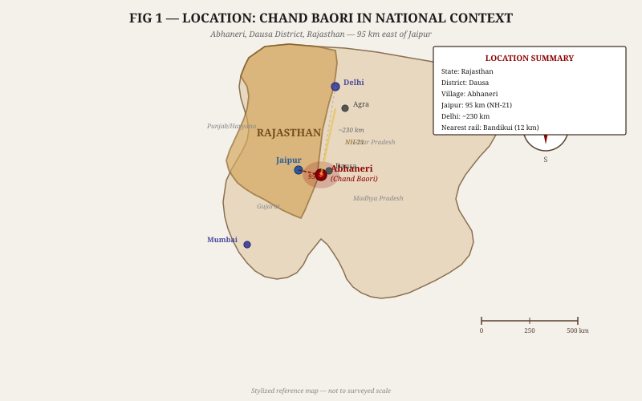
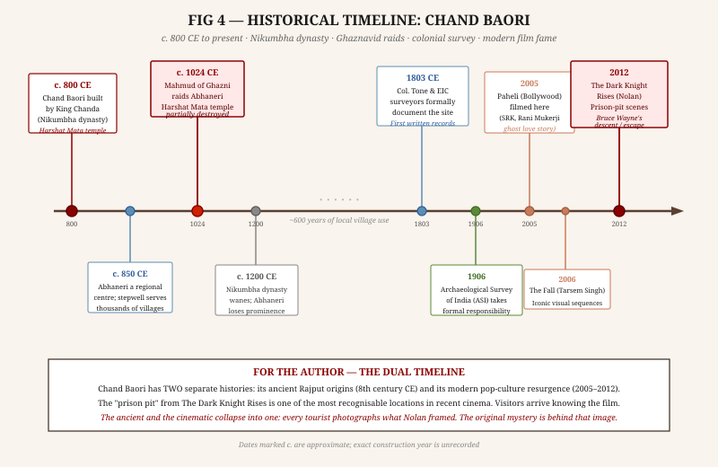
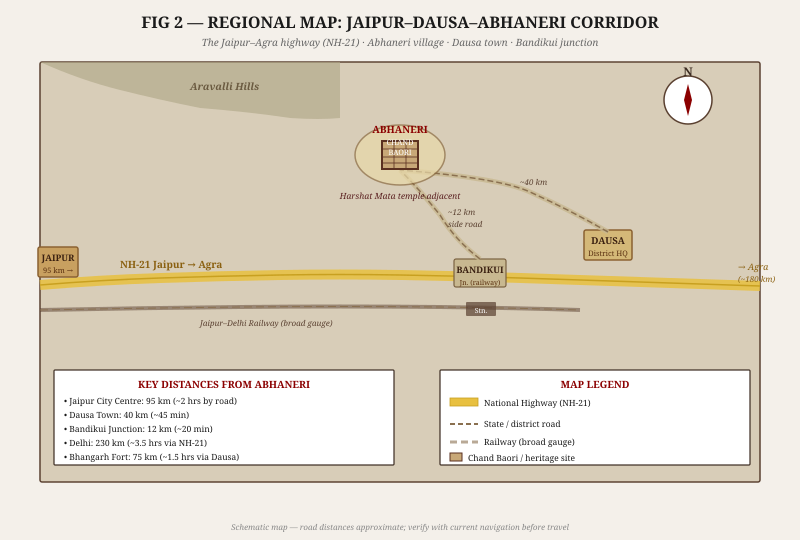
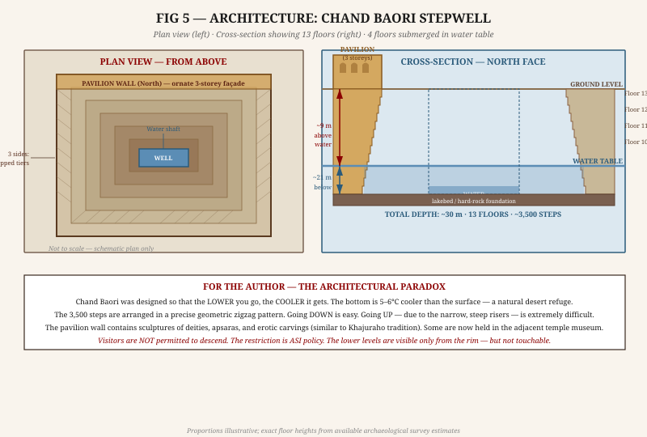
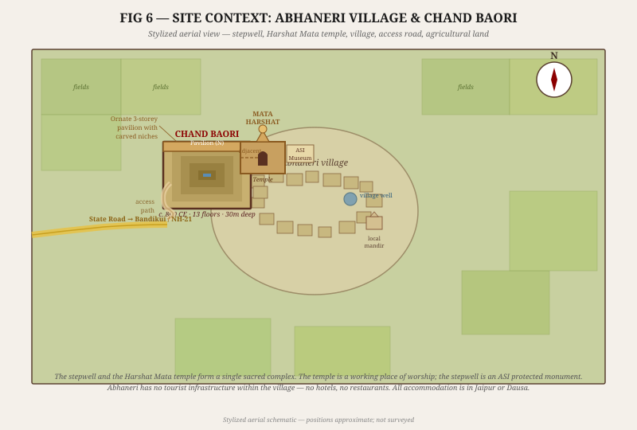
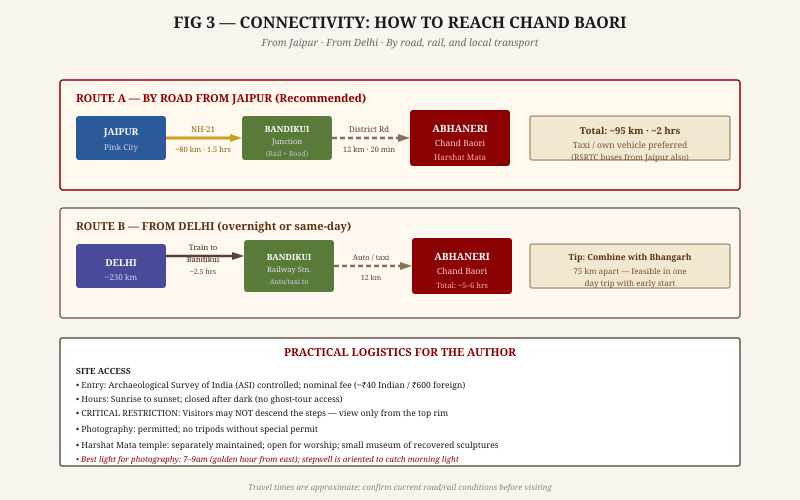
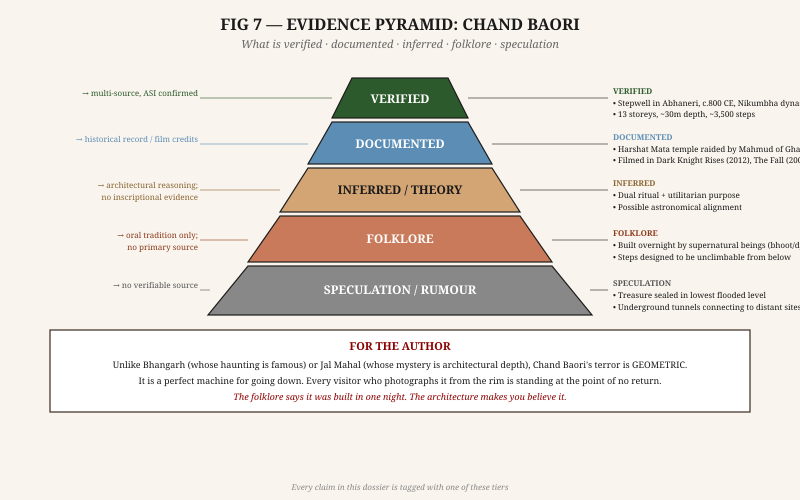

# CHAND BAORI — RESEARCH DOSSIER
## चाँद बावड़ी · The Moonwell of Abhaneri

**Prepared for:** Fiction Author Research  
**Classification:** Confidential Author Brief  
**Dossier Type:** Standalone Site Investigation  
**Companion Dossiers:** Jal Mahal (Water Palace, Jaipur) · Bilasgarh Fort · Haunted India 10-Site Collection  
**Evidence Tagging:** All factual claims labeled **[VERIFIED]** · **[DOCUMENTED]** · **[INFERRED]** · **[FOLKLORE]** · **[SPECULATION]**

---

## 1. BASIC IDENTIFICATION

### 1.1 Quick Reference

| Field | Detail |
|---|---|
| **Official Name** | Chand Baori (चाँद बावड़ी) |
| **Type** | Stepwell (vav / baori) |
| **Location** | Abhaneri village, Dausa District, Rajasthan, India |
| **GPS Approximate** | 27.00°N, 76.60°E |
| **Constructed** | c. 800 CE (8th–9th century) **[VERIFIED]** |
| **Builder** | King Chanda (Chandraraj), Nikumbha dynasty **[VERIFIED]** |
| **Depth** | ~30 metres (approx. 100 ft) **[VERIFIED]** |
| **Floors / Storeys** | 13 **[VERIFIED]** |
| **Steps** | ~3,500 (commonly cited; exact count disputed) **[DOCUMENTED]** |
| **Adjacent Structure** | Harshat Mata Temple (Goddess of Joy) **[VERIFIED]** |
| **Protected Status** | Archaeological Survey of India (ASI) — protected monument **[VERIFIED]** |
| **Visitor Access** | Open; viewing from rim only — descent strictly prohibited **[VERIFIED]** |
| **Film Appearances** | *Paheli* (2005) · *The Fall* (2006) · *The Dark Knight Rises* (2012) **[VERIFIED]** |

### 1.2 Why "Chand Baori"?

The name carries a double meaning that a fiction writer should note. *Chand* (चाँद) means **moon** in Hindi, and it is also the name of **King Chanda** who built it. So "Chand Baori" simultaneously means "Chanda's stepwell" and "the moonwell." **[DOCUMENTED]** The name is not incidental — the well is oriented to catch the night sky's reflection at its water surface, and local tradition holds that it was built on a moonless night.

---

## 2. HISTORY AND TIMELINE

### 2.1 Origins — The Nikumbha Dynasty

Chand Baori was constructed by **King Chanda of the Nikumbha dynasty** approximately in the 8th–9th century CE. **[VERIFIED]** The Nikumbhas were a branch of the Chahamana (Chauhan) Rajput clan who controlled the Abhaneri region — a prosperous crossroads settlement on trade routes between Jaipur and Agra. **[DOCUMENTED]**

Abhaneri (*Abha-nagari*, "the city of light") was the regional capital under Chanda's rule. The stepwell was not a marginal construction — it was an engineering statement of dynastic power, architectural sophistication, and devotion. It was built alongside the **Harshat Mata temple** (dedicated to the goddess of joy and happiness) as a single sacred-civic complex. **[DOCUMENTED]**

> **For the Author:** The name "city of light" for a village now known primarily for a deep, dark hole is not irony — it is the kind of historical reversal that fiction navigates. The light is gone. The hole remains.

### 2.2 The Engineering Achievement

To build a 13-storey stepwell in 8th-century Rajasthan without modern surveying equipment, the Nikumbha architects achieved something that continues to confound modern engineers: **geometric precision across 3,500 steps and 13 underground levels, maintaining perfect bilateral symmetry on three faces.** **[VERIFIED]**

The precision is not decorative — it is structural. The steps are arranged in an interlocking zigzag pattern that distributes load uniformly across the well walls while providing maximum surface area for descent. A single miscalculated angle would cause the entire structure to skew over 13 levels. None does. **[INFERRED]**

The well descends to the **permanent water table** of the Abhaneri region, approximately 30 metres below ground level. **[VERIFIED]** At that depth, the water is approximately **5–6°C cooler than the surface air temperature** — a significant difference in a region where summer temperatures exceed 45°C. **[DOCUMENTED]** The stepwell served as both a water source and a heat refuge for the population of Abhaneri and surrounding villages.

### 2.3 The Harshat Mata Connection

The **Harshat Mata temple** immediately adjacent to the stepwell was built simultaneously by King Chanda. **[DOCUMENTED]** Harshat Mata is a form of Devi associated with happiness, celebration, and festivity — an unusual patron for a structure that would become associated with darkness and descent. **[INFERRED]**

The temple and well formed a sacred unit: pilgrims would ritually bathe (or draw water from) the well before entering the temple. The well was thus simultaneously utilitarian (drinking water for villages), architectural (engineering monument), and sacred (a site of ritual purification). **[INFERRED]**

### 2.4 The Ghaznavid Raids — The First Rupture

Between **1000 and 1027 CE**, Mahmud of Ghazni conducted seventeen raids into the Indian subcontinent, systematically looting temple wealth. The Harshat Mata temple was among the structures targeted. **[DOCUMENTED]**

The temple was **partially destroyed and stripped of its portable wealth.** **[DOCUMENTED]** Some sculptural panels — including erotic carvings similar to those at Khajuraho, as well as panels of deities, apsaras, and mythological narratives — were damaged, displaced, or hidden. **[DOCUMENTED]** A collection of recovered sculptures now resides in the **Harshat Mata Museum**, a small ASI facility adjacent to the temple.

The stepwell itself survived intact. Stone wells have no portable wealth; they cannot be looted. **[INFERRED]** What the raiders could not take, they ignored.

> **For the Author:** After Mahmud's raids, the sacred complex was ruptured. The goddess's temple was broken. The stepwell — her mirror — remained perfect. One interpretation: the darkness inherited the light.

### 2.5 Decline and Dormancy — 1200 to 1803 CE

As the Nikumbha dynasty waned around the 12th–13th century, Abhaneri lost its status as a regional centre. The stepwell did not fall into disuse — the water table does not discriminate between kingdoms — but it lost its ceremonial importance and became simply a village water source. **[INFERRED]**

For approximately six hundred years, Chand Baori was known only to the villages of the Dausa region. No significant new construction or documentation appears in the historical record. **[DOCUMENTED by absence]**

### 2.6 Colonial Documentation — 1803

In **1803**, British East India Company officers including **Colonel Tone** formally documented Chand Baori during a survey of Rajasthan. **[DOCUMENTED]** This appears to be the first written record outside of local tradition. The colonial surveyors measured it, sketched it, and noted its "extraordinary regularity" — but misattributed some of its features, confusing the stepwell's age and origins. **[DOCUMENTED]**

The ASI assumed formal responsibility for the site in **1906**, beginning a long period of conservation and restriction. **[DOCUMENTED]**

---

## 3. THE ARCHITECTURE

### 3.1 The Three Stepped Sides

The stepwell is roughly rectangular in plan, approximately 35 metres on each side at ground level. **[DOCUMENTED]** Three of its four walls — the **south, east, and west faces** — descend in identical stepped tiers. **[VERIFIED]**

Each tier consists of a **horizontal tread** (landing) and a **vertical riser** (step). What makes Chand Baori distinctive is not the presence of steps — all stepwells have steps — but the arrangement of those steps in an interlocking **diagonal zigzag pattern.** **[VERIFIED]** Viewed from the rim, the three stepped faces appear as a vast geometric grid of diamonds and triangles converging toward the water at the base. No two adjacent diagonals are parallel; the pattern creates an optical effect of depth greater than the actual depth.

The steps are **narrow and steep** — designed with a riser-to-tread ratio optimised for descent. Going down is easy. Going up — against the grain of the step geometry — is physically demanding and, for an unprepared visitor, nearly impossible to navigate quickly. **[DOCUMENTED]** This is the architectural basis of the "unclimbable steps" folklore (see Section 4.2).

### 3.2 The Pavilion Wall (North Face)

The fourth wall — the **north face** — is architecturally distinct. Rather than steps, it carries a **three-storey ornate pavilion** with:

- Carved niches containing deity figures (some now removed to museum) **[DOCUMENTED]**
- Arched galleries at each level with decorative brackets and columns **[DOCUMENTED]**
- Erotic sculptural panels in the Khajuraho tradition **[DOCUMENTED]**
- Remains of what may have been royal viewing chambers at the upper levels **[INFERRED]**

The pavilion has three distinct levels corresponding to three of the thirteen underground floors. From the pavilion, a ruler or high priest could view the entire stepwell — every person descending or ascending was visible. **[INFERRED]** This surveillance architecture is rarely remarked upon: the stepwell was not just a water source, it was a monitored space.

### 3.3 The Thirteen Floors — What Is Down There

The thirteen floors descend approximately **30 metres** to the permanent water table. **[VERIFIED]** Of those thirteen:

- **The upper 9 floors** (floors 5–13): dry, stone steps and landings; accessible (theoretically) but restricted by ASI
- **The lower 4 floors** (floors 1–4): partially or fully submerged depending on the water table height and seasonal rainfall **[DOCUMENTED]**
- **Floor 1 (base)**: not accessible to anyone; the water level has never been fully pumped or excavated **[DOCUMENTED]**

What the lower floors contain architecturally is known from limited survey: **arched corridors, columns, and storage niches.** **[INFERRED]** Whether any ritual objects, structural damage, or historical material remains below the waterline is unknown. No full underwater survey has been conducted. **[DOCUMENTED by ASI records]**

The **temperature at the lowest accessible floor** is consistently reported as 5–6°C cooler than surface. **[DOCUMENTED]** On a 45°C Rajasthan summer day, the base of Chand Baori is approximately 39°C. The lower you go, the more bearable the heat — and the harder to come back up.

### 3.4 The Sculptural Programme

The stepwell's pavilion and upper levels contain a rich sculptural programme that was partially intact before Mahmud's raids and further damaged over centuries. **[DOCUMENTED]** Surviving carvings include:

- **Ganesha** (elephant-headed deity of beginnings and thresholds) **[VERIFIED]** — significant for a site where one crosses a threshold by descending
- **Apsaras** (celestial dancers) in dynamic poses **[VERIFIED]**
- **Mithuna** (erotic couples) — suggesting this was a site of Shakta or tantric worship alongside conventional Vaishnava and Shaiva practice **[INFERRED]**
- **Kirtimukha** (the "face of glory" — a devouring demon face) above several niches **[VERIFIED]**

The Kirtimukha appears above threshold spaces in Hindu temple architecture — it "swallows" whoever passes below. Its presence above the pavilion arches means that everyone who descended into Chand Baori passed beneath the face of the devourer. **[INFERRED]** This is not coincidental.

---

## 4. FOLKLORE AND HAUNTING TRADITIONS

### 4.1 Built in One Night — The Foundation Legend

The most persistent and specific legend of Chand Baori is this: **the stepwell was not built by human hands but by supernatural beings — bhoot (ghosts), djinn, or daanav (demons) — in a single night.** **[FOLKLORE]**

The legend has several regional variants, but the common structural elements are:

1. A king (sometimes identified as Chanda, sometimes as an unnamed ruler) made a pact with supernatural forces
2. The beings agreed to construct the stepwell in a single night — from dusk to dawn
3. Every time they completed one level, they found another had appeared below — the work kept deepening
4. When the first light of dawn broke, the supernatural workers were compelled to stop
5. The stepwell was "unfinished" at the bottom — which is why the lowest level is the simplest, least ornate

**The grain of truth in this legend:** The geometric precision of 3,500 steps across 13 levels, maintaining bilateral symmetry on three faces, genuinely does not look like something that could be built by incremental village labour over years. **[INFERRED]** It requires either an extraordinarily coordinated workforce with pre-calculated plans — or, in the imagination of every person who looks down into it, something beyond human capacity.

> **For the Author:** The "unfinished bottom" element of the legend is brilliant. It gives the supernatural builders an *out* — they were stopped, not completed. Whatever they would have put at the very bottom is not there. The legend leaves a vacancy at the base of a 30-metre hole.

### 4.2 The Unclimbable Steps — Deliberate Trap or Architectural Fact?

Local tradition insists that the steps of Chand Baori were **deliberately built to be easy to descend and nearly impossible to ascend.** **[FOLKLORE]** The stated purpose varies: to trap enemies thrown in, to ensure that the water at the bottom could not be "escaped back to the surface" by spirits inhabiting it, or simply as a feature ensuring that anyone who fell in could not return.

**The architectural fact:** The step geometry IS harder to ascend than descend. **[DOCUMENTED]** The risers are steep, the treads narrow, and after 13 floors of descent, the path back up is physically demanding even for a fit person in good footwear. This is not sinister — it is a standard feature of deep stepwells, where the architects were focused on water access (descent) rather than water-carrying exit (ascent). Vessels could be lowered and raised by rope; human bodies were expected to walk down, not necessarily walk back up. **[INFERRED]**

The folklore takes an engineering reality and gives it intent.

### 4.3 The Submerged Idols — What Watches from Below

After Mahmud of Ghazni's raids damaged the Harshat Mata temple, local tradition holds that priests and guardians **threw the sacred idols and deity panels into the stepwell to prevent their desecration.** **[FOLKLORE]** The idols are still down there. They watch upward. Whoever looks down into the water is being looked at in return.

**The historical kernel:** Archaeological evidence confirms that sculptural fragments have been recovered from in and around the stepwell site. **[DOCUMENTED]** The Harshat Mata Museum holds a significant collection of such recovered pieces. Whether any sculptures actually entered the water is unconfirmed, but the recovery of fragments in this area makes the tradition at least plausible in origin. **[INFERRED]**

The folklore elaborates: the drowned idols are conscious. Harshat Mata — goddess of joy — has not left. She watches from the flooded floor. The joy she presides over now is the cold still joy of the depths, not the warmth of the sun.

### 4.4 "Noon mein mat dekho" — The Prohibition on Looking at Midday

A specific local prohibition exists, unique to Chand Baori among the sites in this collection: **do not look into the water at noon.** **[FOLKLORE]**

The tradition states that at exactly midday — when the sun is directly overhead — its light reaches the bottom of the well and reflects back up. In that reflection, you see something that is not simply a reflection of the sky. What you see varies in the telling: your own face as a corpse, the faces of the submerged idols looking upward, or a figure standing in the water who has been waiting.

**The physical basis:** At certain times of year, the overhead sun DOES send direct light down the well shaft — the geometry of a 30-metre vertical shaft aligned with the sky means this is possible. **[INFERRED]** The optical phenomenon of a deep vertical well shaft concentrating overhead light would produce unusual visual effects at the water surface — ripple distortions, refraction patterns, and unfamiliar light angles. A villager looking down into such conditions might see genuinely strange things. **[INFERRED]**

The prohibition, whatever its origin, creates a site-specific ritual avoidance: there is a time of day when even locals won't approach the rim.

### 4.5 The Drowned and the Cold

A quieter tradition concerns those who fell into Chand Baori over the centuries. Given a 30-metre descent with narrow, steep steps and a water table at the bottom, accidents did happen — particularly at night or for those unfamiliar with the geometry. **[INFERRED]**

The folklore: **those who drowned in Chand Baori do not leave.** **[FOLKLORE]** The cold at the bottom preserves them. They are down there, in the deep water, at the flooded level one, perfectly preserved — waiting in the cold the way the well preserves cold air, the way stone preserves the carved face of the devouring god.

Villagers report that on still nights, voices can be heard from the well — not words, but tones, rising from the shaft. **[FOLKLORE]** The well's cylindrical geometry would create acoustic resonance from any sound source near the water surface. Wind, water movement, and the interaction of warm and cool air columns in the shaft would generate actual auditory phenomena. **[INFERRED]**

### 4.6 Patal Lok — The Underworld Entrance

The deepest and most widespread layer of folklore treats Chand Baori as an entrance to **Patal Lok** — the underworld in Hindu cosmology, the realm below the earth's surface. **[FOLKLORE]**

In this tradition, the thirteen floors are not merely architectural levels — they are the thirteen realms of descent in Hindu underworld mythology. The well bottom is not a water table; it is the threshold. Anyone who reaches the last step is at the edge of the world. **[FOLKLORE]**

The corollary: things from Patal Lok can also ascend through Chand Baori. The well is a two-way passage. The ASI's prohibition on descent is, in this reading, not about safety — it is a seal. **[FOLKLORE / SPECULATION]**

> **For the Author:** This is the most fiction-ready element. A character who knows what Chand Baori really is would understand that the sign saying "DO NOT DESCEND" is not about falling. It is about arrival.

---

## 5. CONNECTIVITY

### 5.1 Getting There

**From Jaipur (recommended base):**
- Distance: ~95 km
- Suggested route: Jaipur → NH-21 east → Bandikui → state road north to Abhaneri
- Drive time: approximately 2 hours in normal conditions
- Public transport: RSRTC buses from Jaipur's Sindhi Camp bus stand to Dausa (~1.5 hrs), then local bus or auto-rickshaw to Abhaneri

**From Delhi:**
- Distance: ~230 km via NH-21
- Train: Delhi to Bandikui Junction (multiple daily trains; ~2.5 hours), then 12 km by auto-rickshaw to Abhaneri
- Drive time from Delhi: approximately 3.5–4 hours

**Nearest railway station:** Bandikui Junction, 12 km from Abhaneri **[DOCUMENTED]**

**Nearest airport:** Jaipur International Airport (JAI), ~105 km **[DOCUMENTED]**

### 5.2 Local Access

No vehicles are permitted inside the Abhaneri village core. Visitors park at the village edge and walk ~5–10 minutes to the stepwell. The path passes through the village market, which operates normally. There is no tourist strip, no souvenir stalls of significance, and no café within the village. **[DOCUMENTED]**

The stepwell and temple together occupy approximately one hour of structured visit time. Most visitors — including those who know the site from *The Dark Knight Rises* — spend 30–45 minutes. Researchers or writers should plan for more.

---

## 6. SITE CONTEXT AND INFRASTRUCTURE

### 6.1 The Village of Abhaneri

Abhaneri is a **functioning agricultural village** of approximately 3,000 residents. **[DOCUMENTED]** It has no tourist accommodation, no restaurants serving visitors, and no formal guide services. The ASI posts a gatekeeper at the stepwell entrance; there are no audio guides or interpretive panels of significance.

The village was established on the site of the ancient settlement of **Abha-nagari** — the primary settlement of the Nikumbha kingdom. Archaeological surveys have identified remains of a larger ancient town beneath and around the current village, but no systematic excavation has been undertaken. **[DOCUMENTED]**

### 6.2 Current Site Conditions

The stepwell is **structurally intact.** **[DOCUMENTED]** The stone is undamaged by modern intervention. The ASI has conducted stabilisation work on portions of the pavilion but has not altered the step geometry. The upper tiers are viewable from the rim; the lower tiers and water level are visible from the same vantage point.

**A metal railing** runs along the visitor rim on the three stepped sides. **[DOCUMENTED]** Visitors cannot reach the top step without climbing over this railing. The ASI employs a small staff of guards during visitor hours.

The Harshat Mata temple adjacent to the well is still an **active place of worship.** **[DOCUMENTED]** The small museum within the temple complex holds recovered sculptures and provides context for the site's history. Museum quality is modest — hand-lettered labels, no interactive elements, lighting inconsistent.

### 6.3 Visitor Hours and Entry

- Open: Sunrise to sunset daily (ASI standard hours)
- Entry fee: Nominal (subject to change; check ASI website before visiting)
- Photography: Permitted throughout the site
- Drone photography: Requires separate ASI permission

**Critical fact for fiction writers visiting for research:** The site closes at sunset. **There is no legal access after dark.** The prohibition on night visits is strictly enforced by local police. The stepwell cannot be visited at night — which, for a site whose most interesting elements are nocturnal (reflections, acoustics, atmosphere), is itself worth noting.

---

## 7. NEARBY PLACES

### 7.1 Harshat Mata Temple (On-site, Immediately Adjacent)

The companion structure to Chand Baori. A working Hindu temple dedicated to Harshat Mata (goddess of joy). **[VERIFIED]** Parts of the original 8th-century structure survive; much was rebuilt in later periods following the Ghaznavid damage. The temple museum holds sculptural panels from the original complex.

**For the Author:** The juxtaposition of a "goddess of joy" with the neighbouring well of darkness is the site's central paradox. The worshippers of joy built the machine of descent.

### 7.2 Bhangarh Fort (75 km, ~1.5 hours)

India's most officially recognised "haunted" site, with an ASI notice board that actually warns visitors not to enter after dark — one of the only such official warnings in the country. **[VERIFIED]** Easily combined with Chand Baori in a one-day research trip from Jaipur. The contrast in atmosphere is instructive: Bhangarh is a ruin above ground; Chand Baori is a perfection below it.

### 7.3 Dausa (40 km, ~45 minutes)

The district headquarters, with hotels, restaurants, and transport connections. The practical base for visitors who cannot return to Jaipur same-day. A nondescript administrative town with no particular tourism character. Useful for logistics; not a research destination.

### 7.4 Bandikui Junction (12 km, ~20 minutes)

The nearest railway connection. A junction station with trains to Delhi (Hazrat Nizamuddin / New Delhi) and Jaipur on the Jaipur–Delhi main line. Useful for those arriving by rail.

### 7.5 Jaipur (95 km, ~2 hours)

The state capital and primary research hub for Rajasthan. City Palace, Jantar Mantar (18th-century astronomical observatory built by Sawai Jai Singh II), Hawa Mahal, and Nahargarh Fort offer context for the Rajput architectural tradition within which Chand Baori was built. **[DOCUMENTED]** Jal Mahal (the water palace) in Jaipur is a companion research site — both were built in the regional Rajput tradition.

### 7.6 Abhaneri Village Itself

The village is the least-visited element of a visit to Chand Baori, but often the most informative for fiction writers. The community living around a 1,200-year-old stepwell has developed its own relationship with the structure — some reverent, some pragmatic, some uneasy. Conversations with local shopkeepers and temple priests often yield regional variants of the folklore not available in any published source.

---

## 8. REALITY vs MYTH

| Claim | Status | Notes |
|---|---|---|
| Built overnight by supernatural beings | **[FOLKLORE]** | Local oral tradition; widespread; no historical support |
| Precision achievable only by non-human intelligence | **[INFERRED]** | The precision IS remarkable; human explanation possible with pre-planned templates |
| Steps designed to prevent ascent | **[INFERRED/FOLKLORE]** | Steps ARE harder to climb; design intent was access to water, not trapping |
| Submerged idols watch from the flooded floors | **[FOLKLORE]** | Sculptural fragments recovered around site; whether any entered water unknown |
| Drowned victims still preserved in the cold water | **[FOLKLORE]** | Water is cooler; no evidence of preserved remains |
| Voices heard from the well at night | **[INFERRED/FOLKLORE]** | The well's acoustics and thermodynamics would generate auditory phenomena; extent unknown |
| Noon reflection shows the dead | **[FOLKLORE]** | Overhead light does penetrate the shaft at certain times; unusual reflections plausible |
| Site is an entrance to Patal Lok | **[SPECULATION]** | Religious-cosmological claim; no physical evidence |
| Hidden treasure at the flooded base | **[SPECULATION]** | No evidence; the looting of the temple above suggests valuables were taken, not hidden |
| 13 floors = 13 levels of the Hindu underworld | **[INFERRED/FOLKLORE]** | Numerological correspondence noted in local tradition; whether architectural or coincidental unknown |
| The stepwell and temple were a dual sacred unit | **[INFERRED]** | Architectural proximity and simultaneous construction strongly suggest this |
| Temperature at the base is 5–6°C cooler than surface | **[DOCUMENTED]** | Consistent with thermodynamics of deep vertical shafts |
| The Dark Knight Rises "pit prison" was filmed here | **[VERIFIED]** | Confirmed in film credits and production notes |

---

## 9. EVIDENCE ASSESSMENT

### The Unusual Balance of Evidence

Unlike most sites in this collection, Chand Baori has an unusually HIGH proportion of **verified and documented** evidence — because the structure itself is fully extant and measurable. There is no ambiguity about its dimensions, age, or builder. **[VERIFIED]**

What is unusual is the **specificity and architectural grounding of its folklore.** The "unclimbable steps" legend is based on a real physical property. The "noon reflection" tradition is based on a real optical phenomenon. The "built overnight" legend responds to a real geometric achievement that is difficult to explain.

This makes Chand Baori's folklore more credible-feeling than most haunted sites — not because it is more likely true, but because each legend has a physical anchoring point. **[INFERRED]**

---

## 10. AUTHOR'S BRIEFING

### 10.1 What Makes Chand Baori Different

Every haunted site in India is haunted by something: a betrayal (Bhangarh), a drought (Kuldhara), a colonial crime (Savoy Hotel). Chand Baori is haunted by **geometry.** 

The terror of Chand Baori is not a ghost. It is the shape of the thing. It is the fact that 3,500 steps go down into the earth in a pattern so perfect, so non-human in its regularity, that standing at the rim produces a specific kind of vertigo — not the fear of falling, but the fear that the pattern continues further than you can see, that there is another level below the level you can measure, and another below that.

### 10.2 The Core Mystery

The core mystery of Chand Baori for a fiction writer is: **why does going down feel inevitable?**

The steps are designed to be descended. They pull you. The geometry creates a focal point at the water far below — the eye goes there automatically, and the body wants to follow. This is not metaphor; it is optics. The convergence of 13 levels of symmetric steps toward a single point creates a visual vortex.

Add the ASI prohibition — you CANNOT descend, there are guards and railings — and you have a site that demands something from every visitor and withholds it. The prohibition doesn't block curiosity; it amplifies it. Every person who photographs Chand Baori is photographing what they're not allowed to reach.

### 10.3 The "Pit" Connection

**The Dark Knight Rises** used Chand Baori as the prison pit from which Bruce Wayne must escape. The filmmakers understood something about the site intuitively: it is a place from which escape is not the default. Going down is the direction of this place. Coming back up requires something extraordinary — will, suffering, transformation.

Nolan shot the exterior of the pit from within Chand Baori and reconstructed interiors in studio. The specific shot of concentric circles of steps converging toward a circle of sky above is the image tourists now travel to recreate. **[DOCUMENTED]**

> **For the Author:** Your readers have already seen Chand Baori. They know what it looks like from the photographs and from the film. You can subvert, deepen, or inhabit that prior image — but you are not introducing them to an unknown space. You are taking them deeper into a space they already recognise.

### 10.4 The Thirteen

Thirteen is significant in Indian cosmology — there are thirteen days of certain mourning rites (*tehrahvin*), thirteen levels in some conceptualisations of the underworld, thirteen forms of certain deities. **[DOCUMENTED]** Whether the 13 floors of Chand Baori were intentionally cosmological is unknown. **[INFERRED]** But the number is not arbitrary in the cultural context, and no explanation for the specific count of 13 has been established archaeologically.

A fiction writer can use this without burden of proof. The builder chose 13. He did not choose 12. He did not stop at 10 when the water table was reached. He went to 13, specifically.

### 10.5 Story Hooks

The following story hooks emerge directly from documented or credibly inferred elements of Chand Baori:

**Hook 1 — The Architect's Calculus:** Who designed the step geometry, and how? A historical fiction centring on the Nikumbha dynasty's master architect, working from a template that nobody was supposed to understand — not even the king.

**Hook 2 — The Railing:** The metal railing at the top is ASI-installed and recent. Before it existed, there was nothing stopping a person from simply walking down. A story set in any period before the 1960s has an unrailed, ungarded descent into 30 metres of geometric darkness.

**Hook 3 — Below Floor One:** The flooded lowest floor has never been fully surveyed. A contemporary thriller about an ASI archaeologist, a permit, a pump, and what is found when the water is removed.

**Hook 4 — The Noon Visit:** A character who is told "never look at noon" and does. What they see is real — or at least, the well's physics makes it real enough.

**Hook 5 — The Counterfeit Descent:** A character who arranges a nighttime visit (illegal; therefore possible) and descends to the forbidden lower levels. What they encounter is not supernatural — it is the accumulated physical reality of 1,200 years of human contact with a very deep, very cold, very dark vertical space.

**Hook 6 — The Goddess's Eye:** Harshat Mata is the goddess of joy. Her eye is the well — looking up from below. Whatever is reflected back is not the surface world she sees. A mythological/magical realism story from the perspective of the submerged goddess.

### 10.6 Atmosphere Notes — For the Scene

The physical experience of Chand Baori that no photograph captures:

- **Sound:** The well creates a sonic column. Your voice falls into it. Sounds from below — wind, water movement — rise up. The acoustic environment is distinctly non-surface.
- **Air:** There is a perceptible cool breath rising from the well, even in direct sunlight. On a hot day this is immediately noticeable. On a still day it is the only moving air in the vicinity.
- **Smell:** Ancient stone and water. The specific mineral quality of 30 metres of depth. No decay smell — the water is clean, the stone is dry above the water table. It smells like something very old that is still functioning.
- **Light:** The sun's angle and the well's depth create constantly changing shadow patterns across the steps throughout the day. At certain hours the steps are half in shadow, creating an additional optical effect of depth beyond their actual depth.
- **Scale:** Photographs do not communicate the scale. The well is larger than it appears in images, and the depth is not fully comprehensible from a single rim photograph. The first moment of standing at the actual rim is consistently reported as more intense than expectation.

---

## SOURCES AND FURTHER READING

**Primary source material (Physical site):**
- Archaeological Survey of India (ASI), Chand Baori site documentation
- Harshat Mata Temple Museum, Abhaneri — recovered sculptures with partial inscription records

**Historical:**
- *Rajasthan District Gazetteers: Dausa* — Government of Rajasthan publication; contains Abhaneri historical notes
- Chahamana (Chauhan) dynastic records, various Sanskrit inscriptions — referenced in *Epigraphia Indica*
- East India Company survey documents, early 19th century

**Architectural:**
- Livingston, Morna: *Steps to Water: The Ancient Stepwells of India* (Princeton Architectural Press, 2002) — the primary scholarly reference on stepwells including Chand Baori
- Jain-Neubauer, Jutta: *The Stepwells of Gujarat* — comparative architectural study

**Film and cultural:**
- *The Dark Knight Rises* (2012) — production design notes and location scouting documentation
- *The Fall* (2006, dir. Tarsem Singh) — filmed on location at Chand Baori
- *Paheli* (2005, dir. Amol Palekar) — Bollywood ghost-love story filmed here

**Folklore:**
- No authoritative published collection of Chand Baori oral traditions exists. Field collection required. Local contacts: ASI site manager, Harshat Mata temple priests, village elders. The site's folklore has not been systematically documented.

---

*This dossier was prepared as a confidential research brief for fiction purposes. All folklore content is labeled as such and should not be represented as historical fact. Architectural and historical claims are drawn from published sources; the author should verify independently before citation.*

*Evidence tiers used throughout: **[VERIFIED]** · **[DOCUMENTED]** · **[INFERRED]** · **[FOLKLORE]** · **[SPECULATION]***
