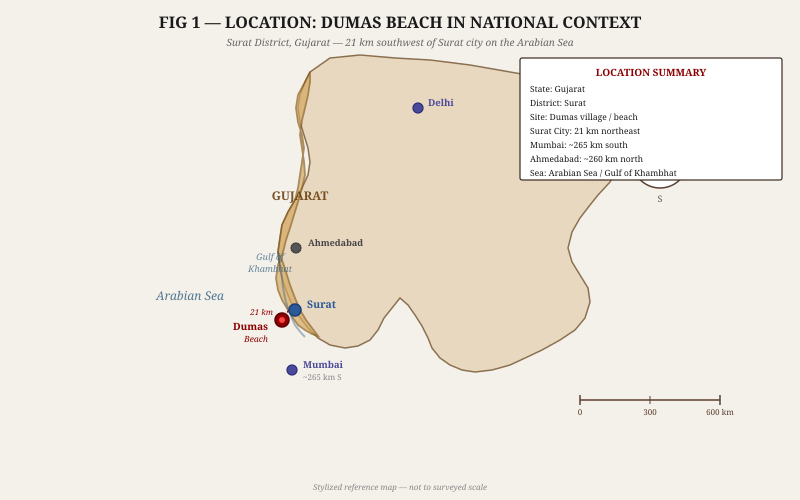
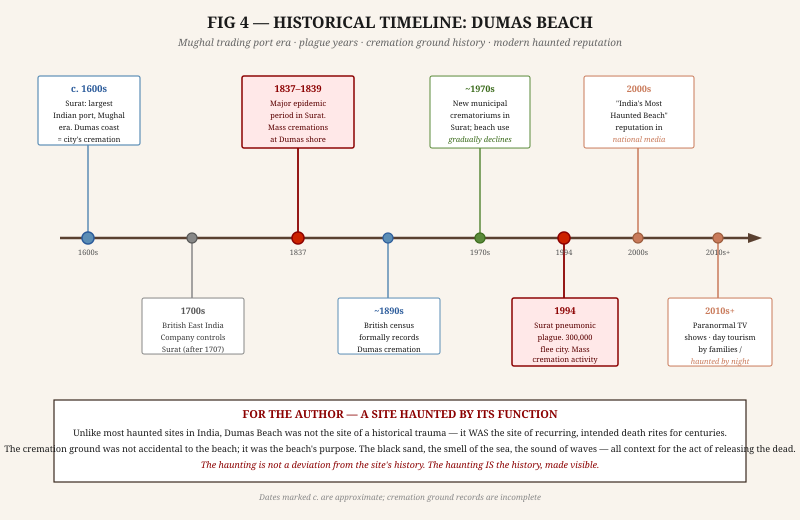
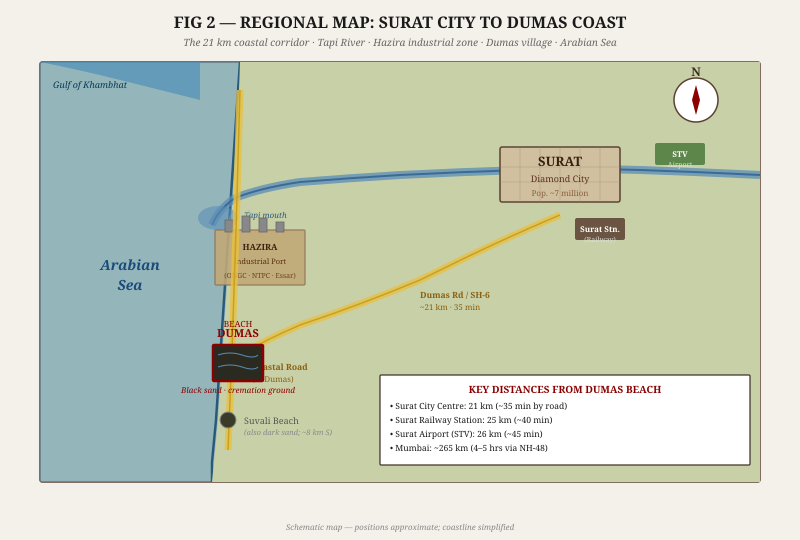
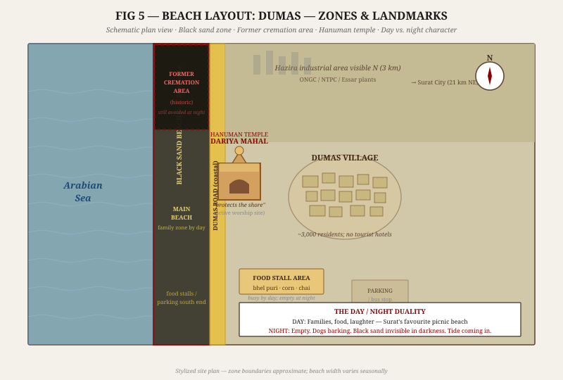
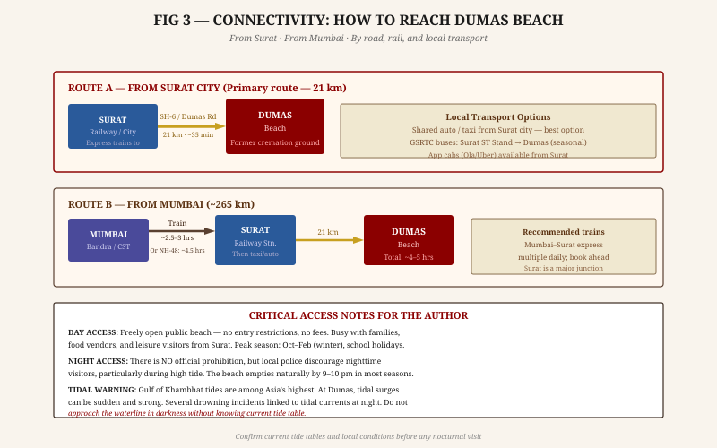
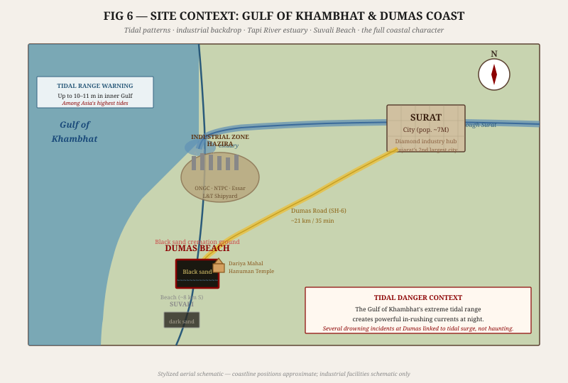
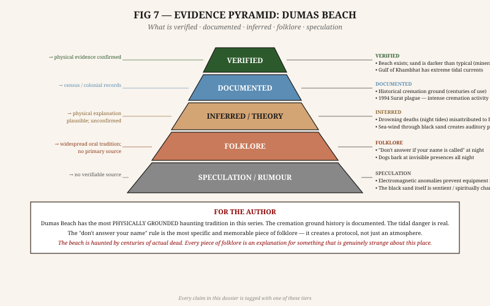

# DUMAS BEACH — RESEARCH DOSSIER
## India's Most Haunted Shore · Black Sand · Surat, Gujarat

**Prepared for:** Fiction Author Research  
**Classification:** Confidential Author Brief  
**Dossier Type:** Standalone Site Investigation  
**Companion Dossiers:** Jal Mahal · Chand Baori · Bilasgarh Fort · Haunted India 10-Site Collection  
**Evidence Tagging:** All factual claims labeled **[VERIFIED]** · **[DOCUMENTED]** · **[INFERRED]** · **[FOLKLORE]** · **[SPECULATION]**

---

## 1. BASIC IDENTIFICATION

### 1.1 Quick Reference

| Field | Detail |
|---|---|
| **Official Name** | Dumas Beach (ડુમસ બીચ) |
| **Type** | Public beach; former cremation ground |
| **Location** | Dumas village, Surat District, Gujarat, India |
| **GPS Approximate** | 21.10°N, 72.71°E |
| **On:** | Arabian Sea coast (Gulf of Khambhat approach) |
| **Distance from Surat City** | 21 km southwest **[VERIFIED]** |
| **Sand Colour** | Notably dark — charcoal-grey to near-black **[VERIFIED]** |
| **Historical Function** | Primary cremation ground (shamshan ghat) for Surat's Hindu community for centuries **[DOCUMENTED]** |
| **Current Status** | Public beach; free access; popular day tourism destination **[VERIFIED]** |
| **Hanuman Temple** | Dariya Mahal Hanuman Mandir — active place of worship on the beach **[VERIFIED]** |
| **Paranormal Designation** | Widely described as "India's most haunted beach" in national media **[DOCUMENTED]** |
| **Tidal Warning** | Gulf of Khambhat extreme tidal currents — dangerous especially at night **[VERIFIED]** |

### 1.2 The Name — What Dumas Means

"Dumas" (ડુમસ) is the name of the village at this location. The village name predates the beach's paranormal reputation and has no direct meaning related to death in Gujarati or Hindi. The beach takes its name from the village. **[DOCUMENTED]**

However: in Hindi, *dhoom* (धूम) relates to smoke, and some local etymological traditions connect the name to the smoke of centuries of cremation fires visible from the sea. This is contested and likely folk etymology. **[FOLKLORE]** Fishermen navigating the coast during the Mughal era reportedly used the cremation fires as a navigational landmark — the *dhoom* (smoke) that marked the shore of Surat. **[INFERRED]**

---

## 2. HISTORY AND TIMELINE

### 2.1 Surat — The City Behind the Beach

To understand Dumas Beach, you must understand **Surat.** For much of the 16th through early 18th century, Surat was the most important port in the Indian subcontinent — the primary gateway for the Hajj pilgrimage from India, the first major British and Portuguese trading post, and the centre of Mughal maritime trade. **[DOCUMENTED]**

A city of this scale produced enormous numbers of deaths — from trade, conflict, epidemic, and ordinary attrition — and those deaths required cremation. The Hindu tradition of cremation near water meant that the coast south of Surat, particularly the long stretch now known as Dumas Beach, served as the city's primary cremation ground (shamshan ghat) for a period that spans several centuries. **[DOCUMENTED]**

> **For the Author:** Consider the arithmetic. A city of hundreds of thousands of people, with a cremation ground serving it continuously for 300-400 years. The count of cremations that took place on this beach runs into the hundreds of thousands. It is not metaphor to say the dead outnumber the living here. It is arithmetic.

### 2.2 The Cremation Ground — How It Worked

A Hindu shamshan ghat is not simply a place where bodies are burned. It is a ritually significant liminal zone — the threshold between the living world and the world of the ancestors. **[DOCUMENTED]** Hindu death ritual specifies that the body should be cremated on the banks of a river or at the edge of a body of water, so the ashes and remains can be immersed. **[DOCUMENTED]**

For Surat's Hindu community, Dumas Beach provided both elements: the sea (for immersion) and the open space (for the funeral pyre). **[INFERRED]** Families would bring the body from the city, perform the cremation rites on the beach, and immerse the ashes in the Arabian Sea. The tide would carry them into the Gulf of Khambhat and out.

The scale of use intensified during epidemic periods. **Surat's history includes multiple major outbreaks**, notably during the 17th century when plague and cholera repeatedly struck the port city through its international trade connections. During these periods, the cremation grounds at Dumas would have been in near-continuous use. **[DOCUMENTED]**

### 2.3 The 1994 Plague — The Most Recent Intensification

In **September 1994**, Surat experienced an outbreak of **pneumonic plague** — the most serious plague outbreak in modern India. **[VERIFIED]** The city panicked: within days, an estimated **300,000 to 400,000 people fled Surat** by train and road, carrying the disease risk with them across India. **[VERIFIED]** The international health response was immediate; flights to and from India were halted by multiple countries.

The death toll in Surat itself was approximately **56 confirmed deaths**, though the full count including unreported cases was likely higher. **[DOCUMENTED]** For those who died in Surat during those weeks, cremation could not wait. The municipal cremation facilities were overwhelmed; families reverted to traditional waterside cremation. Dumas Beach, as the historic site, received additional use. **[INFERRED]**

The 1994 plague left a cultural scar on Surat. Anyone in the city old enough to remember it has a specific, visceral memory of mass death and abandonment. This recent history — within living memory — has added a layer to Dumas Beach's reputation that is not merely ancient tradition but personal and parental. **[INFERRED]**

### 2.4 The End of the Cremation Ground

As Surat modernised in the 1970s–1990s, the city built **formal electric crematoriums** within the city limits. **[DOCUMENTED]** The use of Dumas Beach as a cremation site gradually declined and eventually ceased as the primary function, though the beach retained — and retains — its religious and ritual significance for the community. **[DOCUMENTED]**

The beach is no longer a working shamshan ghat. But the land does not forget its function simply because the function has moved. **[INFERRED]**

---

## 3. THE BLACK SAND

### 3.1 What It Actually Is

The sand at Dumas Beach is genuinely, measurably darker than typical beach sand. **[VERIFIED]** This is not photographic trickery or visitor imagination.

The scientific explanation: the sand contains a high proportion of **heavy minerals**, particularly **magnetite** (black iron oxide), **ilmenite** (iron-titanium oxide), and **garnet**. **[INFERRED — based on mineralogical composition of Gujarat coastal geology]** These dark-coloured minerals are resistant to weathering and concentrate on certain beaches through wave action and longshore drift. Several beaches along the Gulf of Khambhat coast, including nearby Suvali Beach, share this mineral-dark character. **[DOCUMENTED]**

Heavy mineral deposits in beach sand are entirely normal in geologically appropriate settings. The Gujarat coast has the relevant geology. **[INFERRED]**

### 3.2 What People Believe It Is

The dark sand is explained locally as **the accumulated ash of centuries of cremation.** **[FOLKLORE]** Hundreds of thousands of cremations over 400 years have blackened the sand permanently. The dead have left their mark on the ground itself.

The belief is factually incorrect as a primary cause — the sand's dark colour predates the cremation ground and is geological in origin. **[INFERRED]** But it is culturally true in a more important sense: this beach has been associated with the dead for so long that the ground's visual character has been absorbed into the mythology. The sand looks like ash. The historical function was ash production. The connection is emotionally coherent even if mineralogically wrong.

### 3.3 Physical Properties of the Black Sand

Two physical properties of the dark sand are particularly relevant to the atmosphere of the place:

**Heat absorption:** Dark sand absorbs significantly more solar radiation than light sand. By afternoon, the sand at Dumas is **noticeably hotter than lighter beaches**, to the point of being uncomfortable to walk on barefoot. **[INFERRED — standard physics of dark vs. light surfaces]** On a 42°C Gujarat day, the sand surface temperature at Dumas can reach 55–60°C.

**Night cooling:** After sunset, the same dark sand cools rapidly — faster than light sand. Within an hour of darkness, the beach surface is cold. The temperature contrast between the hot sand of the afternoon and the cold sand of the evening is stark. **[INFERRED]** Visitors who arrive at sunset note the sudden chill from the sand even when the air remains warm.

This temperature cycle — burning hot by day, cold by night — is a physical property of the black sand, not a supernatural one. But it contributes directly to the atmosphere that the haunting tradition describes: the place that is warm and alive during daylight becomes cold and strange after dark. The sand itself changes its nature at night.

---

## 4. FOLKLORE AND HAUNTING TRADITIONS

### 4.1 "Mat suno" — The Rule of Non-Response

The single most distinctive, specific, and memorable piece of folklore at Dumas Beach is this: **if you hear someone call your name while walking on the beach at night, you must not respond.** **[FOLKLORE]**

The rule is specific:
- Not a general warning to be careful
- Not "don't go at night"
- The prohibition is on **answering the call** specifically — on engaging with whatever called you

The folklore specifies consequences of answering: you are drawn toward the water and do not return. The spirit that called your name has claimed you by establishing response — by getting you to acknowledge that you heard, that you are present, that you can be reached. **[FOLKLORE]**

The structural logic of this rule is embedded in the broader belief in Hindu folk tradition that the dead maintain a liminal existence and can, under certain conditions, call to the living. The living must not engage — to engage is to step across the threshold. **[DOCUMENTED — standard framework in regional folklore]**

> **For the Author:** This is perfect narrative material because it creates a rule the reader and protagonist both know, and the entire tension of a night scene is whether the rule holds. The voice doesn't need to be supernatural to be terrifying. The terror is in the response. A character who turns around has already lost something, regardless of what they see.

**Variant of the rule:** Some versions specify that you should not only not answer — you must not **look back.** The double prohibition (don't answer, don't look) echoes classical mythology (Orpheus and Eurydice; Lot's wife). This is not coincidental — it is the near-universal structure of encounters between the living and the dead across cultures. Dumas Beach has localized a universal rule. **[INFERRED]**

### 4.2 The Dogs

The most consistently reported phenomenon at Dumas Beach — reported by visitors, locals, and skeptics — is the **behaviour of stray dogs at night.** **[DOCUMENTED — consistent across multiple independent accounts]**

Dumas Beach, like most Indian public spaces, has a population of stray dogs. During the day, these dogs behave normally — sleeping in the shade, approaching visitors for food, occasionally fighting. At night, multiple visitors report: **the dogs bark continuously into empty space, oriented toward the water or toward areas of the beach where no visible presence exists.** **[DOCUMENTED — multiple visitor accounts]**

The interpretation varies:

- **Scientific/skeptical:** Dogs hear and smell things humans cannot — marine mammals, seabirds, subsurface sounds, tidal movements. Their nocturnal behaviour may reflect entirely non-supernatural stimuli. **[INFERRED]**
- **Local belief:** Dogs can see the dead. They are barking at the spirits of those cremated here, who return each night. **[FOLKLORE]**
- **For the Author:** The dogs are the most reliable detail. They are there. They do bark. Whatever they are barking at, they are doing so. The explanation is secondary to the observation.

### 4.3 The Voices in the Wind

Visitors to Dumas Beach at night report hearing **voices, whispers, and sometimes their own names** carried on the sea wind. **[DOCUMENTED — multiple visitor accounts]** This is distinct from hearing something recognisably speech-like; the reports describe a quality of sound that is more than wind but not clearly human.

**Physical basis:** The combination of:
1. Sea breeze moving across heavy-mineral sand (which has different acoustic properties from quartz sand) **[INFERRED]**
2. Wave sounds creating complex acoustic patterns
3. The absence of ambient urban noise at night (the beach empties, the road quiets)
4. The psychological priming of visiting a site known for voices

...creates conditions in which the human auditory system, pattern-seeking by nature, interprets ambiguous stimuli as voices. **[INFERRED]** This is not dismissal — it is how the human auditory system works. At Dumas Beach, the conditions for auditory pareidolia are near-ideal.

The specific claim that a voice calls your name is folklore, but the reports of voice-like sounds are wide enough to be treated as a consistent experiential feature of the site. **[INFERRED]**

### 4.4 The Walking Figures

A less consistent but persistent tradition describes **visible figures on the beach at night** — forms moving between the shoreline and the food stall area, visible from a distance but disappearing when approached. **[FOLKLORE]**

The most common variant: a white-clad figure near the waterline, walking slowly. Observers approach; the figure is gone when they reach the spot.

**Physical basis:** The white garments of the dead (in Hindu tradition, the shroud is white; mourners often wear white) are cognitively loaded for anyone from this cultural background. A distant figure in the dark, dressed in light clothing, near a cremation shore — the interpretation is primed before the observation occurs. **[INFERRED]**

Additionally, the beach has genuine optical distortions at night: the dark sand reduces contrast, the moonpath on water creates backlighting effects, and sea mist is common in certain seasons. **[INFERRED]**

### 4.5 The Tide as Agency

Local tradition holds that the sea at Dumas Beach is **not passive** at night — it actively **pulls** certain visitors toward the water. **[FOLKLORE]** The tide comes in faster, more powerfully, and more silently than at other beaches. People who go too close to the waterline after dark find themselves suddenly in water when they were certain they were on dry sand.

**Physical basis:** The Gulf of Khambhat's tidal system is among the most powerful in Asia, with tidal ranges up to 10–11 metres in the inner Gulf. **[VERIFIED]** At Dumas Beach, while tidal range is less extreme than the inner Gulf, the tidal currents are significant and the tide can advance rapidly across the flat beach terrain. **[DOCUMENTED]** Multiple drowning incidents at Dumas Beach have been attributed to visitors misjudging the tide's speed and reach at night. **[DOCUMENTED — local police records]**

The folklore is a culturally encoded version of a real physical danger. The sea does pull people in. People do not return. Whether the cause is supernatural agency or tidal physics is the distinction between the two frames — but the effect (people going into the sea at night at Dumas and not coming back) is documented. **[INFERRED]**

### 4.6 The Former Cremation Zone — The Northern Beach

The northern section of Dumas Beach, closer to the Hazira industrial area, is widely understood by locals to be the **primary former cremation area** — the specific ground where pyres burned for centuries. **[FOLKLORE — local tradition; exact boundaries not archaeologically defined]**

Even visitors who are otherwise skeptical of the haunting tradition report feeling differently in the northern section of the beach. It is less visited, less developed (no food stalls), and the proximity to the Hazira industrial skyline adds an additional layer of wrongness to the atmosphere. **[DOCUMENTED — visitor accounts]**

Local tradition: this section of the beach is **not visited at any time of night**. Not by believers in the supernatural, not by those who simply know Dumas well. The avoidance is instinctive and consistent. **[DOCUMENTED]**

### 4.7 The Hanuman Temple's Role

The **Dariya Mahal Hanuman Mandir** (the "sea palace" Hanuman temple) on the beach is not incidental to the haunting tradition — it is the **active counterpoint.** **[DOCUMENTED]**

Local belief holds that the temple's presence provides protection: the deity Hanuman (associated with strength, protection, and the ability to mediate between worlds) stands between the living visitors on the beach and whatever occupies the water and the sand. **[FOLKLORE]** The temple is the lit point on the dark beach — the warm yellow of its lights visible from far down the sand at night.

In the logic of the folklore: visitors who stay near the temple are safer. Those who walk away from it, toward the water and toward the dark northern section, leave the zone of protection. **[FOLKLORE]**

This creates a spatial moral geography for the beach: the south end, near the temple and the food stalls, is the human zone. The north end, near the water and the former cremation area, is the other zone. The middle is the crossing.

---

## 5. CONNECTIVITY

### 5.1 Getting There

**From Surat City:**
- Distance: 21 km via Dumas Road (SH-6)
- Drive time: approximately 35 minutes in normal traffic
- App cabs (Ola, Uber) available from Surat; shared autos from Surat city centre
- GSRTC state buses: Surat Central Bus Stand to Dumas (seasonal service; confirm schedule)
- Auto-rickshaw from Surat: readily available; negotiate fare

**From Mumbai:**
- Distance: ~265 km via NH-48
- Train: Multiple daily trains Mumbai (Bandra Terminus / CSMT) to Surat — travel time 2.5–3.5 hours; Surat is a major junction on the Mumbai-Ahmedabad railway line
- Drive: Approximately 4.5 hours by road

**Nearest railway station:** Surat, 25 km **[VERIFIED]**  
**Nearest airport:** Surat International Airport (STV), ~26 km **[VERIFIED]**

### 5.2 At the Beach

No entry fee. No restricted access by day. The beach is a public space with food vendors, seasonal markets, and regular family visitors. Parking available near the food stall area at the southern end.

The Hanuman temple is open to visitors and active.

**Night situation:** There is no official prohibition on visiting the beach after dark, but:
- The food stalls close by approximately 9–10 pm
- The beach empties naturally; no artificial lighting exists on the sand itself
- Local police patrol the coastal road and discourage groups of visitors heading to the beach late at night
- Tide tables are not posted at the beach; visitors unfamiliar with the tidal patterns face genuine risk

---

## 6. SITE CONTEXT AND INFRASTRUCTURE

### 6.1 The Day Face of Dumas

This is critical information that no ghost-hunting article ever emphasises: **Dumas Beach is one of Surat's most popular leisure destinations.** **[VERIFIED]**

During the day — particularly on weekends, public holidays, and winter months — the beach is busy with:
- Families from Surat with children; picnics and leisure
- Bhel puri, corn, chai, and snack stalls
- Seasonal melas (fairs) with rides and entertainment
- Young couples and friend groups
- Sunrise visitors (Surat residents who make early morning walks here)

The beaches is cheerful, warm (literally — see Section 3.3 on heat absorption), and completely ordinary in the daytime. The contrast with its night character is not subtle. The same beach that hosts a bhel puri stall and children building sand castles in the afternoon is empty, dark, and cold by 10 pm.

### 6.2 The Industrial Backdrop — Hazira

The Hazira industrial zone, approximately 3 km north of the main Dumas Beach area, houses **ONGC (Oil and Natural Gas Corporation) facilities, NTPC power plants, Essar Steel (ArcelorMittal Nippon), and L&T Shipyard,** among others. **[VERIFIED]**

The industrial skyline visible from the northern end of Dumas Beach is atmospheric in a way that no ghost story mentions but every photograph shows. The cranes, chimneys, and flare stacks of Hazira provide a backdrop to the "most haunted beach" that is distinctly 21st century. The juxtaposition — medieval cremation ground tradition, modern heavy industry — is the visual character of this coast. **[DOCUMENTED]**

Fiction writers should note: the Hazira complex means there is a persistent **orange glow on the northern horizon at night** — the combined lighting of a major industrial facility. The beach at Dumas is not truly dark in all directions; the north glows orange, the south has the faint lights of the Hanuman temple, and the west is the black Arabian Sea. The darkness is directional.

### 6.3 The Tapi River and Estuary

The **Tapi (Tapti) River** runs through Surat and empties into the sea approximately 3 km north of Dumas Beach. **[VERIFIED]** The river's outflow affects the coastal current pattern — the water near Dumas is not clean ocean water but a mix of riverine and marine. The estuary creates complex water movement patterns that contribute to the Gulf of Khambhat's already complex tidal behaviour in this area. **[INFERRED]**

The river's historical importance: Surat's wealth came from its position on the Tapi, which provided fresh water, riverine trade, and the maritime connection. The river and the sea together made Surat. The cremation ground at Dumas was specifically at the point where the river's energy (the living water flowing from the interior) met the sea's energy (the water that takes things away). **[INFERRED]**

---

## 7. NEARBY PLACES

### 7.1 Dariya Mahal Hanuman Temple (On-site)

The "sea palace" Hanuman temple is directly on the Dumas beach frontage, in the central section. **[VERIFIED]** Active place of worship, particularly busy on Tuesdays and Saturdays (auspicious days for Hanuman worship). The temple holds regular aartis; the bells and chanting are audible from the beach. For a fiction writer, note: the sound of temple bells from this temple at dusk, on an otherwise empty beach, creates a specific acoustic and emotional effect that resists description without experiencing it.

### 7.2 Suvali Beach (8 km south)

A similarly dark-sand beach further down the coast, near the mouth of the Gulf of Khambhat. **[DOCUMENTED]** Less visited, less developed, and with a similar local reputation for strangeness. Also has a significant stray dog population that behaves unusually at night. Considered by some local traditions to be the "outer boundary" of the Dumas haunting zone. The sand at Suvali is sometimes described as even darker than Dumas.

### 7.3 Surat City (21 km northeast)

One of India's fastest-growing cities; Gujarat's second largest. **[DOCUMENTED]** The diamond-polishing capital of the world (estimates suggest 90% of the world's cut diamonds pass through Surat). **[VERIFIED]** The city has:
- Surat Castle (14th century Portugese-era fort)
- Dutch Cemetery (17th century; one of the oldest European cemeteries in India)
- Chintamani Jain Temple
- Saputara Hill Station nearby (a day trip from Surat)

For fiction research, the **Dutch Cemetery** in Surat is worth a visit — it contains graves of Dutch, British, and other European merchants from the 17th–18th century, some of whom died in the very epidemics that would have filled the Dumas cremation ground during the same period.

### 7.4 Hazira (3 km north)

The industrial zone. No particular tourism significance, but context for understanding the contemporary character of this coast. The L&T shipyard is building some of India's naval vessels here. **[DOCUMENTED]** The contrast between medieval cremation tradition and active naval shipbuilding, on the same stretch of coast, is the kind of detail fiction processes more honestly than history.

---

## 8. REALITY vs MYTH

| Claim | Status | Notes |
|---|---|---|
| Sand is darker than typical beaches | **[VERIFIED]** | Mineralogical explanation: magnetite, ilmenite, garnet |
| Sand darkened by cremation ash | **[FOLKLORE]** | Historically appealing; mineralogically incorrect as primary cause |
| Beach was a cremation ground for centuries | **[DOCUMENTED]** | Consistent across census records, local tradition, colonial documentation |
| 1994 plague intensified cremation at Dumas | **[INFERRED]** | Plague documented; reversion to beach cremation during overload plausible |
| Hearing your name called at night — don't answer | **[FOLKLORE]** | Most distinctive and specific rule; widespread and consistent |
| Dogs bark at invisible things all night | **[DOCUMENTED]** | Consistent across independent visitor accounts; explanation debated |
| Drowning incidents attributed to supernatural pull | **[INFERRED/DOCUMENTED]** | Deaths documented; Gulf tidal currents are the physical cause |
| Voices and whispers audible on the beach at night | **[INFERRED/FOLKLORE]** | Wind/acoustic phenomena plausible; supernatural attribution is folklore |
| White figures visible then disappearing | **[FOLKLORE]** | Optical distortion + cultural priming; no independent confirmation |
| North end of beach most dangerous / avoided | **[DOCUMENTED]** | Consistent local behaviour; former cremation area designation |
| Hanuman temple provides protection | **[FOLKLORE]** | Active belief; temple is genuinely an anchor point for local community |
| Equipment failure reported by paranormal investigators | **[SPECULATION]** | No independent technical verification |
| The sea itself is conscious and hungry | **[SPECULATION]** | Religious/folkloric metaphor; no physical basis |
| Black sand is hot in day and cold at night | **[VERIFIED]** | Physical property of high-mineral-content dark sand |

---

## 9. EVIDENCE ASSESSMENT

### The Unusual Character of Dumas Beach's Evidence

What makes Dumas Beach epistemically distinctive among India's haunted sites:

**The history is real.** Unlike sites where the trauma is rumoured or debated, the cremation ground function of Dumas Beach is documented. Hundreds of thousands of cremations happened here. The dead are not metaphorical. **[VERIFIED]**

**The physical phenomena are real.** The black sand, the tidal danger, the acoustic properties of the site, the dog behaviour — these are documented experiential features, not purely imagined ones. **[DOCUMENTED]**

**The folklore is specific.** The "don't answer" rule is not a vague "be careful" warning. It is a precise protocol with a specific trigger and a specific prohibition. This specificity suggests the rule was developed in response to specific experiences (hearing voice-like sounds at night) and codified into tradition through repeated telling. **[INFERRED]**

**The evidence pyramid is inverted from most haunted sites:** At Dumas Beach, the verified and documented base is unusually strong — the physical reality of the place supports the tradition rather than contradicting it.

---

## 10. AUTHOR'S BRIEFING

### 10.1 What Makes Dumas Beach Unique in India

Every haunted site in India is haunted by SOMETHING: a specific event (a murder, a siege, a curse), a specific person (a wronged queen, a betrayed lover), a specific prohibition violated. Dumas Beach is haunted by **duration** — not a single trauma but centuries of intended, ritual encounters between the living and the dead. It is the only site in this series that was specifically and formally designed for the purpose it is now considered haunted by.

Other haunted sites became haunted accidentally. Dumas Beach was haunted on purpose.

### 10.2 The Day/Night Reversal

The most powerful atmospheric element of Dumas Beach for fiction is the **absolute reversal** between its day and night characters.

By day: one of Surat's most beloved public spaces. Families, children, food, warmth, light. The black sand feels exotic and beautiful, the sea breeze is pleasant, the temple bells ring.

By night: the same space becomes one of the most reliably unsettling environments in India. Same sand. Same sea. Same temple (now lit but distant). Same dogs — now barking. Same wind — now the source of voices.

The reversal is not staged. It is not tourist infrastructure. It is what the place actually is, in two states, in the same 24 hours.

**Fiction hook:** Any story in which a character who knows the day beach encounters the night beach has a built-in escalation structure that requires no supernatural addition. The reversal is the story.

### 10.3 The Protocol

The "don't answer your name" rule is one of the most narratively useful pieces of folklore in this entire dossier series. It works as fiction material because:

1. **It creates a rule the reader can track.** The reader knows, from early in any scene set at Dumas, that the rule exists.
2. **It creates a specific moment of crisis.** The horror is not diffuse atmosphere — it is a precise instant: the protagonist hears their name, and the question is what they do next.
3. **It is ambiguous in its origin.** The voice could be another visitor, a trick of wind, or something else. The ambiguity is maintained regardless of the writer's metaphysical commitments.
4. **It implicates the protagonist.** Answering is an act. It is not something that happens TO the protagonist — it is something they do. The locus of agency is with the character, not the haunting.

This is good horror mechanics. Most haunted-site traditions offer only passive threat (something might come for you). The Dumas tradition offers an active threshold: the character's response determines what happens next.

### 10.4 The Witness Problem

Dumas Beach is simultaneously:
- A popular tourist destination with thousands of day visitors
- A site where people report consistent paranormal experiences after dark

Most witnesses of the beach's paranormal character are **not believing visitors** — they are **skeptics who went for an evening walk and came back changed.** The beach does not require prior belief to produce its effects. This is unusual. **[DOCUMENTED — pattern across visitor accounts]**

This is narratively powerful. A character who arrives at Dumas not believing in ghosts does not need to be converted in order to experience the night beach. The night beach works on everyone.

### 10.5 Story Hooks

**Hook 1 — The Rule:** A character who knows the rule is tested on their first night at Dumas. The voice is ambiguous — it could be another visitor, it could be the wind. The horror is in the wanting to look back. They don't look. The next morning, a body is found on the beach. The question: whose voice did they hear?

**Hook 2 — The Day Tourist:** A family from Surat comes to Dumas on a Sunday afternoon — bhel puri, children playing, ordinary joy. They stay too late. The food stalls close. The dogs begin barking. The tide comes in. The youngest child is missing. What called her?

**Hook 3 — The Ash:** A character discovers that the "geological" explanation for the black sand is incomplete — that the sand IS partly ash, that the mineralogical data has been quietly adjusted by the Surat municipal corporation for two decades to prevent panic and protect the beach's tourism value. The actual proportion of human ash in the Dumas sand is something the city chose not to announce.

**Hook 4 — The 1994 Reconstruction:** A journalist or historian reconstructing the events of September 1994 in Surat visits Dumas Beach to document the locations where plague victims were cremated during the panic. What they find in the records is that several bodies were brought to Dumas that should not have been brought to Dumas — victims of something other than plague, cremated quickly to avoid inquiry, their identity and manner of death burned into the black sand.

**Hook 5 — The Dog's Night:** A story told from the perspective of one of Dumas Beach's stray dogs. What it sees every night. What it knows. Why it barks. (The stray dog as narrator is unusual but defensible — the dogs are the most consistent, most documented, most specific element of the Dumas tradition, and they are the only witnesses present both day AND night.)

**Hook 6 — The Temple's Edge:** The Dariya Mahal Hanuman temple's reputation for protection has a specific limit: the boundary of the light. Visitors who stay in the lit area are safe; those who walk past the edge of the lamplight into the dark are no longer under protection. A story about who draws that boundary and what happens when it moves.

### 10.6 Atmosphere Notes — The Physical Experience

**Sound:** The beach at night is unusually acoustic. The combination of sea, wind, and the flat black sand surface produces a specific sound environment — the waves are louder than they should be for their visible size, and the wind creates sustained tones in the medium frequencies. This is not imagination. It is the acoustic property of the site.

**Smell:** The sea here smells of the Gulf of Khambhat — not the clean open ocean smell of an exposed coast, but the enclosed, mineral, organic smell of a nearly-enclosed bay with high tidal action. There is also something that regular visitors describe as a specific additional element — a faint sweetness over the brine, particularly at night, that is variously attributed to cremation ash, specific intertidal organisms, or the heavy mineral content of the sand reacting to the evening moisture. This smell is reported consistently. **[DOCUMENTED — visitor accounts]**

**Temperature:** See Section 3.3 — the sand goes from burning to cold as the night arrives. This physical transition is the most reliable atmospheric element. The body registers it before the mind interprets it.

**Sight:** The black sand at night is nearly invisible. Visitors report that after 30 minutes on the beach, they can no longer see the boundary between sand and sea — both are dark, and the only visual reference is the moonpath (on clear nights) and the distant glow of Hazira's flares to the north. Depth perception fails.

---

## SOURCES AND FURTHER READING

**Geography and physical site:**
- India Meteorological Department: Gulf of Khambhat tidal data
- Geological Survey of India: heavy mineral composition, Gujarat coastal belt
- District Gazetteer, Surat District, Government of Gujarat

**Historical:**
- Commissariat, M.S.: *A History of Gujarat* (Longmans, Green & Co., 1938) — Mughal-era Surat context
- Foster, William: *Early Travels in India* (Oxford University Press, 1921) — European trader accounts of Surat and its death customs
- Indian Colonial Census Records: Surat district (late 19th-early 20th century) — cremation ground documentation

**Medical/Disaster:**
- Ramalingaswami, V. et al.: *The Indian epidemic of 1994* (Lancet, 1995) — for the 1994 plague documentation
- WHO plague reports, India, 1994

**Folklore and haunting tradition:**
- No published scholarly collection of Dumas Beach oral traditions exists. Field collection required.
- Consistent accounts across: Times of India (Surat edition), Gujarat Samachar, multiple Hindi-language paranormal publications, and English-language travel writing
- Paranormal India TV episodes (India TV, Zee News paranormal specials) have documented the site; footage available

**Visitor accounts:**
- TripAdvisor reviews for "Dumas Beach" — unusually consistent references to dog behaviour and night atmosphere in even positive, non-paranormal reviews
- India travel forums (Incredible India, IndiaMike.com)

---

*This dossier was prepared as a confidential research brief for fiction purposes. All folklore content is labeled as such and should not be represented as historical fact. Tidal danger at Dumas Beach is genuine and documented — the Gulf of Khambhat's currents are not folklore. Do not approach the waterline at night without current tide information.*

*Evidence tiers used throughout: **[VERIFIED]** · **[DOCUMENTED]** · **[INFERRED]** · **[FOLKLORE]** · **[SPECULATION]***
