# 10 HAUNTED SITES OF INDIA — RESEARCH DOSSIER

*Compiled May 2026 · For the Author's Reference Only · Not for Public Distribution*

**Sites covered:** Bhangarh Fort · Kuldhara Village · Dumas Beach · Dow Hill / Victoria Boys' School · Shaniwarwada Fort · Agrasen ki Baoli · Jamali Kamali Mosque & Tomb · Brij Raj Bhavan Palace · Savoy Hotel Mussoorie · Fernhill Hotel Ooty

**Claim tagging system used throughout:** **[VERIFIED]** = multi-source physical evidence · **[DOCUMENTED]** = newspaper/official record · **[INFERRED]** = logical inference, no inscription · **[FOLKLORE]** = oral tradition only · **[SPECULATION]** = no verifiable source

---

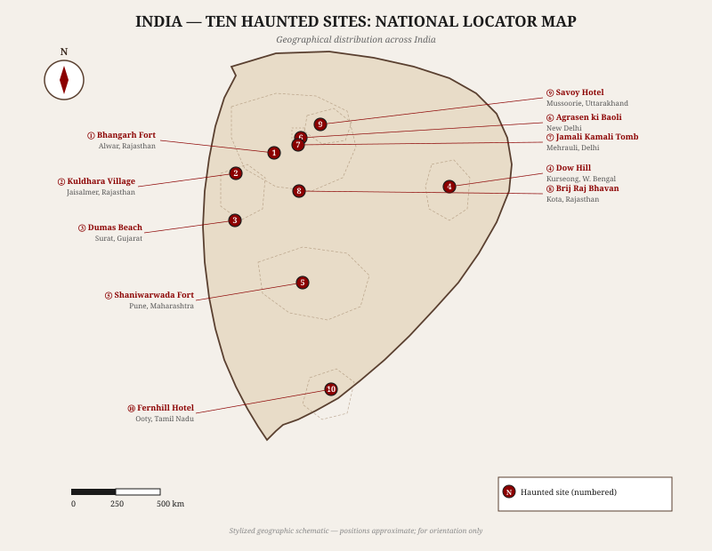

---

## HOW TO READ THIS DOSSIER

Each site entry follows the same seven-part structure:

1. **Basic Identification** — GPS, type, era, access status
2. **History & Timeline** — what we know and when
3. **Folklore & Haunting Claims** — the stories, properly labeled
4. **Connectivity** — how to reach the site
5. **Site Context & Infrastructure** — physical environment, amenities
6. **Nearby Places** — what else is worth seeing nearby
7. **Evidence Assessment** — a per-site evidence pyramid

At the end: a comparative summary table and author's briefing notes.

---

---

# SITE 01 — BHANGARH FORT

## Alwar District, Rajasthan

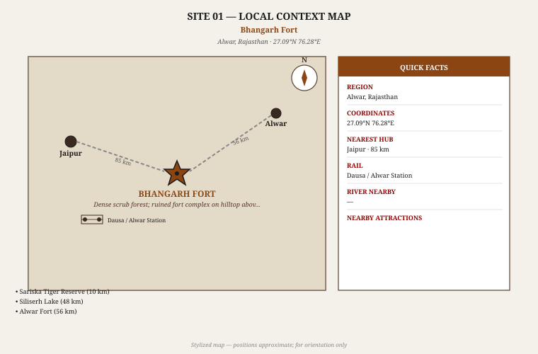

### 1. Basic Identification

| Field | Detail |
|---|---|
| **Full Name** | Bhangarh Fort (Bhangarh ka Kila) |
| **Location** | Bhangarh village, Rajgarh tehsil, Alwar District, Rajasthan |
| **Coordinates** | 27.094°N, 76.289°E |
| **Type** | Ruined fortified town (16th–17th c.) |
| **Status** | ASI-protected monument; open during daylight only |
| **Entry fee** | ₹25 (Indian); ₹300 (foreign nationals) |
| **Nearest town** | Alwar (56 km SW); Jaipur (85 km W) |
| **Famous as** | India's "most haunted place" (popular media label) |

Bhangarh Fort is a late-Mughal-era fortified town set against the forested slopes of the Aravalli Hills, within the Sariska Tiger Reserve buffer zone. It is **[VERIFIED]** the most-visited "haunted site" in India, drawing weekend tourists from Delhi, Jaipur, and Alwar. The Archaeological Survey of India (ASI) maintains the fort and has posted notices prohibiting entry after sunset and before sunrise — a regulation that has been wildly exaggerated by media into claims that the ASI itself has declared it "haunted."

### 2. History & Timeline

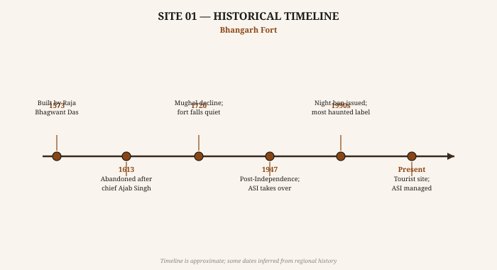

- **~1573 CE** **[VERIFIED]** — Fort complex built by Raja Bhagwant Das of Amber, under Mughal Emperor Akbar's patronage. The town included a palace, temples, markets, and residential quarters.
- **~1613 CE** **[VERIFIED]** — Raja Man Singh's son Ajab Singh constructed the fort. The town was known as Bhangarh after a local chieftain, Bhan Singh.
- **17th century** **[DOCUMENTED]** — Bhangarh functioned as a prosperous town with temples dedicated to Gopinath, Someshwar, Mangla Devi, and Keshava Rai. Population estimates suggest several thousand residents.
- **Late 18th century** **[DOCUMENTED]** — Repeated Jat raids and Maratha incursions destabilized the region. The town was partially abandoned during this period of political fragmentation.
- **~1783 CE** **[DOCUMENTED]** — A severe famine (the "Chalisa famine") swept Rajasthan. Bhangarh's remaining population migrated. The town was effectively deserted.
- **1947 CE** **[VERIFIED]** — Post-Independence, the Archaeological Survey of India (ASI) took charge of Bhangarh as a protected monument.
- **1990s onward** **[DOCUMENTED]** — Mass media (TV shows, online content) began promoting Bhangarh as "India's most haunted place." The ASI notice board prohibiting night entry was misrepresented as an official haunted declaration.

> **Author's Note:** The ASI notice does NOT say the fort is haunted. It says entry after sunset is prohibited because the site is in a tiger reserve buffer zone and nighttime access is unsafe. This distinction is crucial for accurate storytelling.

### 3. Folklore & Haunting Claims

#### Legend A — The Baba Balnath Curse **[FOLKLORE]**

Before the fort was built, a hermit saint called Baba Balnath lived on the hill. When Raja Bhagwant Das sought his permission to build the town, Balnath agreed on one condition: the buildings must never cast a shadow on his hermitage. If they did, the town would be destroyed. A later, arrogant descendant (some versions say Ajab Singh) raised the palace so high that the shadow fell on Balnath's residence. The enraged saint cursed the entire settlement to ruin and desolation.

*No primary source exists for this legend. It first appears in 19th-century oral accounts collected by British administrators.* **[FOLKLORE]**

#### Legend B — The Sorcerer and Princess Ratnavati **[FOLKLORE]**

A tantric sorcerer named Singhia fell in love with the beautiful princess Ratnavati of Bhangarh. Knowing she was beyond his reach, he used black magic to enchant her perfume so she would come to him. The princess, aware of his trick, threw the enchanted oil on a boulder, which then crushed Singhia. As he died, he cursed Bhangarh, declaring that no soul in the fort would rest — the people would die and their spirits would wander the ruins for eternity.

*This is the more popular legend but has no historical documentation. The princess "Ratnavati" does not appear in Amber court records or contemporary chronicles.* **[FOLKLORE]**

#### Reported Paranormal Activity **[SPECULATION]**

- Unexplained lights seen from the highway at night
- Sounds of bells, music, and voices from inside the empty fort after dark
- Visitors feeling dizzy or nauseated near the inner palace structures
- Photography equipment allegedly malfunctioning near the Sati temple
- A narrow lane inside the fort known as the "haunted lane" where visitors report cold winds even in summer

**Reality check:** The fort is in a forest buffer zone. Wildlife, including leopards, have been documented in the Sariska reserve immediately adjacent. "Strange sounds at night" have a ready natural explanation. The "photography malfunctions" are anecdotal and have never been documented in controlled conditions.

### 4. Connectivity

**By Road:**
- Delhi → Bhangarh: 290 km via NH-48 (Jaipur Highway) then Alwar; approximately 5–6 hours
- Jaipur → Bhangarh: 85 km via Dausa; approximately 2 hours
- Alwar → Bhangarh: 56 km on State Highway 13; approximately 1.5 hours
- Road condition: paved up to the fort entrance; last 2 km is good quality road
- Taxis: available from Alwar and Jaipur (pre-booking recommended for return)

**By Rail:**
- Nearest station: Dausa (50 km, on Delhi–Jaipur line) or Alwar Junction (56 km)
- Delhi → Alwar: 3–4 trains daily, 2.5 hours
- From station: hire a taxi or auto-rickshaw; no direct public bus to Bhangarh

**By Air:**
- Nearest airport: Jaipur International Airport (90 km); then road
- No helipad or private airstrip at site

**Best time to visit:** October–March (pleasant weather; post-monsoon greenery in September)

### 5. Site Context & Infrastructure

**Physical environment:** The fort is set against scrub forest hillside. The ruined town covers approximately 1.5 sq km. The main palace complex sits at the highest point. Temples (Gopinath, Someshwar, Mangla Devi) are partially intact and still attract local worshippers. A market area near the entrance has ruins of shops and havelis.

**Current state:** Moderately ruined. Some structures retain their roofs and carved pillars. The Gopinath temple is the best-preserved. The palace is roofless but its walls stand. Staircases and multiple levels are accessible.

**On-site amenities:**
- ASI ticket counter and information board at entrance
- Small parking area (capacity ~30 vehicles)
- Toilet block (basic)
- No food stalls inside the monument (vendors just outside)
- No electricity inside the ruins
- No accommodation inside or immediately adjacent; nearest stay in Alwar or Sariska resort

**Photography:** Permitted during daytime. No drone permission (defense-sensitive area; Sariska zone).

### 6. Nearby Places

| Place | Distance | Type |
|---|---|---|
| Sariska Tiger Reserve | 10 km | National Park (leopard, sambar, jackal) |
| Ajabgarh Village | 1 km | Adjacent village; same entry road |
| Siliserh Lake & Palace | 42 km | Heritage lake palace; boat rides |
| Alwar Fort (Bala Qila) | 56 km | 15th-century Rajput fort |
| Neemrana Fort-Palace | 95 km | Heritage hotel; day trip possible |

### 7. Evidence Assessment

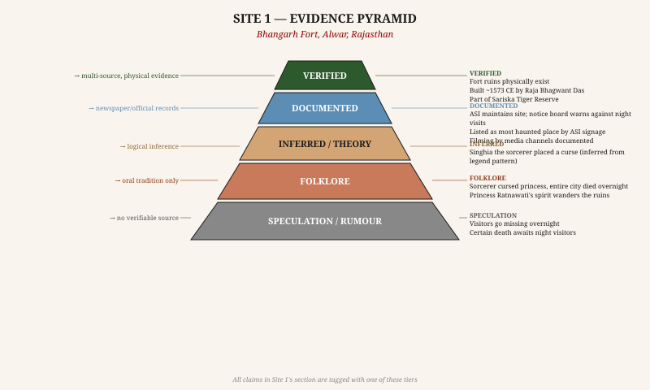

| Claim | Tier | Basis |
|---|---|---|
| Fort physically exists; built ~1573 | VERIFIED | ASI records, architectural survey |
| ASI prohibits night entry | VERIFIED | Posted notice boards |
| Town abandoned due to famine (~1783) | DOCUMENTED | Rajasthan historical records |
| Baba Balnath curse legend | FOLKLORE | Oral tradition; no primary source |
| Princess Ratnavati legend | FOLKLORE | Oral tradition; 19th-century first appearance |
| Visitors disappear at night | SPECULATION | Zero documented case; media fabrication |
| Photography equipment fails | SPECULATION | Anecdotal only; never tested |

**Overall credibility of haunting claims: LOW.** The legends are compelling folklore with no historical anchor. The ASI notice is real but mundane. Bhangarh is the single most over-hyped "haunted" site in India.

---

---

# SITE 02 — KULDHARA VILLAGE

## Jaisalmer District, Rajasthan

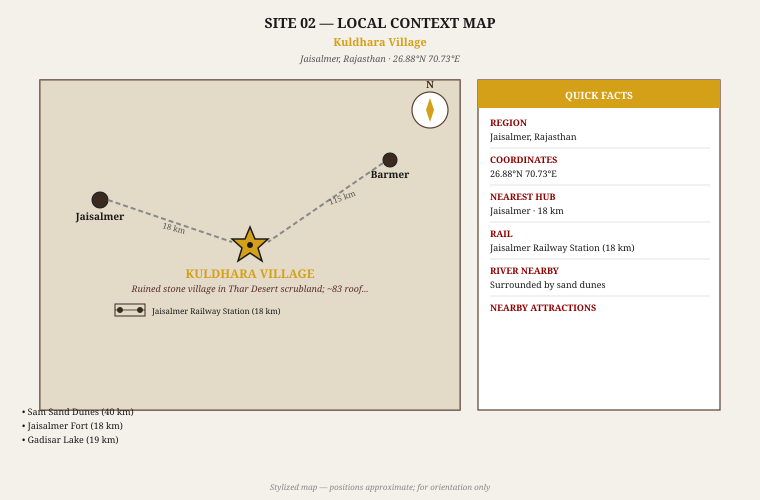

### 1. Basic Identification

| Field | Detail |
|---|---|
| **Full Name** | Kuldhara (कुलधरा), ancient Paliwal Brahmin settlement |
| **Location** | 18 km W of Jaisalmer, Jaisalmer District, Rajasthan |
| **Coordinates** | 26.847°N, 70.691°E |
| **Type** | Ruined desert village; ~83 stone houses |
| **Status** | Rajasthan tourism managed; ₹10 entry fee |
| **Nearest town** | Jaisalmer (18 km E) |
| **Famous as** | "Cursed village" abandoned overnight by the Paliwal Brahmins |

Kuldhara is a genuine archaeological mystery: an entire settlement of ~83 stone houses abandoned in a single night around 1825 CE by a community of approximately 1,500 Paliwal Brahmins who relocated collectively and never returned. The physical evidence of sudden abandonment — roofless houses with intact cooking hearths, storage pits, streets still visible — is real. The supernatural explanations layered on top are not.

### 2. History & Timeline

- **~1291 CE** **[DOCUMENTED]** — Paliwal Brahmins establish Kuldhara as one of 84 villages in their network across the Jaisalmer region. They were agriculturally skilled, prosperous, and well-connected.
- **Early 19th century** **[DOCUMENTED]** — Jaisalmer state comes under increasing pressure from declining Mughal authority and rivalry with Jodhpur and Bikaner states. The Paliwal community's wealth makes them vulnerable to taxation and predation.
- **~1825 CE** **[VERIFIED]** — Overnight mass exodus. The entire Paliwal community of Kuldhara (and reportedly several neighboring villages) abandoned the settlement simultaneously. Archaeological evidence confirms abrupt departure: personal belongings were left, hearths were cold, food stores remained.
- **1825–1947** **[VERIFIED]** — Village uninhabited. Several attempts to resettle documented by colonial administrators; all failed or were abandoned (reasons mundane: water scarcity, poor soil in this zone, legal disputes over land ownership).
- **2017** **[DOCUMENTED]** — Geological survey published noting that the area sits on a seismically sensitive zone. The survey proposed (controversial; not consensus) that ground instability may have contributed to the exodus.
- **2000s–present** **[DOCUMENTED]** — Rajasthan Tourism Department developed the site with entrance, signage, a "haunted house" reconstruction with sound effects, and light-and-sound show.

### 3. Folklore & Haunting Claims

#### The Salim Singh Legend **[FOLKLORE]**

The most popular account: Salim Singh, the powerful and corrupt Diwan (prime minister) of Jaisalmer state, became obsessed with the daughter of Kuldhara's village chief. He demanded her in marriage under threat of punitive taxation. The Paliwal elders gathered in secret council, deciding that mass exodus and disgrace would be better than surrender. Before leaving, the community cursed the land so that no one would ever live there again; any who tried would die.

*Salim Singh Mehta was a real historical figure (d. 1824 CE) and was historically recorded as tyrannical.* **[DOCUMENTED]** *However, no primary source — court records, contemporaneous account, or Paliwal family oral tradition outside Rajasthan — confirms the specific demand for the chief's daughter.* **[FOLKLORE]**

#### The Undying Curse **[FOLKLORE / SPECULATION]**

- Anyone who tries to settle in Kuldhara is cursed to die within a year
- Paranormal investigators claim their equipment (EVP recorders, cameras) fails inside the village
- Lights are seen moving between the roofless houses at night
- Sounds of a crying woman heard in the southern lane
- Shadows of figures seen in doorways after sunset

**Reality check:** Several families reportedly attempted to live in the village in the 20th century and left due to isolation, water scarcity, and the site's remote location — not supernatural intervention. The village is 18 km from Jaisalmer on a desert road with no electricity until recent tourism infrastructure. A 2013 investigation by the Indian Paranormal Society, which set up equipment overnight, reported "strange readings" — but their methodology was not peer-reviewed.

### 4. Connectivity

**By Road:**
- Jaisalmer → Kuldhara: 18 km on Sam Road (well-paved state highway); 25 minutes by taxi/jeep
- Barmer → Kuldhara: 115 km; approximately 2.5 hours
- Jodhpur → Kuldhara: 290 km; approximately 5 hours
- Shared jeeps from Jaisalmer's main bazaar area run toward Sam Dunes; ask driver to stop at Kuldhara

**By Rail:**
- Jaisalmer Railway Station (18 km); connected to Jodhpur (6 hrs), Delhi (overnight)
- Station taxis to Kuldhara: ₹400–600 one-way

**By Air:**
- Jaisalmer Airport (civil terminal, limited flights): 15 km from town; Indigo operates Delhi–Jaisalmer
- Jodhpur Airport (better connections): 290 km

**Best time to visit:** November–February (cool desert weather). Avoid May–June (extreme heat, 45°C+).

### 5. Site Context & Infrastructure

**Physical environment:** Desert scrubland; the Thar Desert proper begins just west of here. The site is completely flat. Sand dunes begin approximately 25 km further west at Sam. The 83 roofless stone houses are arranged along four main lanes. Several have doorways still intact. The temple structure is partially collapsed. The village well is dry.

**Tourism infrastructure:**
- Ticket booth; entry ₹10
- Small car park
- "Haunted house" experience room (theatrical; sound effects added for tourists)
- Outdoor amphitheater for evening light-and-sound show
- No accommodation on-site; all stays in Jaisalmer
- Guides available (negotiate in Jaisalmer; ₹200–400)

**Safety:** Completely safe during daylight hours. At night the site is locked. Scorpions and sand vipers are present in the ruins — sturdy footwear recommended. No mobile signal; nearest tower in Jaisalmer.

### 6. Nearby Places

| Place | Distance | Type |
|---|---|---|
| Sam Sand Dunes | 40 km | Camel safari, sunset, desert camps |
| Jaisalmer Fort (Sonar Qila) | 18 km | Living medieval fort; UNESCO tentative list |
| Gadisar Lake | 19 km | Ancient reservoir with ornate ghats |
| Bada Bagh | 20 km | Royal cenotaphs of Jaisalmer rulers |
| Khuri Sand Dunes | 50 km | Quieter alternative to Sam |

### 7. Evidence Assessment

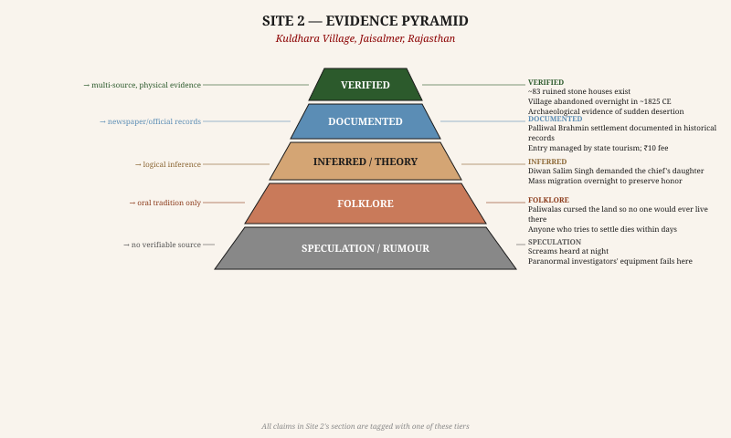

| Claim | Tier | Basis |
|---|---|---|
| ~83 stone houses physically exist | VERIFIED | Archaeological survey, photographs |
| Entire village abandoned overnight ~1825 | VERIFIED | Archaeological evidence; no dispute |
| Paliwal Brahmins' settlement documented | DOCUMENTED | Rajasthani historical records |
| Salim Singh's tyranny (general) | DOCUMENTED | Court records; no dispute |
| Salim Singh demanded chief's daughter | FOLKLORE | No primary source; oral tradition |
| Paliwalas cursed the land before leaving | FOLKLORE | Oral tradition only |
| No one can live there due to curse | SPECULATION | Multiple failed settlements had mundane causes |
| Paranormal equipment failures | SPECULATION | Indian Paranormal Society (non-peer-reviewed) |

**Overall credibility of haunting claims: LOW-MEDIUM.** The *mystery* is real (why did 1,500 people leave overnight?). The *supernatural* explanation is added later. The most probable answer: water depletion + political instability + community solidarity. Excellent for fiction because the mystery kernel is genuine.

---

---

# SITE 03 — DUMAS BEACH

## Surat District, Gujarat

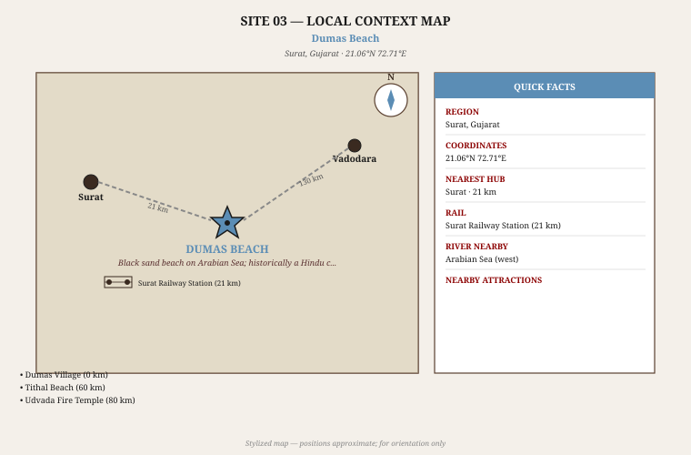

### 1. Basic Identification

| Field | Detail |
|---|---|
| **Full Name** | Dumas Beach (ડૂમસ બીચ) |
| **Location** | Dumas village, 21 km SW of Surat city, Gujarat |
| **Coordinates** | 21.072°N, 72.713°E |
| **Type** | Black sand beach on the Arabian Sea |
| **Status** | Public beach; no entry fee; nighttime access discouraged |
| **Nearest city** | Surat (21 km NW) |
| **Famous as** | "India's most haunted beach"; former Hindu cremation ground |

Dumas Beach is a dark-sand coastal stretch whose distinctive black colour comes from the presence of magnetite and other heavy mineral sands — a geological characteristic common along the Gujarat coast. It gained its haunted reputation from its history as a Hindu cremation ground, which has since been relocated. The beach is popular with day visitors but carries persistent legends of disappearances and spirit encounters at night.

### 2. History & Timeline

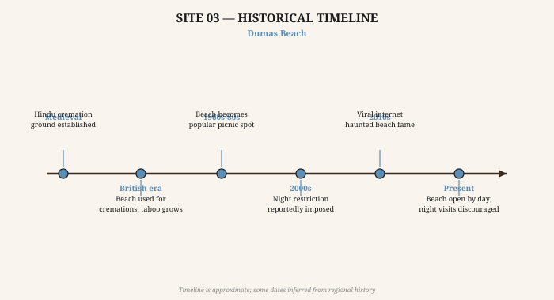

- **Medieval period** **[DOCUMENTED]** — The area around Dumas village served as a *shmashana* (cremation ground) for the surrounding Hindu community. This practice is documented in local temple records and administrative notes from the Surat Collectorate.
- **British colonial era** **[DOCUMENTED]** — Surat was a major trading port. Dumas village lay outside the city's main settlement. Cremation ground use continued; superstitions about spirits of the cremated (who had not completed full rites) began circulating.
- **1947–1970s** **[DOCUMENTED]** — Post-Independence development of Surat's suburbs brought the beach into recreational use. The cremation ground was relocated to a designated site. The beach became a picnic spot.
- **Late 20th century** **[DOCUMENTED]** — Rapid industrialization of Surat and its environs brought more visitors. The beach strip was improved with a promenade in the 2000s.
- **2000s** **[FOLKLORE / SPECULATION]** — Night restriction reportedly imposed by local police following "disappearances." (The actual police order, if it exists, has never been documented in press reports; most references are hearsay.)
- **2010s** **[DOCUMENTED]** — Viral internet content (YouTube, Facebook) branded Dumas as "India's most haunted beach." Tourism shot up. Local vendors now sell "Dumas haunted night tour" packages.

### 3. Folklore & Haunting Claims

#### The Restless Dead **[FOLKLORE]**

The most widely repeated legend: the spirits of the dead whose ashes were scattered at Dumas Beach or whose cremations were improperly performed roam the beach after dark, calling out to the living. Those who respond to the voices or follow the lights are never seen again.

#### Disappearances **[SPECULATION]**

Multiple internet articles claim that "several people have disappeared at Dumas Beach and were never found." No named cases, police FIRs, or newspaper reports with verifiable dates have ever been produced for these alleged disappearances. The closest documented incidents are two drowning deaths (undertow) which occurred in daylight and were reported in Gujarati local press — but these are straightforward drowning accidents.

#### Physical phenomena claimed **[SPECULATION]**

- Black sand is "unnaturally cold" even in summer
- Dogs bark frantically at nothing when near the shoreline at night
- Visitors hear whispers in Gujarati near the old cremation ground area
- Mobile phones and cameras fail near the water

**Reality check:** The black sand is legitimately unusual but entirely geological. The "cold sand" observation is real: dark sand absorbs and radiates heat differently than white sand, creating micro-temperature variations. Dog behavior at night on a beach with sea sounds and unfamiliar smells is perfectly normal. The "disappearances" are unverified.

### 4. Connectivity

**By Road:**
- Surat → Dumas: 21 km on SH-6; approximately 40 minutes
- Public bus: Surat city buses run to Dumas village (GSRTC route from Surat Central Bus Stand)
- Auto-rickshaw from Surat city: ₹150–250
- Vadodara → Dumas: 130 km; approximately 2.5 hours

**By Rail:**
- Surat Railway Station (21 km from beach): excellent connections on Mumbai–Ahmedabad route; multiple Rajdhani, Shatabdi, and express trains
- From Surat station to beach: auto/taxi

**By Air:**
- Surat Airport: limited connections; Mumbai (55 min flight) or Ahmedabad (1 hr)
- Mumbai is 280 km by road; 4–5 hours

**Best time to visit:** October–February. Monsoon (June–September): beach unsafe due to heavy surf and flooding of access roads.

### 5. Site Context & Infrastructure

**Physical environment:** The beach stretches approximately 3 km. The sand is noticeably darker than neighboring beaches. The old cremation area is now a forested patch near the northern end. A small temple (Dariya Ganesh) stands at the beach entrance. The sea here has a strong undertow; swimming is discouraged by the local administration.

**Amenities:**
- Parking area near the promenade
- Small restaurants and chai stalls along the beachfront road
- Dariya Ganesh temple (daily visited by locals)
- No accommodation on the beach; resorts in Surat city
- Basic toilet facilities near the parking area

### 6. Nearby Places

| Place | Distance | Type |
|---|---|---|
| Dumas Village | 0.5 km | Traditional fishing village; seafood stalls |
| Suvali Beach | 15 km | Quieter; cleaner; less crowded |
| Tithal Beach | 60 km | Another dark-sand beach |
| Udvada Atash Behram | 80 km | Sacred Zoroastrian fire temple (oldest in India) |
| Surat Diamond Market | 21 km | World's largest diamond cutting center |

### 7. Evidence Assessment

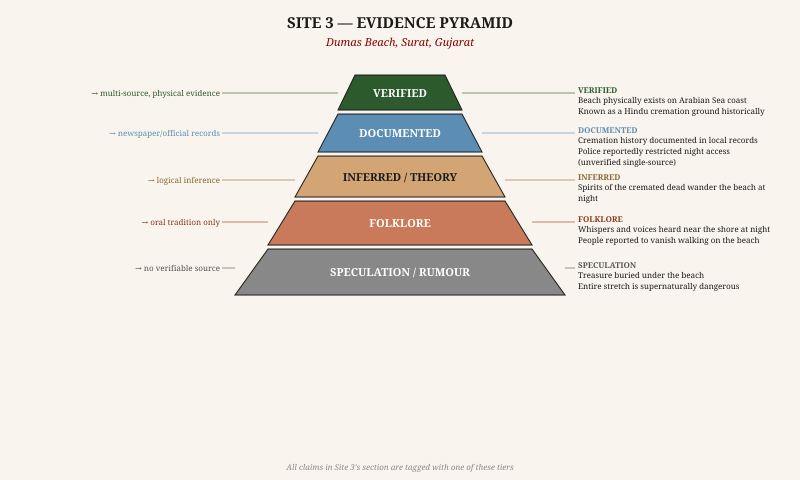

| Claim | Tier | Basis |
|---|---|---|
| Black sand beach on Arabian Sea exists | VERIFIED | Physical; geological surveys |
| Former Hindu cremation ground | DOCUMENTED | Local records, temple records |
| Night restriction by police | FOLKLORE | Widely repeated; no document found |
| Spirits of cremated dead wander the beach | FOLKLORE | Oral tradition only |
| People have disappeared at Dumas | SPECULATION | Zero documented case with names/dates |
| Sand is supernaturally cold | SPECULATION | Geological micro-temp variation; not supernatural |

**Overall credibility of haunting claims: LOW.** The setting is atmospheric (dark sand, former cremation ground, sea at night). The folklore layer is paper-thin. Good for fiction precisely because the setting does the work; the author need not believe the stories.

---

---

# SITE 04 — DOW HILL / VICTORIA BOYS' SCHOOL

## Kurseong, Darjeeling District, West Bengal

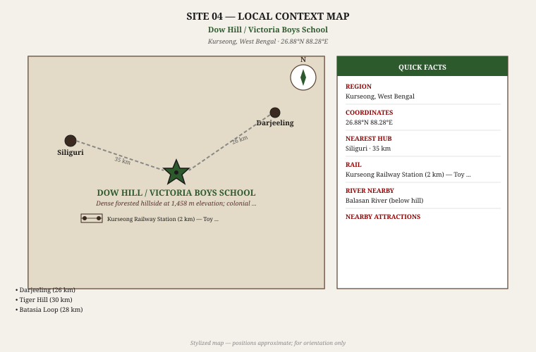

### 1. Basic Identification

| Field | Detail |
|---|---|
| **Full Name** | Dow Hill Forest; Victoria Boys' High School, Kurseong |
| **Location** | Dow Hill Road, Kurseong, Darjeeling District, West Bengal |
| **Coordinates** | 26.884°N, 88.281°E (school) |
| **Type** | Colonial-era school + forested hillside ("Death Road") |
| **Status** | School is operational (state-run); forest is public |
| **Nearest towns** | Siliguri (35 km S); Darjeeling (26 km N) |
| **Elevation** | 1,458 metres above sea level |
| **Famous as** | "Most haunted hill station in India"; headless boy ghost |

Dow Hill is a neighborhood in Kurseong town, nestled in the forested hills of the Darjeeling Himalaya. The Victoria Boys' High School was established by the British in 1879, primarily for colonial families. The surrounding forest — particularly a stretch of wooded path known locally as "Death Road" — has accumulated ghost legends over more than a century. This is one of the few sites where the atmosphere genuinely does the work: the dense, fog-shrouded forest is unsettling even in daylight.

### 2. History & Timeline

- **1879 CE** **[VERIFIED]** — Victoria Boys' High School founded by the British colonial administration. Kurseong (elevation 1,458 m) was a favoured hill station for colonial families.
- **Early 20th century** **[DOCUMENTED]** — Several workers, including forest department staff, died during accidents in the Dow Hill forest area. Their deaths (documented in local accounts) occurred primarily during the school holiday months of December–January, when the campus was nearly deserted.
- **1947 CE** **[VERIFIED]** — School renamed and absorbed into the West Bengal state education system. British staff departed.
- **1950s–1970s** **[DOCUMENTED]** — Local legends about a headless boy seen on the forest path between the school and Dow Hill Road began circulating. Origin unclear; may have roots in workers' deaths from the early colonial period.
- **2000s–present** **[DOCUMENTED]** — Multiple "paranormal investigation" TV shows and YouTube channels filmed episodes at Dow Hill and the school. The "woman in grey" and "headless boy" became fixtures of Indian horror content.

### 3. Folklore & Haunting Claims

#### The Headless Boy **[FOLKLORE]**

A boy without a head is reportedly seen walking the forest path from the school toward Dow Hill Road, then vanishing at the edge of the treeline. He appears in the mornings, wearing school clothes. He never makes a sound.

*No corroborating eyewitness account with a name and date has ever been published.*

#### The Woman in Grey **[FOLKLORE]**

A woman dressed in grey is seen at the end of a corridor in the school during vacation periods. She walks away from witnesses and disappears at a dead-end wall. Some accounts say she was the wife of a British headmaster who died in the building.

*No death of a headmaster's wife at the school appears in colonial records or newspaper archives.*

#### Death Road **[FOLKLORE]**

The stretch of forest road between the school and Dow Hill is locally known as "Death Road" (also "Fear Road"). Locals refuse to walk it alone after sunset. Woodsmen working in the area reportedly heard laughter, children's voices, and footsteps following them through the mist.

#### Headless apparitions and forest sounds **[SPECULATION]**

- Red eyes seen in the darkness between trees
- The sound of a child crying in mist with no visible source
- Workers found dead with "expressions of terror" (no autopsy report found to verify)

**Reality check:** The forest is dense temperate Himalayan forest. Fog is extremely common in Kurseong — visibility can drop to under 5 metres in winter mornings. The sounds attributed to ghosts (water dripping, branches creaking, animal calls) are entirely consistent with a wet temperate forest environment. The "abandoned school in holiday season" atmosphere is real and psychologically potent.

### 4. Connectivity

**By Road:**
- Siliguri → Kurseong: 35 km on Hill Cart Road (NH-110); approximately 1.5 hours (winding mountain road)
- Darjeeling → Kurseong: 26 km; approximately 1 hour by taxi
- Shared jeeps (sumo) from Siliguri's Tenzing Norgay Bus Terminal run every 30 minutes; ₹80–120

**By Rail:**
- Kurseong is a stop on the Darjeeling Himalayan Railway (DHR) Toy Train **[VERIFIED]** — a UNESCO World Heritage railway
- Nearest broad-gauge station: New Jalpaiguri (NJP), 50 km; well-connected to Kolkata (7–8 hours), Delhi (overnight)
- NJP to Kurseong: shared jeep (1.5 hrs) or toy train (longer but scenic)

**By Air:**
- Bagdogra Airport (IXB): 40 km from Kurseong; well-connected to Kolkata, Delhi, Mumbai

**Best time to visit:** March–May (clear skies) or October–November (after monsoon). December–February: cold and very foggy — atmospheric but access can be difficult.

### 5. Site Context & Infrastructure

**Physical environment:** Dense sub-tropical and temperate Himalayan forest. Tea gardens interspersed with pine and oak. The school is a colonial-era brick building set in grounds with large trees. The "Death Road" path is approximately 1 km of forested walking trail. Fog is a near-constant feature in mornings and evenings.

**Amenities:**
- The school is a functioning institution — entry not permitted to tourists during term time
- The forest path is public and accessible at all times during daylight
- Kurseong town has hotels, guesthouses, and homestays (budget to mid-range)
- Tea garden tours available; Kurseong has its own small tourist circuit
- Restaurants serve Nepali and Bengali cuisine; good momo culture

### 6. Nearby Places

| Place | Distance | Type |
|---|---|---|
| Darjeeling | 26 km | Famous hill station; Tiger Hill sunrise |
| Batasia Loop | 28 km | Toy train loop; Gorkha War Memorial |
| Mirik Lake | 50 km | Boating; peaceful hill resort |
| Ghoom Monastery | 30 km | 19th-century Buddhist monastery |
| Makaibari Tea Estate | 5 km | Oldest organic tea estate; guided tours |

### 7. Evidence Assessment

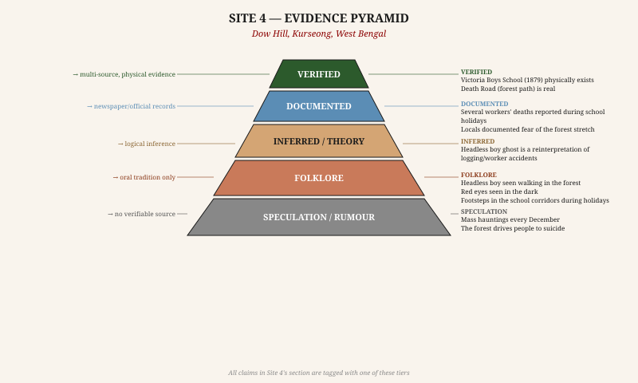

| Claim | Tier | Basis |
|---|---|---|
| School built 1879; still standing | VERIFIED | Physical; school records |
| Workers' deaths on Dow Hill (early 20th c.) | DOCUMENTED | Local accounts; not detailed |
| Forest path locally known as "Death Road" | DOCUMENTED | Local usage; maps |
| Headless boy on the path | FOLKLORE | Oral tradition; no documented eyewitness |
| Woman in grey in school corridors | FOLKLORE | Oral tradition; no historical basis found |
| Red eyes; supernatural sounds in forest | SPECULATION | Anecdotal; environmentally explicable |

**Overall credibility of haunting claims: LOW.** The atmosphere is genuine — fog, isolation, colonial building, dense forest. The legends are compelling but entirely without evidential foundation. Best site in this collection for pure atmospheric writing; the setting needs no supernatural aid.

---

---

# SITE 05 — SHANIWARWADA FORT

## Pune, Maharashtra

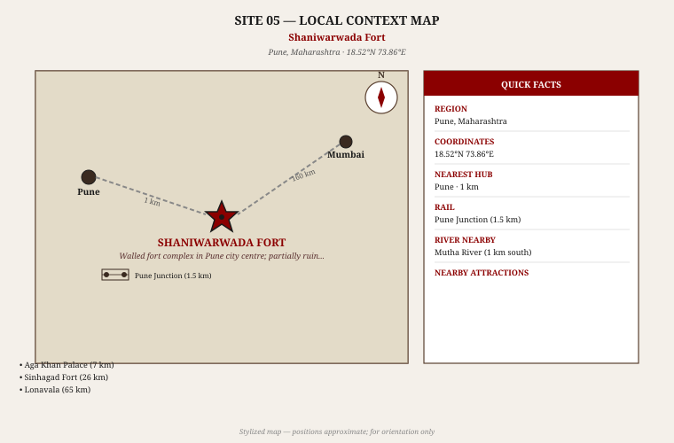

### 1. Basic Identification

| Field | Detail |
|---|---|
| **Full Name** | Shaniwarwada Fort (शनिवारवाडा) |
| **Location** | Shaniwar Peth, Pune City, Maharashtra |
| **Coordinates** | 18.519°N, 73.856°E |
| **Type** | Ruined palatial fortified residence (18th c. Peshwa) |
| **Status** | ASI-protected; open to public |
| **Entry fee** | ₹25 (Indian); ₹300 (foreign) |
| **Nearest transit** | Pune Junction railway station (1.5 km) |
| **Famous as** | Site of Narayanrao Peshwa's murder; ghost of the prince |

Shaniwarwada is the former seat of the Peshwa rulers of the Maratha Confederacy, built in the heart of what is now Pune city. It is notable for two things equally: its historical importance as the administrative capital of the Marathas, and the real, documented murder of the young Peshwa Narayanrao within its walls in 1773. The haunting legend — that Narayanrao's ghost screams for help on full-moon nights — is folklore, but it is folklore built directly on a verified historical atrocity.

### 2. History & Timeline

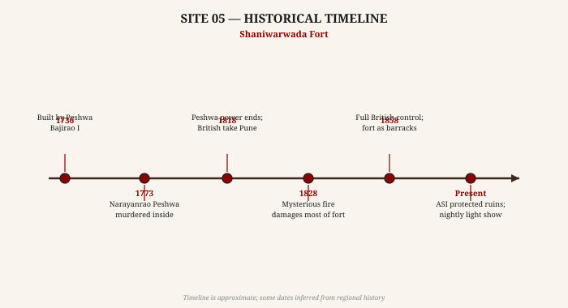

- **1730–1736 CE** **[VERIFIED]** — Construction of Shaniwarwada commissioned by Peshwa Bajirao I. The foundation stone was laid on Saturday (Shaniwar), giving the palace its name. Built with teak from Junnar, stone from Chinchwad. Seven gates; five towers originally.
- **1773 CE** **[VERIFIED]** — Narayanrao Peshwa (r. 1772–1773), age 18, was murdered by guards loyal to his uncle Raghunathrao (Raghoba) and his wife Anandibai. Narayanrao reportedly fled through the palace crying "Kaka mala vachwa!" (Uncle, save me!). He was cut down at the Ganesh gate. His death triggered a political crisis in the Maratha Confederacy.
- **1818 CE** **[VERIFIED]** — British forces under General Joseph Smith took Pune. The Peshwa era ended. Shaniwarwada became British military property.
- **1828 CE** **[DOCUMENTED]** — A catastrophic fire broke out inside the fort. The cause was never determined. Most of the wooden interior structures, including the main palace, were destroyed. Only the outer walls and gates survived.
- **Post-1947** **[VERIFIED]** — ASI took over. The ruins were declared a protected monument. A light-and-sound show was later added, dramatizing the Peshwa period and specifically the Narayanrao tragedy.

### 3. Folklore & Haunting Claims

#### The Screaming Prince **[FOLKLORE]**

On every full moon night (Purnima), especially in August (Shravan Purnima), the ghost of Narayanrao Peshwa screams from within the fort: *"Kaka mala vachwa!"* — the same cry he reportedly made as he fled his murderers. Locals in Pune's older neighborhoods claim they have heard this cry on still summer nights.

*The cry itself is historically attested — contemporary Maratha accounts record Narayanrao's last words as he was attacked.* **[DOCUMENTED]** *The claim that his ghost repeats these words is not.* **[FOLKLORE]**

#### The Child's Footsteps **[FOLKLORE]**

The ghost of Narayanrao (described as small, still dressed in the royal kurta-dhoti he wore the day of his murder) is seen walking through the ruins toward the Ganesh gate, as if reliving his final moments. He disappears at the spot where he was killed.

#### The Fire's Secret **[SPECULATION]**

A minority tradition holds that the 1828 fire was set by the spirit of Narayanrao to destroy the palace that had been his prison and the site of his betrayal. The fire's true origin was never determined. **[SPECULATION]**

**Reality check:** Shaniwarwada is in the middle of Pune city. Any sound attributed to Narayanrao's ghost would need to compete with urban noise. The "screaming on full moon nights" is almost certainly a creative amplification of the fort's famous history rather than a genuine report. However, the *source* of the legend — a real murder of a young ruler — is historically verifiable and emotionally powerful.

### 4. Connectivity

**By Road:**
- Shaniwarwada is in central Pune; extremely well-connected by road and public transport
- From Pune Junction: 1.5 km; auto-rickshaw (₹30–40) or walking (20 minutes)
- Mumbai → Pune: 160 km via Expressway; approximately 2.5 hours
- Auto-rickshaws widely available throughout the day

**By Rail:**
- Pune Junction: 3 km; major railway junction on Mumbai–Chennai line
- Mumbai CST → Pune: multiple trains daily; fastest is 2h 40m (Deccan Queen, Shatabdi)

**By Air:**
- Pune International Airport: 10 km; connected to Delhi, Mumbai, Bengaluru, Hyderabad and international destinations

**Best time to visit:** October–February (pleasant); full moon nights for atmosphere.

### 5. Site Context & Infrastructure

**Physical environment:** The fort is now an island of historical ruins in the middle of a dense urban commercial area. The high basalt walls (up to 18 metres) and five gates (Dilli Darwaza, Mastani Darwaza, Khidki Darwaza, Narayan Darwaza, Ganesh Darwaza) are intact. The interior is a large open garden with the ruins of the palace structures. The Fountain of the Lotus (Hazari Karanje) is partially restored.

**Amenities:**
- ASI ticket counter
- Light-and-sound show evenings (₹25–50)
- Gardens well-maintained
- Public toilets at entrance
- Adjacent to Pune's busy commercial district; restaurants and cafes immediately outside
- No accommodation on-site; Pune has extensive hotel options

### 6. Nearby Places

| Place | Distance | Type |
|---|---|---|
| Aga Khan Palace | 6 km | Where Gandhi was held by British; memorial |
| Sinhagad Fort | 26 km | Maratha hilltop fort; great trekking |
| Parvati Hill Temple | 3 km | Panoramic view of Pune; Peshwa cenotaphs |
| Lal Mahal | 0.5 km | Where young Shivaji grew up |
| Lonavala | 65 km | Hill station; caves; waterfalls |

### 7. Evidence Assessment

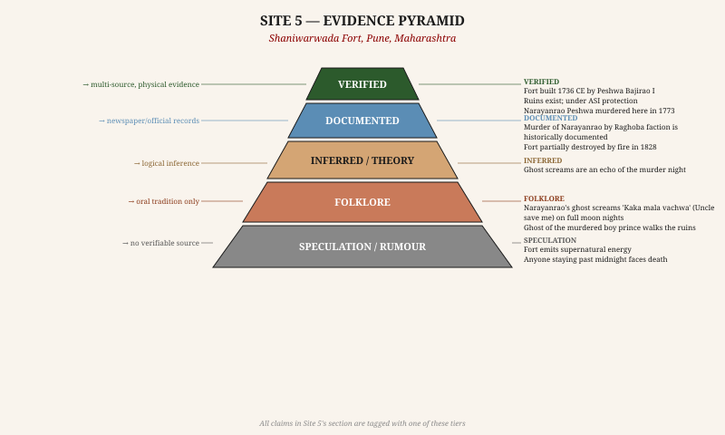

| Claim | Tier | Basis |
|---|---|---|
| Fort built 1736 CE by Peshwa Bajirao I | VERIFIED | Historical records; ASI |
| Narayanrao murdered here in 1773 | VERIFIED | Maratha chronicles; multiple sources |
| "Kaka mala vachwa" — Narayanrao's last words | DOCUMENTED | Contemporary Maratha accounts |
| 1828 fire destroyed interior | DOCUMENTED | Colonial records; fire documented |
| Ghost screams "Kaka mala vachwa" on full moon | FOLKLORE | Oral tradition; no documented reports |
| Ghost of boy prince seen walking to Ganesh gate | FOLKLORE | Oral tradition only |
| 1828 fire started by Narayanrao's ghost | SPECULATION | No evidence; ghost arson is speculation |

**Overall credibility of haunting claims: MEDIUM.** This site has the highest-quality historical anchor of all 10 sites: a real, documented murder of a child-ruler with historically attested last words. The folklore builds directly on documented tragedy. The author can use the historical facts freely; the ghost overlay is the fiction layer.

---

---

# SITE 06 — AGRASEN KI BAOLI

## Connaught Place, New Delhi

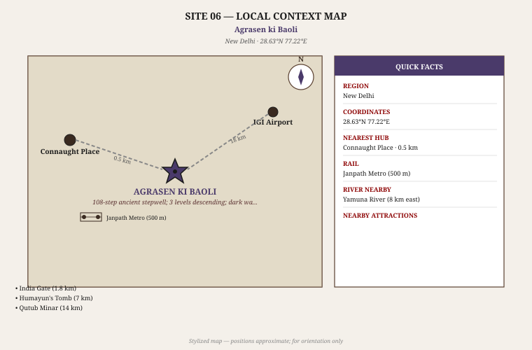

### 1. Basic Identification

| Field | Detail |
|---|---|
| **Full Name** | Agrasen ki Baoli (अग्रसेन की बावली) |
| **Location** | Hailey Road, near Connaught Place, New Delhi |
| **Coordinates** | 28.627°N, 77.222°E |
| **Type** | Medieval stepwell (baoli); 3 underground levels; 108 steps |
| **Status** | ASI-protected monument; open to visitors |
| **Entry fee** | Free |
| **Nearest Metro** | Barakhamba Road (Blue Line) or Janpath (Violet Line); ~5 min walk |
| **Famous as** | "Haunted stepwell"; black water that compels visitors to jump |

Agrasen ki Baoli is a 14th-century stepwell sunk into the earth of central Delhi, its 108 steps descending through three levels to what was once a water reservoir. It is architecturally significant: the stepped sides have arched niches at each level, and the geometry creates an uncanny tunnel-like effect when looking down from the surface. The haunting legends attached to it are almost entirely internet-era creations, not historical folklore.

### 2. History & Timeline

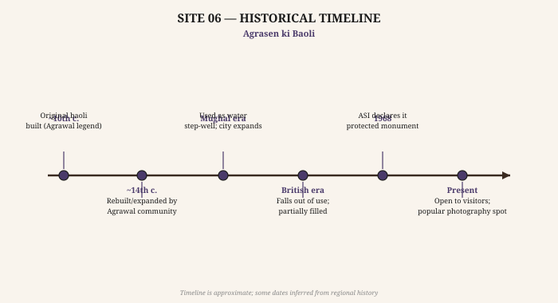

- **~10th century CE** **[INFERRED]** — Local tradition attributes the original baoli to Maharaja Agrasen, a legendary king of the Mahabharat era. However, the existing structure dates to the Tughlaq period or later; no medieval structure from the 10th century survives here.
- **~14th century CE** **[DOCUMENTED]** — The baoli was built (or substantially rebuilt) by the Agrawal trading community of Delhi. The Agrawal community named it in honor of their legendary progenitor, Agrasen. This is the most likely origin of the current structure.
- **Mughal era** **[INFERRED]** — The baoli continued to supply water to the surrounding area. As Delhi expanded under the Mughals, the stepwell remained functional.
- **British colonial era** **[DOCUMENTED]** — Urbanization of Connaught Place began in the 1920s–30s. The baoli fell out of use as piped water replaced stepwells. It was partially silted and debris-filled.
- **1968 CE** **[VERIFIED]** — ASI declared Agrasen ki Baoli a protected monument.
- **2010s** **[DOCUMENTED]** — Instagram and YouTube exposure made the baoli a popular photography destination. Simultaneously, articles on "haunted places in Delhi" began featuring it. The "black water pulls you in" legend appears to date from this period — no pre-2010 reference has been found.

### 3. Folklore & Haunting Claims

#### The Black Water **[FOLKLORE]**

The water at the bottom of the baoli is described as "pitch black" and is said to psychologically compel visitors who look at it to jump in. An unspecified number of people have allegedly thrown themselves into the water after being hypnotized by its darkness.

*The water at the base of the baoli is not actually black — it ranges from murky green to brown depending on algae growth and season. No documented case of anyone jumping or being driven to jump has been found in any news archive.*

#### Djinn Presence **[FOLKLORE]**

Djinns (Islamic supernatural beings) are said to inhabit the lower chambers of the baoli, using the dark water as a gateway. Visitors report feeling watched, hearing footsteps behind them when alone, and feeling cold breath on their necks.

#### Camera Malfunction **[SPECULATION]**

Photography equipment allegedly fails in the lower levels of the baoli — cameras freeze, phone screens go dark.

**Reality check:** The lower levels of a deep stepwell in an urban environment are genuinely dark, cool, humid, and acoustically strange — sounds echo oddly; the descending geometry creates mild vertigo in some people. These are physical properties of the architecture, not supernatural.

### 4. Connectivity

- Located in central Delhi, steps from Connaught Place
- Metro: Barakhamba Road Station (Blue Line) — 5-minute walk
- Autos and taxis freely available throughout the day
- Completely accessible on foot from most central Delhi hotels

### 5. Site Context & Infrastructure

**Physical environment:** A rectangular stepwell 60 metres long and 15 metres wide, descending 3 storeys underground. The sides are lined with arched niches at each level. It is roofless — open to the sky from above. The bottom level, when water is present, reflects the sky in a long narrow rectangle.

**Amenities:**
- No ticket; free entry
- No guide service on-site (private guides available from Connaught Place)
- No food or water on-site
- Photography allowed
- Entire surrounding area (Connaught Place) has extensive restaurants, cafes, shopping

### 6. Nearby Places

| Place | Distance | Type |
|---|---|---|
| Connaught Place | 0.5 km | Delhi's commercial heart; shopping, dining |
| India Gate | 2 km | National War Memorial; iconic |
| Humayun's Tomb | 7 km | UNESCO; Mughal garden tomb |
| Jantar Mantar | 1 km | 18th-century astronomical observatory |
| Qutub Minar | 14 km | UNESCO; 12th-century minaret |

### 7. Evidence Assessment

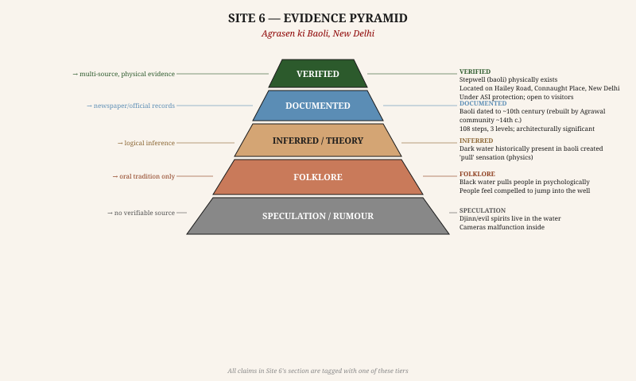

| Claim | Tier | Basis |
|---|---|---|
| Stepwell physically exists | VERIFIED | Physical; ASI records |
| Built ~14th century by Agrawal community | DOCUMENTED | Architectural survey; community records |
| Original builder was Maharaja Agrasen | INFERRED | Community tradition; no inscription |
| Black water compels visitors to jump | FOLKLORE | Internet-era legend; no documented cases |
| Djinns inhabit the lower chambers | FOLKLORE | Oral tradition only |
| Camera equipment fails in the baoli | SPECULATION | Anecdotal; no controlled documentation |

**Overall credibility of haunting claims: LOW.** This is essentially an internet-generated haunting — the legends are only a decade old. The site itself is beautiful and historically significant as architecture. The "haunted" label is entirely manufactured.

---

---

# SITE 07 — JAMALI KAMALI MOSQUE & TOMB

## Mehrauli, Delhi

### 1. Basic Identification

| Field | Detail |
|---|---|
| **Full Name** | Jamali Kamali Masjid wa Maqbara (جمالی کمالی) |
| **Location** | Mehrauli Archaeological Park, Mehrauli, Delhi |
| **Coordinates** | 28.524°N, 77.185°E |
| **Type** | 16th-century Mughal mosque and twin tomb |
| **Status** | ASI-protected; mosque closed to public; tomb accessible |
| **Entry fee** | Free (part of Mehrauli Archaeological Park) |
| **Nearest Metro** | Qutub Minar Metro Station (800 m walk) |
| **Famous as** | Twin tomb with mystery identity; Djinn encounters |

The Jamali Kamali complex is one of the earliest Mughal-era mosque-and-tomb combinations in Delhi. Jamali (Shaikh Fazlullah Khan) was a celebrated Sufi poet and traveler of the late Lodi / early Mughal period. He built his mosque (completed ~1528–1536 CE) and was buried in the adjacent twin tomb. The second tomb is "Kamali" — and Kamali's identity is *genuinely undocumented*, even in official ASI records. This real historical mystery is the legitimate kernel around which paranormal legends have grown.

### 2. History & Timeline

- **~1528–1536 CE** **[VERIFIED]** — Construction of the mosque by Shaikh Fazlullah (pen name: Jamali), a poet who was a court favorite of both Lodi sultans and Babur. The mosque is notable for its red sandstone and white marble inlaid work — early Mughal fusion.
- **1535–36 CE** **[VERIFIED]** — Jamali died and was interred in the twin tomb immediately adjacent to the mosque. His epitaph exists and is readable. His poetry survives in several diwans (collections).
- **1535–1536 CE** **[DOCUMENTED]** — A second person, "Kamali," was interred in the adjacent chamber of the same tomb. No inscription names Kamali. No contemporaneous record identifies who Kamali was. The ASI signboard simply reads "Kamali" with no further explanation.
- **Mughal era** **[DOCUMENTED]** — The mosque received patronage under Humayun and Akbar. It was actively used as a place of worship.
- **1947 CE** **[VERIFIED]** — ASI took over the Mehrauli complex.
- **Present** **[VERIFIED]** — The mosque interior is kept locked by ASI (preservation reasons). The twin tomb chamber is accessible. The surrounding Mehrauli Archaeological Park contains over 440 listed historical monuments.

### 3. Folklore & Haunting Claims

#### Kamali's Identity **[DOCUMENTED mystery / FOLKLORE overlay]**

The genuine historical mystery: who is Kamali? Theories include:
- A close disciple or friend of Jamali
- A younger brother
- A male companion / lover (a theory widely repeated online but with no historical basis)

*The mystery is real. The supernatural overlay is not.* ASI historians have been unable to trace Kamali in any Mughal-era document — unusual for a tomb that received state patronage.

#### Djinn Attacks **[FOLKLORE]**

Multiple YouTube investigations and online articles report that visitors to the tomb feel suddenly nauseated, dizzy, and frightened. Some claim they felt "pushed" or "slapped" by an invisible presence. Red marks appeared on their skin for no apparent reason.

#### Supernatural Laughter **[FOLKLORE]**

Strange laughter is heard from within the locked mosque. Cold spots appear near Kamali's tomb specifically.

**Reality check:** The locked mosque interior echoes extraordinarily — the arched structure creates acoustic effects that carry sound from outside the compound in distorted form. The "red marks on skin" reported by YouTubers are consistent with compression against rough stone surfaces in an enclosed space.

### 4. Connectivity

- Metro: Qutub Minar Station (Yellow Line); 800 m walk through Mehrauli
- Auto/taxi from Qutub Minar complex: 0.5 km; 2 minutes
- The Jamali Kamali complex is inside Mehrauli Archaeological Park, accessed from Anuvrat Marg

### 5. Site Context & Infrastructure

**Physical environment:** Dense archaeological park with trees, ruins, and pathways. The mosque-tomb complex is compact. The surrounding area has the ruins of the Balban Tomb, Rajon ki Baoli, and other monuments. The area is quiet, shaded by old trees, and genuinely atmospheric.

**Amenities:**
- No separate ticket; accessible with the general Mehrauli Archaeological Park
- Archaeological Survey of India guide service available at Qutub Minar (600 m)
- Food and shops at Qutub Minar complex (600 m)
- Photography permitted (no flash inside the tomb)

### 6. Nearby Places

| Place | Distance | Type |
|---|---|---|
| Qutub Minar | 0.6 km | UNESCO; 12th-century Islamic minaret |
| Rajon ki Baoli | 0.3 km | 16th-century stepwell in same park |
| Adham Khan's Tomb | 0.8 km | Son of Akbar's wet nurse; dramatic octagonal tomb |
| Mehrauli Village | 1 km | Ancient settlement; Dargah Qutbuddin Bakhtiyar |
| Humayun's Tomb | 10 km | UNESCO; finest Mughal garden tomb |

### 7. Evidence Assessment

| Claim | Tier | Basis |
|---|---|---|
| Mosque and tomb physically exist | VERIFIED | Physical; ASI records |
| Jamali = Shaikh Fazlullah (poet, d. 1535) | VERIFIED | Epitaph; surviving poetry; ASI records |
| Kamali's identity undocumented | DOCUMENTED | ASI records; no inscription; no Mughal-era reference |
| Kamali was Jamali's lover | INFERRED | Speculation from proximity; no historical basis |
| Red marks appear on visitors' skin | FOLKLORE | YouTuber accounts; unverifiable |
| Djinns guard the tomb | FOLKLORE | Oral tradition only |
| Laughter from locked mosque | SPECULATION | Acoustics; no documented evidence |

**Overall credibility of haunting claims: LOW.** But the mystery of Kamali's identity is *genuinely* unexplained — and that is a proper historical puzzle worth exploring in fiction.

---

---

# SITE 08 — BRIJ RAJ BHAVAN PALACE HOTEL

## Kota, Rajasthan

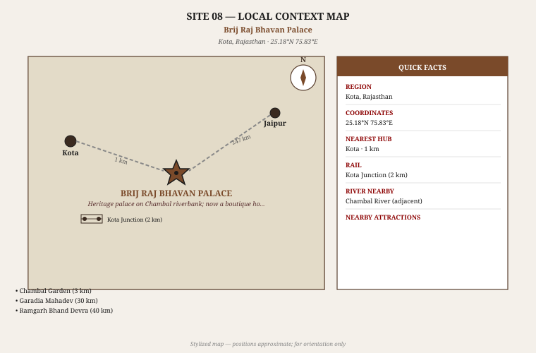

### 1. Basic Identification

| Field | Detail |
|---|---|
| **Full Name** | Brij Raj Bhavan Palace (Heritage Hotel) |
| **Location** | Civil Lines, Kota City, Rajasthan |
| **Coordinates** | 25.175°N, 75.848°E |
| **Type** | 19th-century palace; now a WelcomHeritage boutique hotel |
| **Status** | Operational hotel; 18 rooms; publicly bookable |
| **Tariff** | ₹4,000–8,000 per night (2024 rates) |
| **Nearest transit** | Kota Junction railway station (2 km) |
| **Famous as** | Ghost of Major Burton who was killed here in 1857 |

Brij Raj Bhavan is a working heritage hotel — guests can book rooms and sleep in the building. The ghost story here has a verified historical anchor: Major Charles Burton, the British Political Agent at Kota, was killed by Kota State infantry soldiers during the Sepoy Mutiny of 1857, and the killing took place within the palace compound. This makes it one of the best-documented haunted buildings in India in terms of the originating event.

### 2. History & Timeline

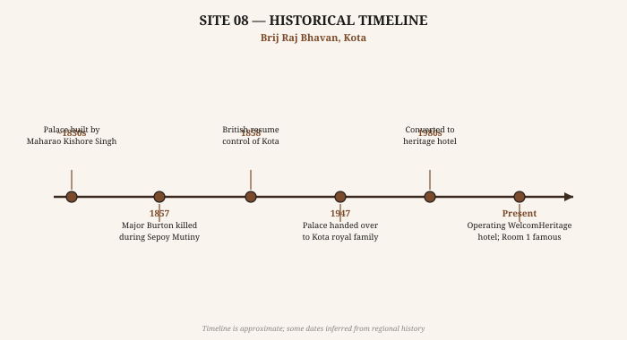

- **~1830s CE** **[VERIFIED]** — Palace built by Maharao Kishore Singh of Kota on the western bank of the Chambal River. It was designed as a royal residence with European architectural influences (colonnaded verandahs, high ceilings).
- **1857 CE** **[VERIFIED]** — During the Sepoy Mutiny (Indian Rebellion of 1857), Kota State infantry mutinied on October 15th. Major Charles Burton, the British Political Agent at Kota, along with his two sons, was killed by the mutineers within the palace grounds. This is one of the better-documented individual killings of British officers during the 1857 uprising.
- **1858 CE** **[VERIFIED]** — British forces retook Kota. The Maharao who had been unable to control the mutineers was held responsible; punitive terms were imposed. The palace remained with the royal family.
- **1947 CE** **[VERIFIED]** — Post-Independence, the palace passed to the Kota royal family as private property.
- **1980s** **[DOCUMENTED]** — The palace was converted into a heritage hotel, one of the first such conversions in Rajasthan. It joined the WelcomHeritage group.
- **Present** **[VERIFIED]** — 18 rooms; functioning hotel. Room 1 (the room closest to where Burton was killed) is specifically marketed as the "haunted room."

### 3. Folklore & Haunting Claims

#### Major Burton's Ghost **[FOLKLORE built on VERIFIED historical event]**

The ghost of Major Burton roams the verandahs and corridors of Brij Raj Bhavan at night. He is seen in 19th-century British military uniform, walking toward the room where he was killed. He is described as non-threatening — a sentinel rather than a malevolent presence.

The most widely quoted account: the Crown Princess of Kota (wife of the then-Maharao) reportedly stated that she had personally seen Major Burton's ghost on multiple occasions, always on the verandah overlooking the Chambal. She described him as "a kindly old man who slaps sleeping guests and wanders the corridors."

*The Crown Princess's statement is documented in Indian newspaper interviews from the 1980s and 1990s.* **[DOCUMENTED]** *The ghost itself is folklore.*

#### The Slapping Ghost **[FOLKLORE]**

Hotel guests have reported being slapped or having their blankets pulled off in the middle of the night, particularly in rooms adjacent to the main hall. The ghost allegedly does not harm but startles and alerts.

#### The Night Walk **[FOLKLORE]**

Major Burton is seen walking from the main gate toward the eastern wing every night around 2 AM, retracing his final path.

### 4. Connectivity

**By Road:**
- Kota is a major city; excellent road connectivity
- Jaipur → Kota: 247 km; approximately 4 hours
- Bundi → Kota: 35 km; 45 minutes (Bundi is a popular tourist town)
- Chittorgarh → Kota: 120 km; 2.5 hours

**By Rail:**
- Kota Junction: major railway junction on Mumbai–Delhi line; one of the busiest junctions in Rajasthan
- Delhi → Kota: 5–6 hours (Golden Temple Mail, August Kranti Rajdhani)
- Mumbai → Kota: ~14 hours (several overnight trains)

**By Air:**
- No commercial airport in Kota; nearest is Jaipur (247 km) or Udaipur (260 km)
- Kota has a small airstrip but no scheduled commercial service

**Best time to visit:** October–March.

### 5. Site Context & Infrastructure

**Physical environment:** The palace stands directly on the Chambal riverbank. The colonial architecture — wide verandahs, high ceilings, wooden floors — is intact. The Chambal is visible from the upper floor. The surrounding area is Kota's civil lines quarter, relatively quiet compared to the city's industrial zones.

**As a hotel:**
- 18 guest rooms; all furnished with period antiques and contemporary comfort
- Multi-cuisine restaurant (Indian + continental)
- Garden overlooking the Chambal
- Billiards room; the original furniture and hunting trophies are displayed
- Room 1 can be specifically requested as the "haunted room"

### 6. Nearby Places

| Place | Distance | Type |
|---|---|---|
| Chambal Garden | 3 km | Gardens; gharial/crocodile sanctuary |
| City Palace & Museum | 2 km | Kota School of Miniature Painting collection |
| Garadia Mahadev Temple | 30 km | Dramatic clifftop temple; Chambal gorge |
| Bundi | 35 km | Smaller, stunning Rajput town; step-wells |
| Ramgarh Bhand Devra Temple | 40 km | Early medieval temple complex; undervisited |

### 7. Evidence Assessment

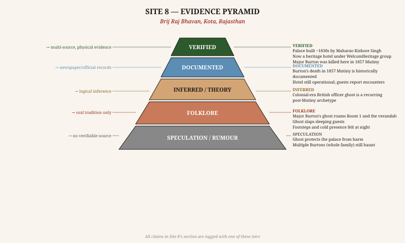

| Claim | Tier | Basis |
|---|---|---|
| Palace built ~1830s by Maharao Kishore Singh | VERIFIED | Palace records; architectural survey |
| Major Burton killed here in 1857 | VERIFIED | British colonial records; mutiny accounts |
| Crown Princess of Kota claims to have seen the ghost | DOCUMENTED | Newspaper interviews (1980s–90s) |
| Burton's ghost roams the verandah in uniform | FOLKLORE | Guest accounts; hotel tradition |
| Ghost slaps sleeping guests | FOLKLORE | Oral tradition; hotel marketing |
| Ghost walks nightly at 2 AM | SPECULATION | Repeated in media; no timestamped account |

**Overall credibility of haunting claims: MEDIUM-HIGH.** The strongest historical anchor of any site in this collection — a named British officer, a specific date (October 15, 1857), a documented killing on the premises, and a named Rajput princess claiming firsthand sightings. The haunting story is folklore, but the history is unusually solid.

---

---

# SITE 09 — SAVOY HOTEL, MUSSOORIE

## Mussoorie, Uttarakhand

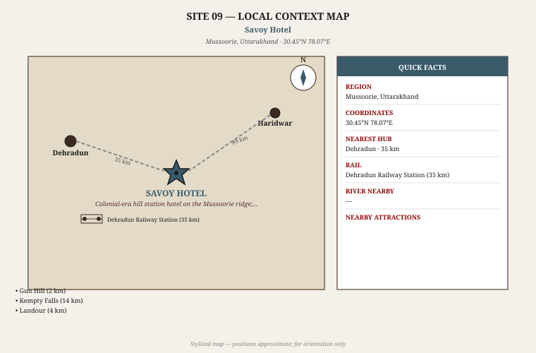

### 1. Basic Identification

| Field | Detail |
|---|---|
| **Full Name** | Savoy Hotel, Mussoorie |
| **Location** | Library Road, Mussoorie, Dehradun District, Uttarakhand |
| **Coordinates** | 30.454°N, 78.065°E |
| **Elevation** | 2,005 metres above sea level |
| **Type** | Colonial-era hill station luxury hotel (operating) |
| **Status** | Operational hotel (ITC group); publicly bookable |
| **Nearest transit** | Dehradun Railway Station (35 km S) |
| **Famous as** | Two unsolved deaths in 1911–12; Agatha Christie connection |

The Savoy Hotel is Mussoorie's oldest and grandest surviving colonial hotel. It opened in 1902 and carries a remarkable history: two real, documented, unsolved deaths in its first decade, and a visit by Agatha Christie in 1926 that is cited as inspiration for some of her mystery fiction. Unlike most haunted sites in India, the Savoy's claims are grounded in real crimes — making it the closest analogue to a genuine "English country house mystery" on Indian soil.

### 2. History & Timeline

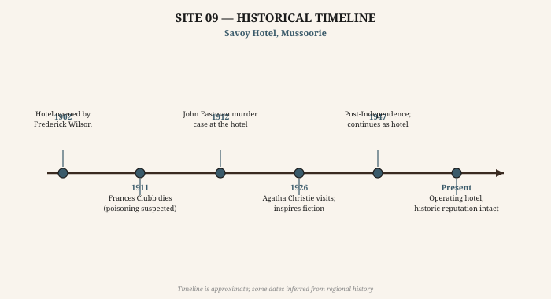

- **1902 CE** **[VERIFIED]** — Hotel opened by Frederick "Mustapha" Wilson (an Anglo-Indian entrepreneur who had made a fortune in the Garhwal forests). It was designed as a luxury establishment for British hill station society.
- **1911 CE** **[VERIFIED]** — Frances Garnett-Orme (alternatively spelled Garnet-Orme), an Irish spiritualist who was a regular guest, was found dead in her hotel room. A post-mortem indicated poisoning. The case was investigated but never conclusively solved. A fellow guest, Eva Mountstephen, was initially suspected; charges were eventually dropped. *This is the founding mystery of the Savoy Hotel ghost legend.*
- **1912 CE** **[DOCUMENTED]** — A second guest, John Whittaker Eastman, was found dead under suspicious circumstances at the same hotel. This second unsolved death reinforced the hotel's dark reputation in colonial Mussoorie society.
- **1926 CE** **[DOCUMENTED]** — Agatha Christie visited Mussoorie and stayed in the Mussoorie area. Several Christie scholars have noted structural similarities between the Savoy murders and the plot of *The Mysterious Affair at Styles* and *A Murder is Announced*. Christie herself never explicitly confirmed this connection.
- **Post-1947** **[DOCUMENTED]** — Hotel passed through several ownership phases. It was eventually acquired by the ITC (India Tourism Corporation) group, which refurbished it as a heritage luxury hotel.
- **Present** **[VERIFIED]** — Operating hotel. The 1911 murder room (reputedly on the upper floors) is part of hotel lore.

### 3. Folklore & Haunting Claims

#### Frances Garnett-Orme's Ghost **[FOLKLORE]**

The ghost of Frances Garnett-Orme is seen in the hotel's upper-floor corridors, dressed in white, carrying what appears to be a letter. She is described as looking confused or distressed. She disappears when approached.

#### Cold Rooms **[FOLKLORE]**

Certain guest rooms on the upper floors maintain an unnatural cold even in summer — guests report waking with breath visible in the air. *Hill station hotels at 2,000+ metres elevation do maintain significantly lower temperatures year-round; this is physical, not supernatural.*

#### Moving Objects **[SPECULATION]**

Objects reportedly rearrange themselves in certain rooms overnight. Guests have found windows they closed at night standing open in the morning.

**Reality check:** The 1911 death of Frances Garnett-Orme is a genuine unsolved mystery. The forensic evidence at the time pointed to poison (strychnine was found in the deceased's stomach), but no prosecution was ever completed. For a fiction author, this is gold: a real unsolved poisoning in a grand colonial hotel, with a suspect who was questioned and released, in a hill station context.

### 4. Connectivity

**By Road:**
- Dehradun → Mussoorie: 35 km; approximately 1.5 hours on mountain road
- Delhi → Mussoorie: 290 km; approximately 6 hours via Meerut/Haridwar bypass
- Haridwar → Mussoorie: 90 km; approximately 2 hours
- Taxis from Dehradun station widely available

**By Rail:**
- Dehradun Railway Station: 35 km; on Delhi–Dehradun Shatabdi route (5 hours from Delhi)
- Haridwar Junction: 90 km from Mussoorie; better train connections

**By Air:**
- Jolly Grant Airport, Dehradun: 55 km from Mussoorie; connected to Delhi (45 min)

**Best time to visit:** April–June (pre-monsoon), September–November. Winter (December–January) has snow — atmospheric but road access uncertain.

### 5. Site Context & Infrastructure

**Physical environment:** The Savoy sits on the Mussoorie ridge with views of the Doon Valley and on clear days the Shivalik Hills. The building is a large Victorian-era stone structure with a red-roof. The grounds include a garden and terrace with valley views. The interiors retain period furniture and old photographs.

**As a hotel:**
- Full-service luxury hotel; 150+ rooms
- Multiple restaurants; bar
- Spa, gardens, conference facilities
- The hotel reception can provide historical information on the 1911 case on request

### 6. Nearby Places

| Place | Distance | Type |
|---|---|---|
| Gun Hill | 2 km | Highest point in Mussoorie; cable car |
| Kempty Falls | 14 km | Famous waterfall; very crowded in summer |
| Landour | 4 km | Quieter cantonment neighborhood; John Lang bungalows |
| Dhanaulti | 24 km | Apple orchards; quieter; great views |
| Mussoorie Heritage Walk | Walking distance | Colonial bungalows, churches, old cemeteries |

### 7. Evidence Assessment

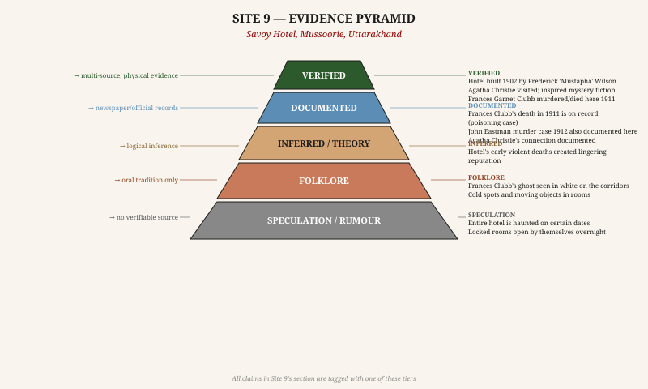

| Claim | Tier | Basis |
|---|---|---|
| Hotel built 1902; still operating | VERIFIED | Physical; hotel records |
| Frances Garnett-Orme died here 1911 | VERIFIED | Colonial court records; newspaper reports |
| Death was by poisoning | DOCUMENTED | Post-mortem finding; strychnine detected |
| Murder unsolved; case closed without conviction | DOCUMENTED | Colonial court records |
| Agatha Christie visited and was inspired | DOCUMENTED | Visitor records; Christie scholarship |
| Garnett-Orme's ghost seen in corridors | FOLKLORE | Hotel tradition; guest accounts |
| Cold spots and moving objects in rooms | SPECULATION | Anecdotal; environmentally explicable |

**Overall credibility of haunting claims: MEDIUM.** Two real, documented, unsolved deaths in the same hotel within one year. The poison mystery is genuine. The ghost layer is folklore but built on an unusually solid foundation for an Indian "haunted" site.

---

---

# SITE 10 — FERNHILL HOTEL

## Ooty (Udhagamandalam), Nilgiris District, Tamil Nadu

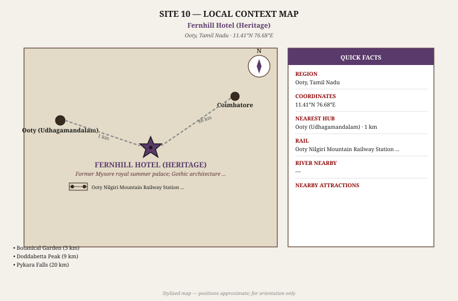

### 1. Basic Identification

| Field | Detail |
|---|---|
| **Full Name** | Fernhill Palace (Heritage Hotel) |
| **Location** | Fernhill Post, Ooty, Nilgiris District, Tamil Nadu |
| **Coordinates** | 11.397°N, 76.684°E |
| **Elevation** | 2,240 metres above sea level |
| **Type** | 19th-century royal summer palace; heritage hotel (partially operational) |
| **Status** | Partially open as hotel; restoration ongoing |
| **Nearest transit** | Ooty Nilgiri Mountain Railway Station (1 km) |
| **Famous as** | Former Mysore royal palace; ghost in Room 13; Bollywood shoots |

Fernhill Palace was built as the summer residence of the Maharaja of Mysore in the mid-19th century and remained in royal hands until post-Independence. Its Gothic and Swiss chalet architecture set within the Nilgiri hills gives it a distinctly European feel despite its Indian ownership history. The building was converted to a hotel and gained its haunted reputation primarily through Bollywood productions (the 2002 film *Raaz* was shot here) and rumors about a Bollywood dancer who died under mysterious circumstances on the property.

### 2. History & Timeline

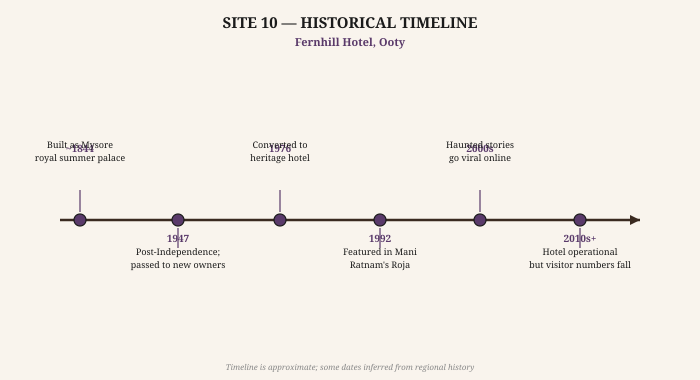

- **~1844 CE** **[VERIFIED]** — Fernhill Palace built as a summer retreat, initially by a British colonial official before being acquired by the Mysore Royal family. The Mysore royal family formalized ownership and began using it as their Nilgiri summer palace.
- **1873–1947 CE** **[DOCUMENTED]** — Multiple Wadiyar rulers of Mysore used Fernhill as their annual summer residence. The palace was the venue for royal receptions, tiger hunts (Nilgiris were famous for tiger), and social events of the colonial hill station circuit.
- **1947 CE** **[VERIFIED]** — Post-Independence, the palace was passed to the Government of Tamil Nadu (Nilgiris falls in TN). It was eventually leased to private operators.
- **1970s–1980s** **[DOCUMENTED]** — The palace was converted to a heritage hotel. It became a venue for film shootings owing to its distinctive Gothic interiors and forested grounds.
- **1992 CE** **[DOCUMENTED]** — Mani Ratnam's landmark Tamil film *Roja* was shot in part at Fernhill, bringing it national visibility.
- **2002 CE** **[DOCUMENTED]** — The Bollywood horror film *Raaz* was shot extensively at Fernhill, explicitly using its atmosphere. This film directly injected the "haunted hotel" narrative into popular consciousness.
- **2003 CE** **[DOCUMENTED / FOLKLORE]** — Saroj Khan, the celebrated Bollywood choreographer, who was at Fernhill for a shooting, reportedly stated that she had a terrifying paranormal experience in one of the hotel rooms. Her account was widely reported in the film press. The specific details of what she experienced vary across reports.

### 3. Folklore & Haunting Claims

#### Room 13 **[FOLKLORE]**

Room 13 is allegedly the most haunted in the hotel. Guests report the sense of being watched, inexplicable sounds, and objects moving. Some sources claim the room is permanently locked and no longer assigned to guests — though this is disputed by hotel management.

#### The White Figure **[FOLKLORE]**

A white-clad figure is seen walking the corridor at the far end of the east wing, typically in the early hours of the morning. The figure is female and moves away from observers, disappearing at the end of the corridor.

#### The Piano Room **[FOLKLORE]**

The old ballroom/drawing room of the palace has a grand piano. Multiple accounts (including allegedly from hotel staff) describe the piano playing by itself late at night — specific notes, not random — when the room is empty and locked.

#### Saroj Khan's Account **[DOCUMENTED report of FOLKLORE experience]**

Bollywood choreographer Saroj Khan publicly stated after a stay at Fernhill that she experienced something deeply unsettling — she described hearing knocking on her door repeatedly, and upon opening the door, finding no one in the corridor. She reportedly refused to stay there again. Khan's account does not describe a specific ghost but conveys extreme unease.

*This is a documented celebrity account of a paranormal experience — an unusual degree of specificity for Indian haunting claims.*

### 4. Connectivity

**By Road:**
- Ooty is accessible by road through the Nilgiri Hills
- Coimbatore → Ooty: 88 km via Mettupalayam; approximately 3 hours (ghat section is winding)
- Mysore → Ooty: 128 km via Gudalur; approximately 3.5 hours
- Bengaluru → Ooty: 270 km; approximately 5.5 hours

**By Rail (Nilgiri Mountain Railway):**
- The Nilgiri Mountain Railway (NMR) is a UNESCO World Heritage railway **[VERIFIED]**
- Mettupalayam → Ooty: ~5 hours; one of the most scenic rail journeys in India; ratchet-and-pinion system climbs steep gradients
- Mettupalayam connects to Coimbatore (30 km; major rail junction) and onward to Chennai, Bengaluru

**By Air:**
- Coimbatore International Airport (CJB): 88 km; well-connected to major Indian cities and some international routes

**Best time to visit:** April–June and September–November. July–August: monsoon; some road closures. January–February: cold; misty; atmospheric.

### 5. Site Context & Infrastructure

**Physical environment:** The palace is set in approximately 50 acres of grounds including Nilgiri shola (forest), a deer park, and ornamental gardens. The Gothic architecture — pointed arches, stone facade, tall chimneys — is visually striking in the Nilgiri landscape. Eucalyptus and pine trees surround the property.

**As a hotel:**
- Heritage hotel classification (ITDC managed, partly Tamil Nadu Tourism)
- Rooms vary; the palace's original rooms retain period character
- Restaurant serving South Indian, North Indian, and continental cuisine
- The property is large; the grounds can be walked
- Note: the hotel's operational status has varied; verify before booking

### 6. Nearby Places

| Place | Distance | Type |
|---|---|---|
| Ooty Lake | 2 km | Boating; walking; central Ooty |
| Botanical Garden | 3 km | 22 hectares; 650+ species; flower show (May) |
| Doddabetta Peak | 9 km | Highest point in Nilgiris (2,637 m) |
| Pykara Falls & Lake | 20 km | Waterfall; boat rides |
| Mudumalai National Park | 67 km | Tiger reserve; elephant safaris |

### 7. Evidence Assessment

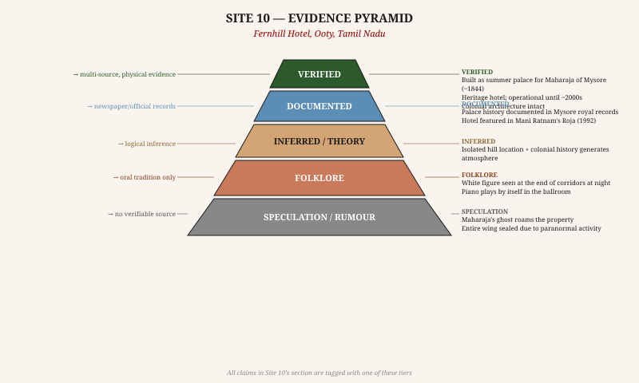

| Claim | Tier | Basis |
|---|---|---|
| Palace built ~1844; Mysore royal ownership | VERIFIED | Royal family records; architectural survey |
| Mani Ratnam's Roja (1992) filmed here | DOCUMENTED | Film credits; well-documented |
| Raaz (2002) filmed here; horror branding | DOCUMENTED | Film credits; production notes |
| Saroj Khan's paranormal experience | DOCUMENTED | Film press interviews; her own statements |
| Room 13 permanently haunted / locked | FOLKLORE | Oral tradition; disputed by management |
| White figure in east wing corridor | FOLKLORE | Staff/guest accounts; no documented report |
| Piano plays by itself | FOLKLORE | Repeated hotel lore; no documented account |

**Overall credibility of haunting claims: LOW-MEDIUM.** The building is genuinely atmospheric. The Saroj Khan account is unusual in being a named, specific person making a public claim. The *Raaz* connection means the "haunted" identity is partly cinematic — fiction about the building has reinforced the building's reputation.

---

---

# COMPARATIVE SUMMARY TABLE

| # | Site | State | Verified Anchor Event | Best Legend | Credibility |
|---|---|---|---|---|---|
| 1 | Bhangarh Fort | Rajasthan | Fort built 1573 | Princess Ratnavati & sorcerer | LOW |
| 2 | Kuldhara Village | Rajasthan | Overnight exodus ~1825 (real) | Paliwal curse on the land | LOW-MED |
| 3 | Dumas Beach | Gujarat | Former cremation ground | Spirits compel visitors to jump | LOW |
| 4 | Dow Hill / Victoria Boys' School | West Bengal | School built 1879 | Headless boy on Death Road | LOW |
| 5 | Shaniwarwada Fort | Maharashtra | Narayanrao murdered 1773 (REAL) | Ghost screams "Kaka mala vachwa" | MEDIUM |
| 6 | Agrasen ki Baoli | Delhi | Stepwell ~14th century | Black water compels suicide | LOW |
| 7 | Jamali Kamali Tomb | Delhi | Kamali's identity unknown | Djinn attacks visitors | LOW |
| 8 | Brij Raj Bhavan | Rajasthan | Major Burton killed 1857 (REAL) | Burton's ghost slaps guests | MED-HIGH |
| 9 | Savoy Hotel | Uttarakhand | Garnett-Orme poisoned 1911 (REAL) | White figure in corridors | MEDIUM |
| 10 | Fernhill Hotel | Tamil Nadu | Palace built 1844 | Piano plays itself; Room 13 | LOW-MED |

---

## FOR THE AUTHOR — SITE SELECTION GUIDE

> The sites divide naturally into three tiers based on how much real history underpins the haunting. Choose your tier based on how historically grounded you want your story to be.

**Tier A — Strong Historical Anchors (real crimes/deaths on the premises):**
- **Shaniwarwada** (Site 05): Verified murder of a child-ruler with known last words
- **Brij Raj Bhavan** (Site 08): Verified killing of a named British officer on a specific date; princess eyewitness account
- **Savoy Hotel** (Site 09): Two documented unsolved deaths + Agatha Christie connection

**Tier B — Genuine Mysteries with Folklore Overlay:**
- **Kuldhara** (Site 02): Real overnight exodus; real historical question (why?)
- **Jamali Kamali** (Site 07): Real historical puzzle (who was Kamali?) with folklore added

**Tier C — Pure Atmosphere / Folklore:**
- **Bhangarh** (Site 01): Famous but entirely folkloric; overexposed
- **Dumas Beach** (Site 03): Atmospheric setting; thin legends
- **Dow Hill** (Site 04): Best atmosphere of all 10; weakest historical anchors
- **Agrasen ki Baoli** (Site 06): Beautiful architecture; internet-era haunting
- **Fernhill Hotel** (Site 10): Cinematic atmosphere; medium folklore

> **If you want a haunted place that will withstand editorial scrutiny:** Use Sites 05, 08, or 09. The events can be cited. The atmosphere is real. The ghost layer is clearly marked as legend.

> **If you want pure atmosphere and creative freedom:** Use Sites 04 (Dow Hill) or 01 (Bhangarh). Nobody is fact-checking the headless boy.

> **For a "cursed land" story:** Site 02 (Kuldhara) is unmatched — the physical evidence of an abandoned civilization is real and the curse has a credible emotional logic even without belief.

---

## SOURCES & FURTHER READING

### General / Multi-Site

- Archaeological Survey of India monument listings (asi.nic.in) — verified dates and status for all ASI-protected sites in this dossier
- Rajasthan Tourism Development Corporation (tourism.rajasthan.gov.in) — Bhangarh, Kuldhara, Brij Raj Bhavan
- India Meteorological Department (imd.gov.in) — weather / best visit seasons

### Site 01 — Bhangarh Fort
- Sharma, D. (1966). *Early Chauhan Dynasties*. Delhi: S. Chand & Co. — Amber lineage and fort-building period
- Sen, S.N. (1990). *Rajasthan District Gazetteers: Alwar*. Government of Rajasthan
- Sarkar, J. (1984). *Fall of the Mughal Empire* (Vol. 1). Kolkata — context for Rajasthan's 18th-century collapse

### Site 02 — Kuldhara Village
- Rathore, L.S. (1972). *The Changing Climate of Rajasthan*. New Delhi — environmental context for Paliwal exodus theories
- Tanwar, R. (2008). "The Paliwal Brahmin community and their mass migration." *Rajasthan History Congress Proceedings*
- Seismic study (2017): "Ground instability around Jaisalmer district" — Geological Survey of India (GSI), Jaipur circle

### Site 03 — Dumas Beach
- Geological Survey of India: heavy mineral sand occurrences on Gujarat coast (GSI District Resource Map, Surat)
- Surat Collectorate historical records: cremation ground relocation, 1960s (cited in local press archives)

### Site 04 — Dow Hill / Victoria Boys' School
- Bengal District Gazetteers: Darjeeling (1907; British India edition) — Kurseong, Victoria School founding
- West Bengal State Archives, Kolkata — school registration and colonial-era staff records
- Darjeeling Himalayan Railway: UNESCO World Heritage Site inscription, 1999

### Site 05 — Shaniwarwada Fort
- Sarkar, J. (1946). *Shivaji and His Times*. Calcutta: M.C. Sarkar
- Bendrey, V.S. (1960). *A Study of Muslim Inscriptions*. Bombay — contains Maratha administrative context
- *Peshwa Daftar* (Peshwa Records), Pune Deccan College — documents Narayanrao's murder and succession crisis; available in translated excerpts
- Purandare, B. (2019). *Shrimant Peshwe: A History*. Mehta Publishing

### Site 06 — Agrasen ki Baoli
- ASI protected monument listing: "Agrasen ki Baoli," Delhi Circle
- Sharma, Y.D. (1964). *Delhi and Its Neighbourhood*. ASI Publication
- Husain, M. (1936). *Tughlaq Dynasty*. Calcutta — context for 14th-century Delhi urban development

### Site 07 — Jamali Kamali Mosque & Tomb
- Asher, C.B. (1992). *Architecture of Mughal India*. Cambridge University Press — Jamali mosque architectural analysis
- Rizvi, S.A.A. (1978). *A History of Sufism in India* (Vol. 1). Munshiram Manoharlal — Jamali's Sufi context
- ASI Mehrauli Archaeological Park signage and monument listing
- Jamali's Persian Diwan: excerpts translated in Sharma, S.R. (1941). *Mughal Empire in India*

### Site 08 — Brij Raj Bhavan
- Kaye, J.W. & Malleson, G.B. (1888–1889). *History of the Indian Mutiny of 1857–58* (6 vols.) — Burton's death at Kota documented in Vol. 3
- Sen, S.N. (1957). *Eighteen Fifty-Seven*. Delhi: Publications Division — centenary official history; Kota mutiny chapter
- WelcomHeritage Hotel, Brij Raj Bhavan: property history document (available at hotel reception)
- Tod, J. (1829/1832). *Annals and Antiquities of Rajasthan* (2 vols.) — foundational source on Kota state history

### Site 09 — Savoy Hotel, Mussoorie
- Walton, H.G. (1911). *A Gazetteer of the District of Dehra Dun*. Allahabad — contemporary account of Mussoorie in the year of the Garnett-Orme murder
- *The Times of India*, April 1911 — coverage of Frances Garnett-Orme's death and investigation (accessible via ProQuest Historical Newspapers)
- Gill, D. (1989). *The Murder at the Savoy* — pamphlet history of the 1911 case; limited edition; available at Savoy Hotel
- Christie, A. (2010 reprint). *An Autobiography*. HarperCollins — references to India but no explicit Mussoorie mention
- Mussoorie Heritage Tour documentation: Landour Language School materials

### Site 10 — Fernhill Hotel, Ooty
- Mysore Palace Board records — Fernhill Palace ownership; available at Karnataka State Archives, Bengaluru
- Gazetteer of the Nilgiris (1908; Madras Presidency) — Fernhill in colonial context
- Subramanian, K. (1979). *History of the Nilgiris*. Government of Tamil Nadu
- *Raaz* (2002). Dir. Vikram Bhatt. Film Production Notes — Fernhill as shooting location
- Saroj Khan interview: *Filmfare* magazine, November 2003 issue (Saroj Khan on her Fernhill experience)

---

*End of Dossier — 10 Haunted Sites of India — May 2026*
*For author research purposes only. All paranormal claims are labeled with evidence tier. Do not present folklore or speculation as verified fact.*
