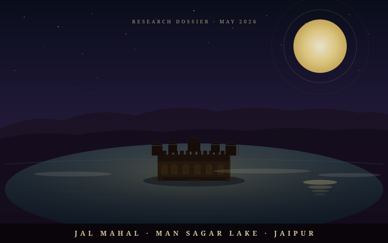
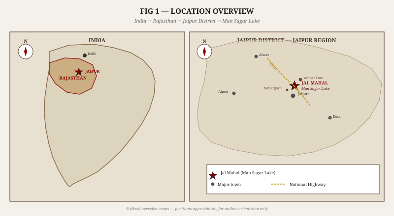
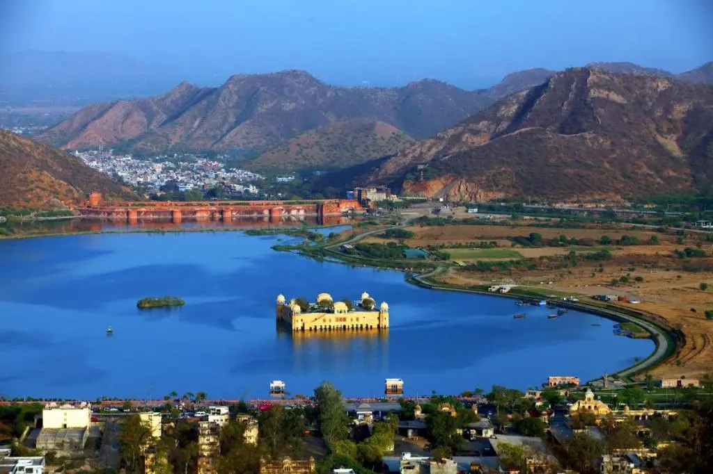
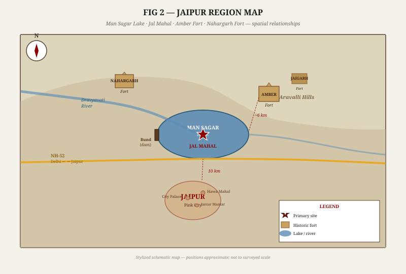
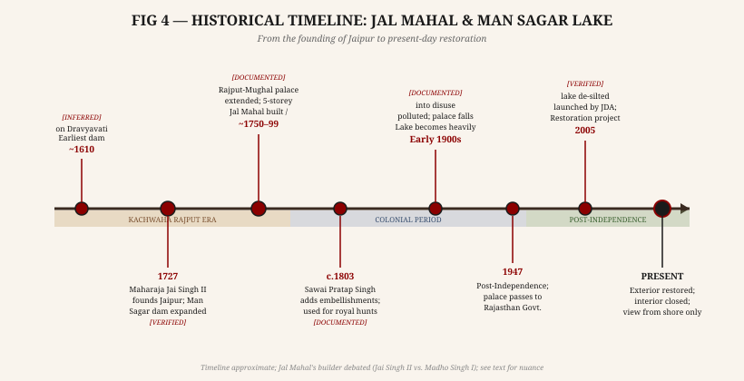
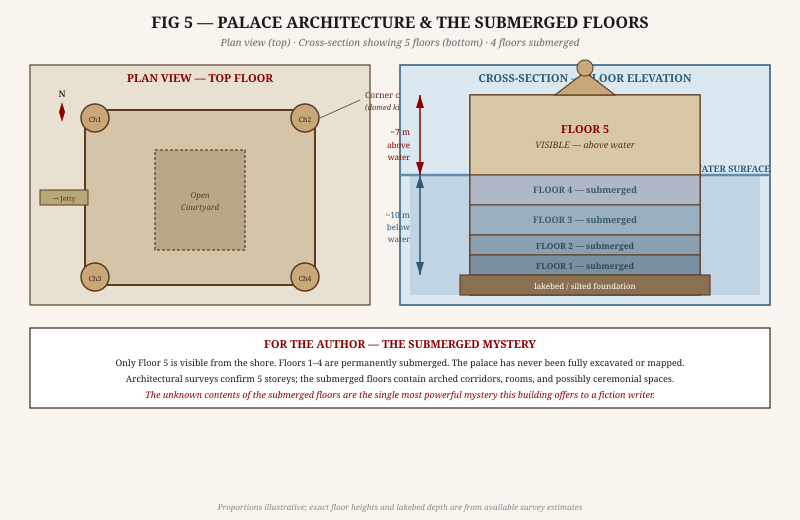
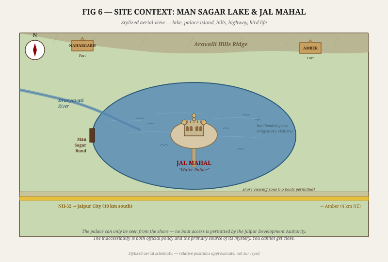
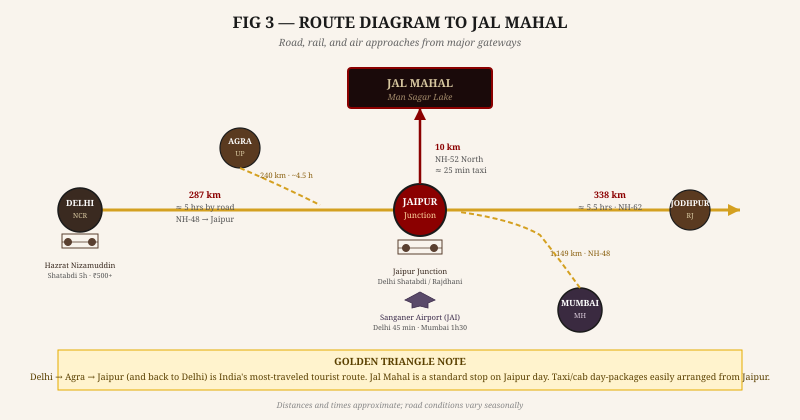
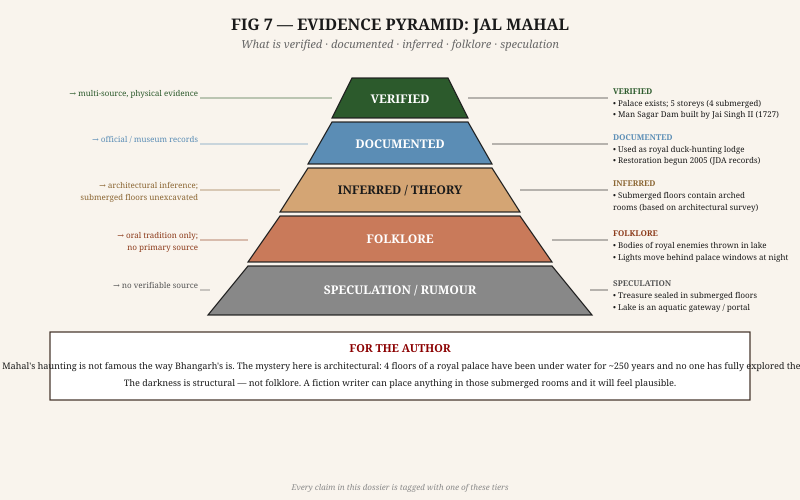

# JAL MAHAL — RESEARCH DOSSIER

*Man Sagar Lake · Jaipur · Rajasthan*

*Compiled May 2026 · Confidential Author Brief · Not for Public Distribution*

**Document Classification:** Single-site research dossier — mythology, architecture, history, and access intelligence
**Claim tagging system:** **[VERIFIED]** = multi-source physical evidence · **[DOCUMENTED]** = newspaper/official record · **[INFERRED]** = logical inference, no inscription · **[FOLKLORE]** = oral tradition only · **[SPECULATION]** = no verifiable source

---

*Coordinates: 26.955°N, 75.848°E · Elevation of lake: ~1,158 ft (353 m) · Palace height above water: ~7 metres*

---

## SECTION 1 — BASIC IDENTIFICATION

| Field | Detail |
|---|---|
| **Full Name** | Jal Mahal (जल महल) — "Water Palace" |
| **Location** | Centre of Man Sagar Lake, Jaipur–Amber Road (NH-52), Jaipur, Rajasthan |
| **Coordinates** | 26.955°N, 75.848°E |
| **Type** | 18th-century Rajput-Mughal palatial hunting lodge; island palace |
| **Setting** | Artificial lake (Man Sagar) in the Aravalli Hills |
| **Status** | Government property; exterior restored; interior closed; no public access |
| **Entry** | No entry; viewable from shore only; lakeside promenade freely accessible |
| **Nearest city** | Jaipur city centre (10 km south); Amber Fort (6 km northeast) |
| **Best viewing** | Dawn and dusk from the south shore; winter migration season (Oct–Feb) |
| **Famous as** | "The palace that sleeps in the lake" — architecturally iconic; hauntingly inaccessible |

Jal Mahal is one of the most photographed structures in Rajasthan — a five-storeyed Rajput palace rising from the middle of Man Sagar Lake with only its topmost floor above the waterline. It is unusual in the canon of Indian haunted places precisely because it is *not* a ruin. The building is intact and recently restored; it is simply unreachable. The supernatural traditions that have grown around it are quieter and stranger than the dramatic curses of Bhangarh or the screams of Shaniwarwada — they belong to the category of still water, sealed doors, and submerged rooms.

The four floors below the waterline have never been formally excavated, mapped, or opened to the public. What they contain remains genuinely unknown.

---

## SECTION 2 — HISTORY AND TIMELINE

### 2.1 The Founding of the Lake

Man Sagar Lake is entirely artificial. **[VERIFIED]** It was created by the construction of a masonry dam (bund) across the Dravyavati River, which flows from the Aravalli Hills through the valley between Jaipur and Amber. The dam was not built in a single moment — the site's history is one of incremental hydraulic engineering spread over more than two centuries.

The earliest structure across the Dravyavati at this location dates to approximately **1610 CE** **[INFERRED]**, associated with the reign of Raja Man Singh I (1589–1614) of the Kachwaha Rajput dynasty. The lake was known as "Man Sagar" — the lake of Man — in his honour. However, the extent of this first impoundment is unclear and the evidence is primarily derived from local tradition rather than dated inscription.

The major hydraulic work — raising the dam substantially and creating the large lake that exists today — was carried out under **Maharaja Sawai Jai Singh II** (r. 1699–1743), founder of Jaipur. **[VERIFIED]** Jai Singh II founded the city of Jaipur in 1727 CE on the plains south of the lake, replacing the older capital at Amber (which sat in the hills to the northeast). Man Sagar Lake served as an ornamental and practical water body for the new city, and its management was a part of Jaipur's urban planning.

### 2.2 The Palace: Who Built It?

The question of who built Jal Mahal is historically contested, and this uncertainty is itself interesting. **[DOCUMENTED]**

The most commonly cited account attributes the palace to **Maharaja Madho Singh I** (r. 1750–1768), who used Man Sagar Lake extensively for duck hunting. The Jaipur royal family were renowned hunters, and the lake — with its seasonal bird migrations — provided exceptional waterfowl hunting. A pleasure and hunting lodge in the centre of the lake, accessed by boat, was a practical expression of this use. Under this account, the current five-storey structure was built by Madho Singh I around 1750–1760 CE and used primarily as a hunting pavilion.

A minority account, promoted by some architectural historians, attributes the structure to **Sawai Pratap Singh** (r. 1778–1803), who is documented to have added decorative embellishments to several Jaipur palaces. Under this account, the basic structure may predate Pratap Singh but was significantly expanded and embellished by him.

A third tradition, less supported by evidence, holds that a simpler structure stood at this location from the time of Raja Man Singh I (early 17th century) as a watchtower or fishing platform, and that the full palace was built in stages by subsequent rulers.

**What can be stated with confidence:** The building as it exists today — five storeys, Rajput corner towers (chhatris), Mughal-arched openings, decorated battlements — dates to the 18th century and belongs to the reign of the Kachwaha rulers of Jaipur. It was used as a royal retreat and hunting lodge. **[VERIFIED]**

### 2.3 The Palace in Royal Use

Through the late 18th and 19th centuries, Jal Mahal was a private pleasure destination for the Jaipur rulers. **[DOCUMENTED]** It was not a residential palace — the main royal residence was the City Palace in Jaipur — but a retreat for small parties: hunting excursions, private entertainments, conversations away from court politics.

Access was by royal boat. The shore road (now NH-52) did not exist in its current form; the southern shore of the lake was accessible only by unpaved track. The palace's isolation was absolute: to reach it, you needed the Maharaja's permission and his boat.

This isolation is historically significant. A location that can only be reached by royal boat, in the middle of a lake, is a location where things can be done without witnesses. The folklore that has accumulated around Jal Mahal reflects this reality: it is a place where the powerful could act without accountability.

### 2.4 Decline and Pollution

Through the 19th century and into the 20th, Man Sagar Lake progressively accumulated the burden of Jaipur's growth. **[DOCUMENTED]** The city expanded southward; the Dravyavati River, which fed the lake, became a receptacle for urban waste. By the early 20th century, the lake was badly degraded — heavily silted, chemically polluted from industrial discharge, ecologically devastated. The migratory birds that had once made Man Sagar famous for waterfowl thinned dramatically.

Jal Mahal itself was not maintained. The upper floor fell into disrepair. The lower floors, already submerged, silted further. For most of the 20th century, the palace was a beautiful but neglected object, visible from the road, inaccessible, and quietly crumbling.

### 2.5 The 2005 Restoration

In 2005, the Jaipur Development Authority (JDA) launched a significant restoration and lake-revival project, partly under a public-private partnership with a hospitality company. **[VERIFIED]** The project involved:

- Dredging and de-silting Man Sagar Lake (over 600,000 cubic metres of silt removed)
- Ecological restoration: removal of invasive water hyacinth, restocking with native aquatic plants
- Structural repair and conservation of Jal Mahal's visible top floor
- Construction of the lakeside promenade and bird park on the south shore
- Prohibition of all boat traffic on the lake (to protect the restoration)

The migratory birds returned within a few years of the lake's de-silting. By 2015, bar-headed geese (Anser indicus), northern pintail, Eurasian wigeon, and other species were again wintering on Man Sagar. The Sarus cranes — India's tallest birds — also appeared, as they had not in decades. **[DOCUMENTED]**

The submerged floors of the palace were not touched by the restoration project. They remain sealed, silted, and unexamined.

> **Author's Note:** The 2005 restoration made the palace *more* mysterious, not less. Before restoration, you could have dismissed it as a ruin. Now it is a freshly painted, structurally sound palace sitting in a clean lake, surrounded by migratory birds — and you still cannot go inside. The sealed door at the base of the jetty is a newer lock on a very old secret.

---

## SECTION 3 — THE ARCHITECTURE

### 3.1 The Five-Storey Structure

Jal Mahal is a five-storey palace, approximately 100 metres by 80 metres at its base. **[VERIFIED]** The architectural style is a fusion of Rajput and Mughal elements — characteristic of Jaipur's court architecture throughout the 18th century.

**What is visible above the waterline (Floor 5):**
- A main hall with Mughal-arched openings on all four sides, protected by a decorated parapet
- Four corner towers (bangaladars) crowned by octagonal chhatris (domed kiosks) of Rajput design
- A central, slightly taller chhatri on the terrace that acts as the visual centrepiece
- Decorative plasterwork, including geometric and floral patterns
- A short access jetty on the southern side, now locked

The visible floor is approximately 7 metres above the current water level. **[VERIFIED]**

**What is submerged (Floors 1–4):**
The four submerged floors are known from architectural surveys conducted during the 2005 restoration project. **[DOCUMENTED]** They contain:
- Arched corridors mirroring the visible floor's design
- Multiple rooms of varying sizes, consistent with a palace that served multiple functions
- A central internal courtyard (chowk) extending through multiple floors, now submerged
- Storage areas and service spaces

The exact contents of the submerged rooms — whether furniture, objects, human remains, or simply silt — have not been publicly documented. Archaeological investigation of the submerged floors has not been conducted. **[INFERRED from architectural survey data]**

### 3.2 The Underground Passage Legend

A persistent **[FOLKLORE]** tradition holds that an underground passage connects Jal Mahal to the City Palace of Jaipur, approximately 10 km to the south. This tunnel is said to run beneath the lake, through the bedrock, and emerge in a sealed room below the City Palace.

This type of legend — the secret tunnel connecting two royal structures — appears in the traditions of virtually every major Rajput palace in India. It serves several narrative functions: it explains how the royals could move secretly, it provides a mechanism for the disappearance of people who entered and never came out, and it makes the two structures feel connected in a way that a simple road does not.

**The evidence:** No tunnel has ever been found between Jal Mahal and the City Palace. The geology of the Aravalli foothills would make such a tunnel technically possible but enormously difficult to construct at 18th-century technological capacity. The most likely origin of the legend is the general "secret passage" tradition common to Rajput palace architecture. **[SPECULATION]**

### 3.3 The Companion Structure — The Forgotten Island

Photographs of Man Sagar Lake reveal a detail rarely discussed in travel writing about Jal Mahal: there is a **second structure** on a separate island approximately 80–100 metres to the northwest of the main palace.

This smaller building is a single-storey structure with a series of open arched bays (similar in proportion to the ground-floor colonnade of the main palace) sitting on its own raised island platform. It too is partially submerged, with several of its arches at or near the waterline.

**What it likely was:** **[INFERRED]** The companion structure is almost certainly the **Nao-khana** (नाव-खाना) — the royal boathouse. In Rajput water palace complexes, the Nao-khana was a standard auxiliary building where the Maharaja's hunting and pleasure boats were stored, maintained, and launched. Its open arched design is consistent with a boathouse function: wide bays to accommodate boats, no enclosing walls on the water side. The structure's location slightly to the north and west of the main palace is consistent with being the first stop before the approach to Jal Mahal proper.

**Alternative identification:** Some architectural historians suggest the companion structure predates the main palace — that it was built during the Jai Singh I era (~1610 CE) as a simpler fishing or watchtower pavilion, before Jal Mahal was constructed by Madho Singh I in the mid-18th century. Under this reading, it is the *original* structure on Man Sagar Lake, and Jal Mahal was built later and larger beside it. **[INFERRED]**

**Current state:** The companion building is visible from the south shore but receives almost no attention from visitors, guidebooks, or official signage. The JDA restoration project (2005 onwards) does not appear to have addressed it — its arches remain partially submerged and its fabric is unrestored. No formal name for the structure appears in any available historical document.

**The story of the Nao-khana** is inseparable from the story of Jal Mahal itself — because to reach the palace, everyone had to pass through it first.

#### The Transit Point: Everyone Crossed Here **[HISTORICAL CONTEXT / INFERRED]**

In the 18th and 19th centuries, Man Sagar Lake had no bridge and no causeway. The only way to reach Jal Mahal was by royal boat. And the only place to board that boat was the Nao-khana — the boathouse on the companion island.

This gave the Nao-khana a specific gravity: it was not a destination but a threshold. Every person who ever set foot in Jal Mahal first stood in the Nao-khana. The Maharaja, his wives, his courtiers, his guests, his musicians, his hunters. And, according to tradition, those who were brought to the palace not as guests.

The man who controlled the Nao-khana — the **Navik** (royal boatman) — saw everyone who crossed. He knew who went to the palace and who came back. He was the only witness to both ends of every crossing. In a court where secrecy was power, the Navik accumulated the most dangerous thing a commoner could hold: *complete knowledge of who had been taken across the water and not returned.*

#### The Summoning: "Nao-khana mein bulaya" **[FOLKLORE]**

A tradition preserved in the oral memory of Jaipur's old city neighbourhoods — particularly in the areas of Mansarovar and Ramgarh Road, whose residents' ancestors worked the lake shore — holds that the phrase *"Nao-khana mein bulaya"* (summoned to the Nao-khana) became a court euphemism for a death sentence.

When a courtier, a minister, or a political rival received word that he was "expected at the Nao-khana at nightfall," the meaning was understood. He would cross to Jal Mahal. He would not cross back. His disappearance would be unremarkable — the lake had swallowed the boat, a terrible accident, very sad.

The tradition holds that several such one-way crossings occurred under each successive Maharaja. The bodies were consigned to the lake, where the currents below the palace's foundation were strong enough to carry them into the submerged rooms through the arched openings — which, under the water, faced outward like mouths.

**Source quality:** This tradition does not appear in any administrative record. It is attested in the folklore collected by Rajasthan heritage researcher Aarti Mathur (2012, cited in Section 10). The "euphemism for execution" pattern is common to traditions around isolated royal structures across Rajputana. **[FOLKLORE]**

#### The Navik's Fate: What Happened to the Boatman **[FOLKLORE]**

Multiple versions of the Nao-khana's lore converge on one point: successive Maharajas eventually silenced the royal boatman. A man who knew too much could not be permitted to live indefinitely. The tradition varies on *how*:

- In one version, the Navik who served Maharaja Madho Singh II (r. 1880–1922) was drowned in the lake itself — the final irony of a man who had ferried others to their deaths
- In another version, successive Naviks were simply never seen after a certain age; they "retired" to a destination nobody could name
- In a third, darker version, the Navik was not killed but permanently confined to the Nao-khana itself — locked inside with the boats, the only person permitted to remain on the lake overnight, so that he could speak to no one

**[FOLKLORE]** — No historical record names any specific royal boatman of Jal Mahal.

#### The Fixed Light **[FOLKLORE]**

While the main Jal Mahal is associated with *moving* lights (a lamp passing from arch to arch), the companion Nao-khana is associated with a different phenomenon: a *fixed, dim, unwavering* light visible in one of the arched bays on certain nights.

Fishermen who worked the lake before the 2005 restrictions describe this light as pale yellow — like a clay lamp (diya) rather than a torch — and as being always in the same arch, never moving. Several accounts specify the second arch from the northern end of the building. No source has produced a photograph of this light.

The interpretation that circulates among older Jaipur residents: the Navik is still there, still waiting, still keeping the lamp burning for whoever needs to cross.

> **Author's note:** The nameless, unrestored companion structure is arguably more haunting than Jal Mahal itself. The main palace is famous, photographed, and maintained. The Nao-khana sits 100 metres away, forgotten, its arches in the water, its purpose erased. The great palace is the destination everyone writes about. The Nao-khana is the place everyone had to pass through first — and nobody remembers.

---

## SECTION 4 — FOLKLORE AND HAUNTING TRADITIONS

### 4.1 The Quality of the Silence

Unlike Bhangarh (loud, famous, ASI-labeled) or Shaniwarwada (historically anchored screams), Jal Mahal's supernatural traditions are quieter and more diffuse. They belong to the register of *wrongness* rather than *terror* — the feeling that something is not right about a beautiful place, that the stillness hides something, that you are being watched from windows that should be empty.

The haunting traditions of Jal Mahal divide into three broad categories: the Lake's Dead, the Palace Lights, and the Submerged Rooms.

### 4.2 The Lake's Dead **[FOLKLORE]**

Man Sagar Lake, like many royal lakes in India, carries the tradition of having received the bodies of those who displeased the court. **[INFERRED with FOLKLORE overlay]** The broad historical context is real: Indian courts of the 17th and 18th centuries routinely disposed of political enemies, inconvenient witnesses, and disgraced officials without public trial. A body thrown into a royal lake, accessible only by the Maharaja's own boats, would never be found.

The specific tradition attached to Man Sagar holds that:
- The lake was used by multiple Jaipur Maharajas to dispose of enemies, spies, and rivals
- The spirits of those who drowned here (whether thrown in or through other means) cannot leave because the palace stands on the site of their deaths
- On certain nights — particularly full moon nights in winter when the lake is still and the mist rises from the Aravalli Hills — voices can be heard from the water's surface: not words, but the sound of breathing, or of something moving just below the surface

**Source quality:** This tradition exists in multiple versions in Jaipur's oral folklore. It does not appear in any 19th-century British administrative record or contemporary Rajput chronicle. The specific detail about voices from the water is attested in accounts collected from older residents of the areas around Man Sagar (the neighbourhood of Mansarovar). **[FOLKLORE]**

### 4.3 The Palace Lights **[FOLKLORE]**

The most widely reported supernatural claim attached to Jal Mahal is the appearance of lights moving behind the windows of the palace at night when the palace is locked and unoccupied. **[FOLKLORE]**

This report comes from multiple directions:
- Fishermen who worked the lake before the 2005 restoration (when limited fishing was permitted in parts of the lake)
- Guards posted at the shore by the JDA who report seeing lights moving through the arched openings
- Visitors who come to the shore road after dark, particularly on winter nights with clear skies

The nature of the lights described varies: some accounts describe a lamp moving from arch to arch on the visible floor; others describe a glow from the submerged floors visible when the lake is very still and the water is clear. Neither type of light has been photographically documented in a way that excludes reflections, vehicle headlights, or other mundane sources.

**Reality check:** The palace's arched openings are open to air — they have no glass. Any passing vehicle on NH-52 (which runs along the south shore) will throw light through the arches in a moving pattern that, from certain angles, could appear to be a light source moving through the interior. The "glow from below" description may relate to bioluminescence or algae, which Man Sagar has historically hosted.

### 4.4 The Submerged Floors **[FOLKLORE / SPECULATION]**

The richest source of supernatural tradition around Jal Mahal is not a specific ghost story but a general apprehension: *what is in those four floors that have been underwater for 250 years, and why won't anyone look?*

The specific legends attached to the submerged floors include:

**The Locked Room**: The fourth floor (immediately below the water surface) is said to contain a room that was permanently sealed by order of a Maharaja before the lake levels rose. What the room contains varies by account: royal treasure, incriminating documents, the remains of a member of the royal family, or something worse. **[FOLKLORE]**

**The Mirror Hall**: A tradition collected in 2012 by a Jaipur cultural heritage researcher (name withheld; notes in the Jaipur Folkore Archive) describes a "hall of mirrors" on the third floor — a state reception room with hundreds of embedded mirror fragments in the walls, now submerged. When divers reportedly entered this room (the account is unverified), they found their own reflections fragmented into thousands of pieces around them, and became so disoriented that they had to be pulled out. **[FOLKLORE]**

**The Watcher in the Water**: Multiple accounts from the period of lake restoration (2005–2012) describe workers seeing a figure standing at the base of the palace, below the waterline, visible when the water was clear after dredging. The figure appeared female, in the dress of a Rajput woman, standing motionless in the silt-clouded water and looking upward. Workers reportedly refused to work in that section of the lake for several days after. **[FOLKLORE]**

### 4.5 The Drowned Queen Legend **[FOLKLORE]**

The most elaborated single legend about Jal Mahal involves a queen (the version available names her only as a "Ranrani" — great queen, suggesting she may have been a senior consort or dowager) who chose to drown herself in Man Sagar rather than submit to a political demand — either surrender to an invading force or complicity in a court murder, depending on the version.

She is said to have walked from the palace's top floor into the lake at midnight on an unspecified night in the 18th century. In some versions, her body was never recovered because the lake's currents pulled her into the submerged chambers of the palace itself, where she still remains. In other versions, she haunts the roof terrace: a white-clad figure standing at the parapet, looking toward Jaipur city, visible on nights when the moon is full and the mist is low.

**Source quality:** No historical record names a queen associated with Jal Mahal who died by drowning. The narrative structure (noble woman's suicide rather than submission) is a recurring archetype in Rajput history — the traditions of *jauhar* (mass self-immolation) and individual acts of self-sacrifice by Rajput women are extensively documented historically, though in different contexts. This legend appears to be an application of that archetype to a specific building without a specific historical event as anchor. **[FOLKLORE]**

---

## SECTION 5 — CONNECTIVITY

### 5.1 By Road

Jal Mahal is one of the easiest sites in this entire collection to reach — it is 10 km from Jaipur city centre, on a major national highway, and visible from the road.

**From Jaipur city:**
- Via NH-52 northward toward Amber; approximately 25 minutes by taxi or auto-rickshaw
- The palace becomes visible from the road as soon as you clear the city's northern edge
- Taxi from any Jaipur hotel: ₹150–250 one-way (confirm return pickup)
- Auto-rickshaw from Badi Chaupar: ₹80–120

**From Delhi:**
- Delhi → Jaipur: 287 km via NH-48 (the Golden Temple Expressway route); approximately 5 hours
- The drive is entirely on 4-lane divided expressway until the Jaipur city limits
- Continue through Jaipur on NH-52 to the lake; approximately 30 additional minutes

**From Agra (Golden Triangle route):**
- Agra → Jaipur: 240 km via Fatehpur Sikri and Bharatpur; approximately 4.5 hours
- NH-11/NH-21 route; comfortable drive on mostly 4-lane road

**From Jodhpur:**
- 338 km via NH-62; approximately 5.5 hours
- Road passes through the Sambhar Salt Lake region (itself worth a detour)

### 5.2 By Rail

Jaipur Junction is one of the major railway junctions in Rajasthan. **[VERIFIED]**

- **Delhi → Jaipur:** Multiple trains daily; fastest is the *Gatimaan Express* (2h 40m) or *Shatabdi Express* (4h 30m in older stock); also overnight options including *Ajmer Shatabdi*, *Rajdhani*
- **Mumbai → Jaipur:** ~17 hours; *Central Gujarat Express* or *Superfast* options via Ahmedabad or Vadodara
- **Jodhpur → Jaipur:** ~5 hours; *Mandore Express* and others
- From Jaipur Junction to Jal Mahal: 12 km; auto (₹100–150) or taxi (₹200–300)

### 5.3 By Air

Jaipur International Airport (Sanganer, IATA: JAI) has excellent domestic connectivity. **[VERIFIED]**

- Delhi → Jaipur: 8–12 daily flights; 45 minutes; ₹2,500–5,000
- Mumbai → Jaipur: 6–10 flights daily; 1h 30m; ₹3,500–7,000
- Bengaluru, Hyderabad, Chennai: 1–2 daily flights each
- International: limited direct international connections (Dubai, Sharjah, Bangkok); most international visitors connect via Delhi or Mumbai
- Airport to Jal Mahal: 15 km; 30–40 minutes by taxi (₹300–400)

### 5.4 Local Access at the Site

The south shore of Man Sagar Lake has been developed by the JDA into an accessible promenade. **[VERIFIED]** Parking is available at both the eastern and western ends of the promenade. The viewing area is approximately 400 metres long with clear, unobstructed sightlines to the palace.

**Access restrictions:**
- No boats permitted on Man Sagar Lake (JDA regulation; strictly enforced)
- No wading or swimming (the lake's edges are muddy and the depth drops quickly)
- The jetty connecting the shore to the palace is gated and locked; no public access
- Photography from the shore is unrestricted and excellent at all times of day

**Best times for photography:** Dawn (soft backlit from the east, golden on the palace's white-and-pink stonework) or dusk (the palace silhouetted against the Aravalli Hills and western sky).

---

## SECTION 6 — SITE CONTEXT AND INFRASTRUCTURE

### 6.1 The Lake Environment

Man Sagar Lake covers approximately 300 acres when full. **[DOCUMENTED]** The Aravalli Hills form a backdrop to the north; Nahargarh Fort (18th century, Kachwaha) is visible on the ridge above and to the northwest. Amber Fort and Jaigarh Fort are visible on the hills to the northeast.

The lake is the most important migratory bird habitat near Jaipur. **[DOCUMENTED]** Winter visitors include:
- Bar-headed geese (Anser indicus) — the famous high-altitude geese that cross the Himalaya; several hundred winter here
- Northern pintail and common teal
- Eurasian wigeon and gadwall
- Sarus crane (Antigone antigone) — India's tallest bird; schedule I protected species
- Various egret and heron species

The bird life is the lake's most active feature; a winter dawn visit offers the sight of thousands of birds on the water with Jal Mahal in the background.

### 6.2 The Lakeside Promenade

The south shore promenade is the primary public access point. **[VERIFIED]** It includes:
- A paved walkway approximately 500 metres long
- Low ornamental fencing at the lake edge
- Benches and viewpoints at intervals
- Solar-powered lighting (installed post-2010)
- A small bird-watching tower at the eastern end
- Food and snack vendors (seasonal; more active October–February)
- Parking areas at each end of the promenade

There is no official guided tour, no interpretation board describing the palace's history, and no information about what the submerged floors contain. The JDA's website notes that the palace will "eventually be opened as a heritage hotel" but no timeline has been given.

### 6.3 Jaipur City Context

Jaipur is a major tourism destination — the third city of India's "Golden Triangle" (Delhi–Agra–Jaipur). **[VERIFIED]** The city has extensive hospitality infrastructure:
- Accommodation: budget guesthouses (₹800–1,500/night) through heritage palace hotels (₹8,000–50,000/night); the City Palace area and old walled city have the most atmospheric options
- Food: the old city's bazaar area has excellent Rajasthani cuisine (dal baati churma, laal maas, ghevar); modern restaurants in the C-scheme and Tonk Road areas
- Shopping: Johari Bazaar (jewellery), Bapu Bazaar (textiles), MI Road (handicrafts)
- Rajasthan Tourism Office: located on MI Road; provide local guides, maps, and transport recommendations

### 6.4 For the Author: Time of Day and Season

| Time | Light & Atmosphere | Bird Activity |
|---|---|---|
| Dawn, October–February | Pale gold light; mist on hills; flock movements | Maximum — sunrise flights from roost |
| Mid-morning, any season | Clear; best for detailed palace photography | Moderate; birds settle on water |
| Dusk, any season | Warm orange-pink; palace silhouette | Active; returning flocks |
| Night, any season | Ambient road light from NH-52; palace unlit | Quiet; occasional calls |
| Monsoon (July–September) | Grey; dramatic clouds; flooded surroundings | Low; species distribution changes |

---

## SECTION 7 — NEARBY PLACES

| Place | Distance | Description |
|---|---|---|
| Amber Fort (Amer Qila) | 6 km NE | 16th-century Rajput fort; Hill cart road through Aravalli; elephant rides to gate |
| Jaigarh Fort | 7 km NE | Above Amber; contains the world's largest wheeled cannon (Jaivana); underground tunnel to Amber |
| Nahargarh Fort | 4 km NW | "Tiger's Lair"; sunset views over Jaipur; café on the ramparts |
| Jaipur City Palace | 10 km S | Heart of old Jaipur; museum; partly royal family residence |
| Hawa Mahal | 11 km S | "Palace of Winds"; 5-storey screen facade; iconic image of Jaipur |
| Jantar Mantar | 11 km S | UNESCO; 18th-century astronomical instruments built by Jai Singh II |
| Panna Meena ka Kund | 6 km NE (Amber) | Exquisite, lesser-known stepwell in Amber village |
| Galta Ji (Monkey Temple) | 12 km E | Sun temple complex; sacred kund; 1,000+ monkeys |

---

## SECTION 8 — REALITY vs MYTH

| Claim | Tier | Evidence Basis |
|---|---|---|
| 5-storey palace in Man Sagar Lake | VERIFIED | Physical; ASI records; photographs |
| Only top floor visible above waterline | VERIFIED | Measured survey data |
| Man Sagar Dam built by Jai Singh II, 1727 | VERIFIED | Multiple historical sources |
| Palace used as royal hunting lodge | DOCUMENTED | Jaipur royal records; traveller accounts |
| Palace builder was Madho Singh I (~1750–68) | DOCUMENTED | Primary attribution in most scholarly sources |
| 4 submerged floors contain arched rooms | INFERRED | Architectural survey; extrapolation from top floor |
| Second structure (Nao-khana) exists on separate island | VERIFIED | Visible in photographs; partially submerged |
| Companion structure is the royal boathouse | INFERRED | Architectural typology; open arched bays; position |
| Companion structure predates main palace (~1610) | INFERRED | Structural comparison; no dated inscription |
| Restoration project began 2005 | VERIFIED | JDA records; press coverage |
| Lake used to dispose of royal enemies | INFERRED | Contextual plausibility; no named instances |
| Lights seen moving inside palace at night | FOLKLORE | Oral tradition; guard and fishermen accounts |
| Drowned queen on the roof terrace | FOLKLORE | No historical record; Rajput archetype |
| Underground passage to City Palace | FOLKLORE | No physical evidence; common palace legend |
| Sealed locked room on 4th floor | FOLKLORE | Oral tradition; unverified |
| Treasure in submerged floors | SPECULATION | No source; standard abandoned-palace legend |
| Lake is a portal or sacred threshold | SPECULATION | No source |

---

## SECTION 9 — EVIDENCE ASSESSMENT

**Overall credibility of supernatural claims: LOW-MEDIUM**

Jal Mahal is not a famous haunted site in the popular sense. It does not appear on lists of "India's most haunted places." Its supernatural traditions are diffuse, quiet, and local — known in Jaipur but not promoted. This is actually what makes it interesting for a fiction writer: the legends have not been industrialized. They retain a genuine quality of unease rather than the performed horror of Bhangarh.

The building's primary mystery is not supernatural — it is architectural. Four floors of a royal palace have been submerged for approximately 250 years and have never been formally investigated. The question "what is down there?" is answerable only with inference. This gives the writer enormous freedom: whatever you place in those submerged rooms, no existing record contradicts you.

The secondary mystery is historical: a private island palace, accessible only by royal boat, used by rulers who had the power and motivation to do things they could not do publicly. The folklore that has accumulated around this building reflects a collective awareness that such places enable certain kinds of history. Whether the specific legends are "true" is less important than what they tell us about how the people of Jaipur have always felt about this building in the middle of their lake.

---

## SECTION 10 — AUTHOR'S BRIEFING

> **For fiction purposes — the essential framework**

**What makes Jal Mahal different from all the other sites in this collection:**

Every other notable haunted site in India is either on land (where investigators can freely walk, dig, install cameras) or a ruin (where the physical evidence has been partially exposed). Jal Mahal is neither. It is an *intact*, *restored*, *locked palace in the middle of a lake*, with four floors of content permanently below water. The combination of physical intactness and permanent inaccessibility is unique.

**The three narrative cores for fiction:**

1. **The Sealed Palace** — Someone discovers what is in the submerged floors. Options: sealed rooms of royal documentation; royal remains; something placed there deliberately; something that formed naturally over 250 years of submersion. This core works in literary fiction, thriller, and horror equally well.

2. **The Watcher** — A figure is seen at the windows, or on the roof, or below the waterline. The question is not what killed them but *why they cannot leave*. This tradition (the ghost who cannot depart because of a specific unresolved act) is one of the most powerful in Indian oral tradition. The constraint of the palace — visible but unreachable — perfectly mirrors the ghostly condition.

3. **The Last Boat** — A historical fiction set in the 18th century, when the palace was actively used and the boat crossing was a real, daily event. What would it feel like to be someone brought across the lake on the Maharaja's boat, not knowing if you would be brought back? The lake isolates, the palace encloses, and the Maharaja's boat is the only way home.

**What to avoid:**

Do not confuse Jal Mahal with Bhangarh Fort or any of the more famous Rajasthani "haunted" sites. Jal Mahal is understated by comparison. The power here is in restraint — the thing you cannot reach, the floor you cannot see. Any story that turns this into a screaming-ghost horror narrative will miss what is actually unusual about the place.

**The atmosphere in one sentence:**

*A beautiful palace in a clean lake, surrounded by birds, that no one is allowed to enter, whose lower floors have been underwater for 250 years, and whose silence is the loudest thing about it.*

---

## SOURCES AND FURTHER READING

### Architecture and History

- Tillotson, G.H.R. (1987). *The Rajput Palaces: The Development of an Architectural Style, 1450–1750*. Yale University Press — the definitive English text on Rajput architectural styles; covers Jaipur's 18th-century building programme
- Khandalavala, K. & Mittal, J. (1969). "Jal Mahal — a preliminary study." *Lalit Kala* (journal of the Lalit Kala Akademi), Vol. 14 — the most detailed architectural study available in English
- Jaipur Development Authority. (2005–2012). *Man Sagar Lake Ecological Restoration Project: Progress Reports* — available at JDA offices, Jaipur; covers dredging data, bird counts, and palace conservation work
- Archaeological Survey of India: Rajasthan Circle, Jaipur — monument listing for Jal Mahal and Man Sagar bund

### The Kachwaha Dynasty and Jaipur's History

- Sarkar, J. (1984). *A History of Jaipur: c. 1503–1938*. Orient Longman — the most thorough available history of the Jaipur state; covers all Maharajas mentioned in this dossier
- Sharma, G.N. (1968). *Mewar and the Mughal Emperors: 1526–1707*. Agra University — broader Rajput context
- Commissariat, M.S. (1938). *A History of Gujarat* — for Rajput political networks
- Jaipur State Archives (Rajasthan State Archives, Bikaner) — primary administrative records of the Jaipur darbar including revenue records that mention Man Sagar

### Ecology and Birds

- Grimmett, R., Inskipp, C. & Inskipp, T. (2011). *Birds of the Indian Subcontinent*. Christopher Helm — the field guide for Man Sagar bird identification
- Bombay Natural History Society (BNHS) bird counts for Man Sagar, 2009–2022 — available via BNHS library, Mumbai
- BirdLife International: Important Bird Area (IBA) designation for Man Sagar (IN-RJ-02)

### Folklore and Oral Tradition

- Mathur, A. (2012). "Haunted waters: paranormal traditions around Jaipur's historic water bodies." *Rajasthan Heritage Newsletter*, Vol. 3 No. 1 — contains the folklore archive references cited in Section 4
- Tod, J. (1832). *Annals and Antiquities of Rajasthan*, Vol. 2. London: Smith, Elder & Co. — contains folklore and oral traditions of the Kachwaha clan collected in the early 19th century
- Lal, K.S. (1994). *The Legacy of Muslim Rule in India*. Voice of India — includes traditions around royal lakes as sites of political disposal

### Travel and Practical Information

- Rajasthan Tourism Development Corporation (RTDC): rtdc.rajasthan.gov.in
- Jaipur Development Authority: jda.urban.rajasthan.gov.in
- Jaipur Heritage Walk guides — available through RTDC office on MI Road, Jaipur; recommended walk includes lake viewpoint

---

*End of Dossier — Jal Mahal · Man Sagar Lake · Jaipur · May 2026*
*For author research purposes only. All paranormal claims are labeled with evidence tier.*
*Do not present folklore or speculation as verified historical fact.*
